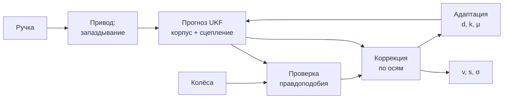

# Математическая модель движения трамвая

Модель и фильтр для резервного расчёта скорости и положения трамвая без GNSS и инерциальных систем.
Входы - только позиция ручки контроллера и скорости колёс двух тележек. Числа на реальных записях
получены `tools/eval.py` ([docs/EVAL.md](docs/EVAL.md)), числа на имитаторе -
`prototype/scenarios.py` (раздел 8).

Структура уравнений фиксирована, все числовые константы собраны в одном описании `Params`
([estimator_core.py](ros2_ws/src/tram_state_estimator/tram_state_estimator/estimator_core.py)).
Значения для вагона кейса получены калибровкой по записям (0.2) и лежат в листе `config/tram.yaml`.
Разделы 1-7 описывают модель в общем виде, раздел 8 - её проверку на имитаторе, раздел 0 -
применение к данным кейса, разделы 9 и 10 - ограничения и план развития.

**Разделы**

- [0. Решение на данных ТЗ](#0-решение-на-данных-тз)
- [Что где](#что-где)
- [1. Корпус](#1-корпус)
- [2. Привод и аппроксиматор](#2-привод-и-аппроксиматор)
- [3. Сцепление и проскальзывание](#3-сцепление-и-проскальзывание)
- [4. Модель измерений](#4-модель-измерений)
- [5. Фильтр](#5-фильтр)
- [6. Адаптация параметров](#6-адаптация-параметров)
- [7. Срывы и отказы датчиков](#7-срывы-и-отказы-датчиков)
- [8. Что проверено](#8-что-проверено)
- [9. Ограничения](#9-ограничения)
- [10. План развития](#10-план-развития)
- [Лист параметров](#лист-параметров)
- [Подстановка констант из ТЗ](#подстановка-констант-из-тз)
- [Соответствие постановке](#соответствие-постановке)

---

## 0. Решение на данных ТЗ

### 0.1. Что показали данные

122 прогона двух трамваев (30618 - 103, 30639 - 19), 36,75 ч. Разбор -
[`analysis/explore.py`](analysis/explore.py), [`explore2.py`](analysis/explore2.py), полное
описание датасета - [`docs/DATA.md`](docs/DATA.md).

| Факт | Следствие |
| :--- | :--- |
| скорость тележек в км/ч, а не в м/с (README датасета): отношение к GNSS - медиана 3,598 | `meas_units: km_h` |
| масштаб колёс (GNSS / тележки): 30618 - 1,00136, 30639 - 0,99757; по датам до 1,2 % | параметр `vehicle`, онлайн-масштаб колёс (0.7 п. 2) |
| тележки ~9,4 Гц каждая, в разные моменты; ручка 20 Гц; разрывы тележек до ~1 с | ядро принимает показания каждой тележки отдельно |
| после перевода единиц колёса отличаются от GNSS не больше 0,16 м/с в 99 % времени | колёса точнее модели привода |
| провал одной тележки (сообщений нет) до 73,5 с у 30639, ноль одной тележки на ходу до 0,8 с | обратимая диагностика ядра (раздел 7) |
| в части прогонов вагон разгоняется при «тормозной» позиции ручки (−8…−15) | правило согласия тележек (0.3) |
| GNSS есть в 86 прогонах; две антенны вдоль вагона, rover впереди | курс на старте даже на стоянке; выход - точка `base_link` (0.5) |
| высота за прогон меняется до 47 м | z берётся из карты путей |
| 25 пар точных копий (все - 30618 за 10.08): 97 уникальных записей | разбиение по уникальным записям, оценка на 15 чистых отложенных (0.2) |

### 0.2. Калибровка (офлайн, разрешена ТЗ) и дисциплина train / holdout

Разбиение зафиксировано в [`tools/split.json`](tools/split.json) по уникальным записям: `train` -
98 прогонов (80 уникальных), `holdout` - 17, `holdout_scored` - 15 чистых отложенных с GNSS (без
дублей и без копий в обучении). Листов параметров и карт по два:

| | Лист и карта ОЦЕНКИ | Лист и карта ЖЮРИ |
| :--- | :--- | :--- |
| по каким записям | только `train` (80 уникальных) | все 97 уникальных |
| файлы | `config/eval/tram.yaml`, `config/eval/track_map.npz` | `config/tram.yaml`, `config/track_map.npz` |
| для чего | все отчётные числа на `holdout_scored` | уходит в пакет |

Пороги и умолчания (детекторы срыва, карта, множитель пути, σ) выбирались только на `train`,
`holdout_scored` считался после выбора. Где правка найдена на отложенных, это подписано (0.7 п. 5).

- **Привод.** Таблица `A(u, v)`: ускорение на ровном пути по 31 позиции ручки (u = позиция / 15)
  и 11 узлам скорости, билинейная, метод наименьших квадратов со сглаживанием
  ([`calib_drive.py`](analysis/calib_drive.py)). Отсчёты, противоречащие ручке, в подгонку не идут.
  Запаздывание 0,2 с и инерция 0,3 с подобраны перебором на подгоночных прогонах. Тяга растёт до
  позиции +9 (~0,9 м/с²) и падает со скоростью; позиции −9…−15 - торможение ~1,0-1,5 м/с²; позиция
  −8 выше 2 м/с даёт лишь −0,3…−0,6 м/с².
- **Масштаб показаний и шум** - по установившемуся движению против скорости GNSS
  ([`calib_sheet.py`](analysis/calib_sheet.py)).
- **Фильтр и выходная σ** - прогоном связки на подгоночных записях
  ([`calib_tune.py`](analysis/calib_tune.py), [`calib_sigma.py`](analysis/calib_sigma.py)). Крип
  выключен (`c_creep = 0`), адаптация масштабов привода тоже (`adapt_on: false`): на обучающих
  записях выигрыша нет.
- **Пересчёт** - `analysis/calib_all.sh`. Результат -
  [`config/tram_calibration.json`](ros2_ws/src/tram_state_estimator/config/tram_calibration.json)
  (жюри) и `config/eval/tram_calibration.json` (оценка), из них генератор делает листы ноды.

Эффект калибровки на 15 чистых отложенных ([`docs/EVAL.md`](docs/EVAL.md) §4): с подогнанным
листом MAE скорости 0,0335 м/с, ±2σ 96,0 %, средняя 3D 3,81 м; с паспортными заглушками крипа -
0,0365 м/с, 95,5 %, 4,12 м.

### 0.3. Согласие тележек сильнее модели

В данных вагон иногда разгоняется при «тормозной» позиции ручки. Фильтр, который верит модели
больше, чем обеим тележкам, держал бы скорость у нуля. Поэтому показание принимается вопреки
модели при трёх условиях:

- **Согласие.** Показание согласно со всеми остальными тележками: разница не больше `agree_tol` =
  0,3 м/с, их показания не старше `agree_age`.
- **Физичность.** Ни одна тележка не ускоряется физически невозможно: признак буксования из ТЗ
  «резкий рост скорости колёс» такое показание отвергает.
- **Нет срыва.** Расхождение не объясняется блокировкой, неоднозначностью «стоим или скользим» или
  срывом обеих тележек разом (раздел 7).

Тогда неопределённость скорости расширяется до расхождения, и показание принимается. Оконное
измерение масштаба привода тоже проходит проверку правдоподобия: окно с ошибкой ручки его не
сдвигает.

### 0.4. Время и публикация

Нода [`tram_node.py`](ros2_ws/src/tram_state_estimator/tram_state_estimator/tram_node.py) не
зависит от часов: время - `header.stamp` входных сообщений (время из bag). Связка
[`runner.py`](ros2_ws/src/tram_state_estimator/tram_state_estimator/runner.py) делает шаги ядра на
сетке 50 мс: пришло сообщение с меткой `t` - выполнены и опубликованы все шаги до `t`, каждый со
своей меткой. Свежее показание тележки приводится к моменту шага. Выходы `/result/velocity`,
`/result/position`, `/result/acceleration`, `/tram/estimator_status` - 20 Гц. Плохие входы (NaN,
метка 0, скачок времени, второй bag) нода отсекает и не падает; при паузе входов публикует прогноз
не дальше 0,2 с ([`docs/ROBUST.md`](docs/ROBUST.md)).

Реальное время на полном bag 20 мин, проигрывание 1x, нода с `--cpus 2 --memory 512m`:

| Показатель | Значение | Допуск ТЗ |
| :--- | ---: | ---: |
| частота публикации | 20,0 Гц | ≥ 10 Гц |
| задержка «вход → выход», p50 / p99 | 51,2 / 54,2 мс | ≤ 100 мс |
| задержка, максимум | 169,4 мс | пик ≤ 250 мс |
| CPU | 0,103 ядра | ≤ 2 ядра |
| память (RSS) | 70,1 МБ без роста | ≤ 0,5 ГБ |

Около 50 мс задержки заложено сеткой. На записи `30618_af7496f0` с паузой записи входов 0,9 с пик
задержки 181,5 мс, больше 250 мс - ни одной пары (9 п. 24).

### 0.5. Положение x, y, z

Судья сравнивает x, y, z в метрах. Колёса дают только пройденный путь, форму пути даёт **карта
путей**.

1. **Система выхода - система судьи.** Плоские MGRS от угла квадрата **37UCB непрерывно**, как
   записан pathgraph организаторов: x = UTM E − 300 000, y = UTM N − 6 100 000 (зона 37), без
   скачка на границе E = 400 км. Точка - **`base_link`** (ось поворота передней тележки на уровне
   рельса), z - высота рельса (`NavSatFix.altitude` − 3,0 м). Перевод -
   [`geodesy.py`](ros2_ws/src/tram_state_estimator/tram_state_estimator/geodesy.py); другая
   система задаётся параметрами `projection`, `mgrs_grid`, `output_point`.
2. **Выставка по GNSS** - окно `init_window_s` = 3 с от первой годной точки master:
   `base_link = master + 9,873/12,436 · (rover − master)`, курс - вектор master → rover. Без rover
   курс берётся по смещению master или по карте; выставка работает и на ходу. До неё
   `/result/position` не публикуется. GNSS после окна, если он есть, поправляет положение вдоль пути
   (`gnss_correction`; [`docs/POSITION_FRAME.md`](docs/POSITION_FRAME.md) §12), скорость не меняет.
3. **Карта путей - гибрид** ([`build_map.py`](analysis/build_map.py),
   [`track_map.py`](ros2_ws/src/tram_state_estimator/tram_state_estimator/track_map.py)):
   pathgraph организаторов (шаг 1 м) плюс наша карта из траекторий `base_link` по GNSS за его
   концами, где лежит около четверти отсчётов. Карта жюри - 17 554 точки, 51 остановка, 4 конечные,
   3 ветки за тупиком у западной конечной
   ([`docs/POSITION_FRAME.md`](docs/POSITION_FRAME.md) §3). Карту из GNSS организаторы разрешили.
4. **Движение по карте.** Точка сдвигается на пройденный путь по курсу и притягивается к оси пути с
   тем же курсом; высота - из карты. На стрелке берётся ветка, по которой ездили чаще. Сошла с
   карты - ищет путь с тем же курсом в расширяющемся радиусе. В тупике у конечной курсор держится
   (`terminal_hold`); если вагон уехал за тупик у западной конечной дальше 15 м, курсор уходит на
   разворотное кольцо (вагон стоял у платформы) или на боковой путь
   ([`docs/POSITION_FRAME.md`](docs/POSITION_FRAME.md) §11).
5. **Множитель пути** - калибровка по тем же прогонам, что и карта, со сквозной поправкой ×1,001,
   выбранной на train.
6. **Привязка к остановкам.** Точки остановки - места, где стояли ≥ 3 прогонов с разбросом ≤ 4 м.
   Если вагон стоит дольше 8 с и такая точка с тем же курсом в окне 3σ вдоль пути, положение
   переносится в неё; очередь за другим трамваем (~30 м) в окно не попадает. По привязкам
   подстраиваются масштаб пути (`scale_adapt`, ±1 %) и масштаб колёс для скорости
   (`wheel_scale_online`, не больше ±2 %; [docs/VEHICLES.md](docs/VEHICLES.md) §6). Масштаб колёс
   учится по положению без поправок GNSS, иначе они попали бы в скорость.
7. **σ положения:** σ_s² = σ_пути² + `ss_map`² + (`ss_rel`·Δs)², Δs - путь после выставки или
   привязки.

### 0.6. Результаты на отложенных прогонах

[`tools/eval.py`](tools/eval.py) воспроизводит прогон «как судья» через ту же связку, что нода: GNSS
только первые 3 с, пары «выход - эталон» по ближайшей метке в пределах 0,05 с. 15 чистых
отложенных записей, лист и карта ОЦЕНКИ; эталон скорости - GNSS master, положения - `base_link` по
двум антеннам в MGRS 37UCB. База «только колесо» - тот же `Runner` (выставка, карта, привязки) со
средним свежих показаний тележек вместо ядра. Полностью - [`docs/EVAL.md`](docs/EVAL.md).

| | Модель | Только колесо |
| :--- | ---: | ---: |
| Скорость, MAE / RMSE, м/с | **0,0335 / 0,0890** | 0,0463 / 0,0948 |
| Смещение: всё / торможение, м/с | **−0,0027 / −0,0032** | +0,0069 / +0,0482 |
| Истина в ±2σ (стоянка / тяга / выбег / торможение) | **96,0 %** (96 / 95 / 97 / 96) | - |
| Положение, средняя 3D, м | 3,81 | 3,77 |
| Конец прогона, ср. / медиана / макс, м | 2,7 / 1,86 / 10,0 | 2,6 / 1,37 / 10,4 |
| Дрейф 3D по концу, % пути, медиана / макс | 0,037 / 0,140 | 0,026 / 0,145 |
| Поперёк оси pathgraph, ср., м | 0,011 | 0,011 |
| \|вдоль\| ≤ 2σ_s | 92,8 % | - |
| **Трамвай 30618** (12 прогонов, его проверяют организаторы): MAE / 3D / конец ср. и макс | **0,0266 м/с / 1,91 м / 1,74 и 5,0 м** | 0,0369 / 1,85 м |
| Трамвай 30639 (3 прогона): MAE / 3D | 0,0610 м/с / 11,39 м | 0,0837 / 11,38 |
| Частота публикации | 20 Гц | |

С GNSS посреди маршрута (`tools/eval_gnss.py`, [`docs/EVAL.md`](docs/EVAL.md) §5.1) средняя 3D у
30618 - 1,76 м при редких пачках GNSS и 1,48 м при GNSS весь прогон против 1,91 м с GNSS только в
первые 3 с (ошибка в конце записи 1,74 → 0,87 м); скорость та же.

На чистых записях положение у модели и у базы одинаковое: его держат карта и привязки к
остановкам. Модель выигрывает по скорости (особенно на торможении) и при отказах датчиков.
Инъекции в реальные отложенные записи ([`docs/EVAL.md`](docs/EVAL.md) §6; MAE в окне, м/с;
остаток пути через 300 с):

| Аномалия | Модель | Только колесо |
| :--- | ---: | ---: |
| отказ передней тележки, 60 с | 0,028; 0,1 м | 2,378; 186,2 м |
| обе тележки 0 км/ч, 20 с | 1,001; 36,0 м | 9,328; 206,7 м |
| обе залипли, 20 с | 1,124; 39,4 м | 5,357; 116,1 м |
| юз −30 % обеих тележек на торможении | 0,183 (флаг срыва 99 % окна) | 1,772 |
| буксование +30 % обеих на разгоне | 0,211 | 0,862 |
| шум ×5 | 0,100 | 0,147 |

### 0.7. Ограничения решения на данных

1. **Выбор ветки на стрелке не наблюдаем** по колёсам и ручке: берётся преобладающая. У западной
   конечной ветку за платформой выбирают по тому, стоял ли вагон у платформы: три отложенных
   прогона, уехавших за платформу, в конце ошибаются на 5,0 / 0,16 / 0,28 м. Не распознаются
   запись, кончившаяся раньше, чем вагон уехал на 15 м за тупик (train `a869780d`: 31 м), и стоянка
   у сигнала перед боковым путём. Два пути отправления с кольца в карте ЖЮРИ равноправны, берётся
   западный: у `27e994fc` (восточный) конец 4,0 → 7,2 м
   ([`docs/POSITION_FRAME.md`](docs/POSITION_FRAME.md) §11.4).
2. **Масштаб колёс меняется по датам** до 1,2 % у одного вагона против 0,38 % между вагонами. Дату
   нода не знает, её гасят привязки к остановкам (`wheel_scale_online`, медленнее `scale_adapt`). У
   30639 (все отложенные от 05.05) это снижает MAE скорости с 0,0762 до 0,0610 м/с; средняя 3D
   11,39 м против 1,91 м у 30618 (с `vehicle: 30639` - 11,14 м, MAE 0,0604). У 30618 онлайн-масштаб
   на отложенных стоит +1,9 % MAE (0,0261 → 0,0266) из-за записи `21dd3af3`: первые два отрезка
   ошибочно дали −0,7 % на 1,7 км. На train выигрыш −4 % (дата 03.09 - −22 %). Часть записей 30639
   без RTK, эталон там сам смещён (`30639_d3c43d69` - 22,0 м). Разбор -
   [docs/VEHICLES.md](docs/VEHICLES.md).
3. **Как судья строит свой эталон `base_link`** (по двум антеннам или по одной с курсом), не
   сказано. Мы строим по двум антеннам с tf; на кривых способы могут разойтись.
4. **Карта - офлайн-данные** (карта ОЦЕНКИ - только из обучающих записей). Если маршрут проверки
   выйдет за карту, положение ведётся по курсу, пока путь с тем же курсом не найдётся.
5. **Без GNSS в первые секунды положения нет** (скорость есть). Без rover на двух самых крутых
   кривых (R 30-34 м) выставка ошибается: 6 из 680 стартов, ошибка в конце 95-325 м. Правка
   радиуса поиска курса без rover найдена на отложенном `30618_21dd3af3`; числа «holdout без
   rover» (3,98 м) получены после неё.
6. **Плавный срыв обеих тележек не отличить от разгона** (9 п. 13): резкий юз и буксование обеих
   тележек на 20 % и больше распознаются, плавный (нарастает за 0,5 с и дольше) и на 15 % - нет.
7. **Эталон GNSS сам содержит выбросы** (скорость на отсчёт падает до 0); в средних числах они
   есть.
8. **Коррекция по GNSS посреди маршрута доверяет RTK**: короткий сбой RTK внутри ворот после
   долгого перерыва GNSS принимается целиком, долгий (десятки секунд) - тоже; без RTK делаются только
   малые поправки. σ положения после поправок оптимистичнее: |вдоль| ≤ 2σ_s 85-93 % против 96-98 %
   без них. Числа отложенных для коррекции оптимистичны (их смотрели при разработке), честная
   проверка - свежие обучающие записи ([`docs/POSITION_FRAME.md`](docs/POSITION_FRAME.md) §12.4,
   §12.8).

### 0.8. Допущения

Где допущение подтвердили организаторы, это сказано.

1. **Скорость тележек - в км/ч** (подтвердили организаторы; в README датасета - м/с). Одометрия
   беззнаковая: вагон едет только вперёд.
2. **GNSS есть в первые секунды каждой проверочной записи** (ТЗ): он нужен для выставки, без него
   положения нет, скорость есть. GNSS посреди маршрута по ответу организаторов можно использовать
   для коррекции, но в проверочных bag его почти не будет. Записи начинаются и кончаются примерно у
   разворотных колец Щукинской и Таллинской (по ответу организаторов).
3. **Система судьи** - MGRS от угла квадрата 37UCB непрерывно, оси по REP-103, точка `base_link`,
   z - высота рельса (ответ организаторов, 0.5).
4. **Антенны - на прямой вдоль вагона** (tf организаторов, y = 0): `base_link` берётся на отрезке
   master → rover (0.7 п. 3).
5. **Проверка идёт на той же линии**, что в датасете: организаторы прислали pathgraph этой линии
   (0.7 п. 4).
6. **Вагон задаётся параметром `vehicle`** (по умолчанию 30618: организаторы проверяют только
   его). От вагона зависит только масштаб колёс; своя таблица привода на train не лучше
   ([docs/VEHICLES.md](docs/VEHICLES.md) §4).
7. **Масса и уклон не разделяются**: оба попадают в возмущение `d` (раздел 1). Таблица привода
   снята на реальных записях и уже содержит среднюю загрузку и профиль линии.
8. **Эталон скорости - горизонтальная скорость GNSS master**: официального эталона нет, источников
   четыре.
9. **Время - `header.stamp` из bag**, режим проигрывания не важен (подтвердили организаторы);
   данные «из будущего» не используются.
10. **Граница юза и блокировки** (`lock_ratio`) и `mu_min` - допущения, а не измерения:
    сцепление скольжения по этим входам не наблюдаемо (9 п. 1, 15).

---

## Что где



Прогноз по сигналу управления, коррекция по одометрии. Каждое измерение оси проходит проверку
правдоподобия; отвергнутое состояние не меняет. Когда верить нечему, модель работает разомкнуто, а
неопределённость растёт.

Обозначения: `s` - путь, `v` - скорость корпуса, `u` - нормированный момент привода (−1…+1), `d` -
приведённое возмущение, `k_т`, `k_б` - масштабы тяговой и тормозной характеристик, `μ` - доступное
сцепление, `ω_a` - частота вращения оси, `N` - нагрузка на ось.

---

## 1. Корпус

Задача одномерная: вагон едет по рельсам, положение - координата вдоль пути.

```math
\dot s = v, \qquad
M\,\dot v \;=\; F_{\text{кор}} \;-\; W(v) \;+\; M\,d
```

`F_кор` - сила, реально переданная корпусу (раздел 3), `W(v)` - сопротивление движению в форме
Дэвиса: постоянная часть (качение, подшипники), линейная (механические потери), квадратичная
(аэродинамика):

```math
W(v) \;=\; A + B\,v + C\,v^2 \quad (v > 0)
```

Возмущение `d` собирает всё неучтённое: уклон, отклонение массы от номинала, ветер, ошибку
коэффициентов `W`. Оно моделируется случайным блужданием и оценивается вместе с состоянием. Массу и
уклон по одному продольному каналу не разделить (рост массы и подъём дают одинаковый отклик), для
скорости и положения это не нужно. Направление движения - «вперёд» (`v ≥ 0`): одометрия
беззнаковая, откат ею не виден.

---

## 2. Привод и аппроксиматор

Позиция ручки - **команда**, а не момент: между ними лежат набор поля и ограничитель рывка. Модель
первого порядка с чистым запаздыванием:

```math
\tau_{\text{пр}}\,\dot u + u \;=\; \Phi\big(n(t-\tau_{\text{з}})\big)
```

`Φ` - таблица листа «позиция → доля полного момента», отдельная для тяги (`notch_tract`) и
торможения (`notch_brake`). Число позиций - длина таблицы, зависимость может быть нелинейной.
Дробная позиция интерполируется, позиция за пределами таблицы даёт полный момент.

Сила привода - **нелинейный аппроксиматор**: нелинейна по скорости, линейна по адаптируемым
масштабам. Тяга и торможение описываются раздельно: электродинамический тормоз гаснет у нуля и
замещается механическим.

```math
F_{\text{пр}}(u,v) \;=\;
\begin{cases}
k_{\text{т}}\,F_{\text{т}}\,u\,\min\!\big(1,\, v_{\text{баз}}/v\big), & u>0\\[4pt]
k_{\text{б}}\,F_{\text{б}}\,u\,\big[h + (1-h)\min\!\big(1,\, v/v_{\text{ЭД}}\big)\big], & u<0
\end{cases}
```

Тяга - полка постоянного момента, затем ослабление поля (постоянная мощность). Торможение: ниже
`v_ЭД` электродинамический тормоз гаснет, механический подхватывает долю `h = brake_hold_frac`
полной силы (`h = 1` - полное замещение, `h = 0` - тормоз гаснет вместе с ЭД).

**Табличный режим.** Если в листе задана таблица `acc_table` на сетках `acc_u`, `acc_v`, привод
описывается ею, а не паспортными кривыми. Так модель применена к данным кейса (0.2):

```math
F_{\text{пр}}(u,v) \;=\; k\,M\,\big(A(u,v) - A(0,v)\big),\qquad
W(v) \;=\; -M\,A(0,v) \;(\ge 0)
```

`A` - ускорение на ровном пути, билинейная интерполяция; строка `u = 0` - выбег, то есть
сопротивление движению. `k = k_т` при тяге, `k_б` при торможении. Структура фильтра от режима не
меняется.

---

## 3. Сцепление и проскальзывание

Привод может потребовать больше, чем даёт рельс. Корпусу передаётся сила, **ограниченная
сцеплением**:

```math
F_{\text{кор}} \;=\; \operatorname{clip}\!\Big(F_{\text{пр}},\; -\mu N_{\text{торм}},\; +\mu N_{\text{пр}}\Big)
```

`N_пр`, `N_торм` - суммарная нагрузка на моторные и тормозные оси, `μ` - доступное сцепление. Без
этого предела разомкнутый прогноз на льду разгонял бы вагон силой, которой там быть не может (на
имитаторе - ошибка пути в километры). `μ` - оцениваемый параметр, зависит от погоды. Он наблюдаем
только при насыщении, поэтому оценивается по признакам срыва (раздел 6).

### Крип

Передача силы требует проскальзывания колеса относительно рельса. До пика характеристики оно
линейно по нагрузке оси:

```math
\xi_a \;=\; c\,\frac{F_a}{N_a} \;-\; c_0,
\qquad F_a = \text{доля } F_{\text{кор}} \text{ на оси } a
```

Под тягой колесо опережает корпус (`ξ > 0`), под торможением отстаёт (`ξ < 0`), ненагруженная ось
идёт чуть медленнее корпуса (`c_0` - сопротивление вращению). За пиком характеристики начинается
срыв, его ловит проверка правдоподобия (раздел 5).

---

## 4. Модель измерений

Показание оси:

```math
\boxed{\;\omega_a r \;=\; v\,(1 + \xi_a)\;}
```

Крип **предсказывается и вычитается**, а не принимается за шум. Прогноз крипа считается по
номинальной силе (`k = 1`): иначе неточность коэффициента `c` уводила бы масштаб привода в границу.
Дисперсия измерения нагруженной оси: `σ² = σ_meas² + (v·σ_creep)²`.

**Пересчёт показаний.** Датчик задаётся листом, без правки кода:

| Параметр | Что задаёт |
| :--- | :--- |
| `meas_units` | единицы: `rad_s`, `rpm`, `hz` (об/с), `pulses_s` (с `ppr`), `m_s`, `km_h` |
| `sensor_ratio` | передаточное число от колеса к валу датчика; 1 - датчик на колесе |
| `sensors_per_axle` | 2 - оба борта, 1 - один |
| `sensor_axles` | на каких осях есть датчики |

Показания сразу переводятся в скорость обода колеса, м/с (`k_ед` - перевод единиц в рад/с, `i` -
передаточное число; для `m_s` и `km_h` оно не применяется):

```math
v_w \;=\; \frac{k_{\text{ед}}\;\hat\omega_{\text{вал}}}{i}\;r
```

Нода проверяет, что в сообщении ровно `sensors_per_axle` значений на каждую ось с датчиком, иначе
отбрасывает его с ошибкой. С параметром ноды `wheel_names` показания берутся по `JointState.name`,
а не по позиции.

- **Частота датчиков.** Показания могут приходить реже цикла фильтра. Шаг без нового сообщения
  делает только прогноз, производная колеса и время стоянки считаются по реальному интервалу между
  показаниями. Если учитывать одно показание на каждом шаге заново, при датчиках 20 Гц и цикле
  100 Гц это даёт 37 ложных срывов за прогон.
- **Кривые.** Среднее по бортам оси равно скорости центра колеи при любом радиусе. При одном
  датчике на ось дисперсия измерения растёт на `(v · curve_ratio_max)²`, где
  `curve_ratio_max = b/R_min`.
- **Износ бандажей.** Разброс масштаба осей выравнивается на выбеге: там срыв исключён, и
  расхождение осей относится к датчику.

---

## 5. Фильтр

Сигма-точечный (UKF), состояние `x = [s, v, d, k_т, k_б]`. Модель нелинейна и по процессу (предел
сцепления, ослабление поля), и по измерению.

**Прогноз.** Дрейф параметра включается только там, где он наблюдаем: возмущение - на выбеге,
масштаб тяги - под тягой, масштаб торможения - под торможением. Иначе возмущение и масштаб привода
поглощают друг друга.

**Коррекция.** Оси обрабатываются по одной и упорядочиваются по невязке: сначала согласованное
большинство, затем подозрительные. Поэтому буксующая ось не тянет состояние на себя. Измерение
отвергается в трёх случаях:

- **Невязка.** Нормированная невязка `ν²/S` выше порога (по умолчанию 9, то есть 3σ).
- **Ускорение колеса.** Колесо ускоряется быстрее физического предела корпуса плюс запас: оно
  срывается.
- **Срыв.** Идёт срыв, и показание уходит в сторону срыва.

Отвергнутое измерение состояние не меняет. Если отвергнуты все оси и срывом это не объясняется,
неопределённость `d` раздувается до предела, правдоподобного при текущей команде. Так фильтр
выходит из собственной ошибки за ограниченное время.

- **Нет одометрии.** Разомкнутый шаг: прогноз без коррекции, неопределённость растёт. Нули не
  подставляются: это выглядело бы остановкой.
- **Нет ручки.** Скорость и путь корректируются по колёсам с последней позицией ручки, но `d`,
  `k_т`, `k_б` не адаптируются.
- **Старт.** Скорость берётся из первых показаний: под тягой - минимум по осям, при торможении -
  максимум, на выбеге - медиана. Оценка точна с первого шага, в том числе при перезапуске ноды на
  ходу.
- **Стоянка.** Принятые показания и оценка около нуля - скорость обнуляется. Каждая остановка
  сбрасывает ошибку скорости, поэтому дрейф положения растёт линейно с путём.

**Неоднозначность «стоим или скользим».** Если оценка недавно (не дольше `t_valid` назад)
подтверждалась колёсами, а теперь отвергнуты все оси при торможении со срывом или все колёса разом
показывают ноль при скорости выше `v_dead_ref`, колёса перестают свидетельствовать о скорости.
Это блокировка или общий отказ датчиков, по этим входам их не различить. Выставляется флаг
`ambiguous`:

- **Нули не принимаются.** Скорость ведёт модель с пониженным сцеплением: оценка остаётся сверху,
  а не падает в ноль при скользящем вагоне.
- **Стоянки нет.** Стоянка не объявляется, `valid = false`.
- **σ широкая.** Публикуемая `σ_v` не меньше половины скорости в начале срыва, `σ_s` нарастает на
  ту же величину за каждую секунду и остаётся после снятия флага.

Оценка сверху - безопасная сторона: вагон считает себя ближе к тому, что впереди. На имитаторе при
общем отказе датчиков на сухом рельсе это +122 м пути (σ_s к концу 242 м), при блокировке на льду
−200 м (σ_s 418 м; сцепление скольжения у имитатора там ниже `μ_min`). Флаг снимается, когда
колёса снова покатятся (показания выше `v_standstill`, срыва нет); если вагон остановился, флаг
держится до трогания. Условие «из подтверждённого состояния» нужно потому, что после долгого
буксования всех осей завышенная оценка при торможении выглядит как блокировка, и защёлка держала бы
её (на имитаторе +315 м пути вместо +70 м).

---

## 6. Адаптация параметров

Параметры адаптируются только там, где они наблюдаемы:

| Параметр | Как | Когда |
| :--- | :--- | :--- |
| Возмущение `d` | UKF, через ковариацию | установившийся выбег, `v > v_адапт` |
| Масштаб тяги `k_т`, торможения `k_б` | оконное измерение (ниже) | установившаяся тяга/торможение, `v > v_адапт`, нет срыва |
| Сцепление `μ` | признаки насыщения | срыв: падает к `μ_min`; иначе медленно к номиналу |
| Масштаб осей | выравнивание по медиане | выбег, принятые измерения |

**Масштаб привода.** За окно установившегося режима вагон меняет скорость на

```math
M\,(v_2 - v_1) \;=\; k\int F_{\text{ном}}\,dt \;-\; \int W\,dt \;+\; M\,d\,T
\quad\Longrightarrow\quad
k_{\text{изм}} \;=\; \frac{M\,(\Delta v - d\,T) + \int W\,dt}{\int F_{\text{ном}}\,dt}
```

`k_изм` входит в фильтр как линейное измерение параметра. Разность скоростей гасит постоянное
смещение одометрии (крип, ошибка радиуса). У шаговой невязки это смещение на порядок больше
полезного сигнала, и масштаб по ней уходит в границу. Параметры удерживаются в физически возможном
диапазоне.

---

## 7. Срывы и отказы датчиков

Сводка признаков и реакций, подробности - под таблицей.

| Ситуация | Признак | Реакция |
| :--- | :--- | :--- |
| буксование части осей под тягой | нагруженная ось отвергнута в сторону «больше»; подтверждение: резкий рост колеса или другая ось читает меньше | остальные оси держат скорость; `μ` падает; ось не участвует |
| срыв всех осей разом (юз или буксование обеих тележек) | одновременный скачок показаний всех осей одного знака | показания в сторону срыва не принимаются, скорость ведёт модель; режим SLIP |
| конец срыва всех осей | колёса вернулись скачком или плавно, приняты подряд `slip_ok_s`, истёк `slip_t_max`, нули или шум | колёса снова принимаются; нули - неоднозначность «стоим или скользим» |
| блокировка при торможении | тормозные оси ниже `lock_ratio` прогноза (колесо за пиком сцепления) | модель с пониженным `μ`; `ambiguous`; нули не принимаются, пока колёса не покатятся |
| высокий шум показаний | оценка шума оси по вторым разностям выше `sigma_meas` | дисперсия измерения и пороги растут: шум - не срыв; оценка в `meas_noise` |
| оборванный датчик | ноль, когда и остальные датчики, и оценка корпуса больше `v_dead_ref` | колесо исключается из оси |
| залипший датчик | отсчёты не меняются дольше `stuck_n`, остальные изменились больше `stuck_dv` | колесо исключается из оси |
| исключённый датчик снова согласен | расхождение не больше `recover_tol + recover_rel·v` в течение `t_recover` | колесо возвращается |
| отказ всех датчиков в ноль | все оси разом в ноль на ходу | `ambiguous`, модель разомкнута, `σ_v`, `σ_s` расширены |
| отказ всех датчиков в другое значение | резкий скачок всех показаний | срыв всех осей или, если скачок меньше `slip_rel`·v, отвержение показания |
| нет данных колёс | устаревшие входы | разомкнутый шаг |
| нет данных ручки | устаревший вход | коррекция по колёсам, параметры заморожены |

- **Исключение датчика обратимо.** Пятно льда, заблокировавшее ось на 0,5 с, не выключает её
  датчики до перезапуска. Одинаковые отсчёты сами по себе не залипание: на постоянной скорости
  энкодер выдаёт одно и то же число. Ноль считается обрывом, только если движение подтверждает и
  оценка корпуса: при буксовании на месте моторные колёса крутятся, а вагон стоит.
- **Недостоверная оценка.** `valid = false`, когда принятых измерений нет дольше `t_valid`, нет
  данных колёс или выставлен `ambiguous`; потребитель обязан это учитывать. Во время срыва всех
  осей через `t_valid` оценка тоже `valid = false`, режим - SLIP (не DEGRADED): скорость ведёт
  модель.

**Срыв всех осей.** У вагона кейса обе тележки моторные и тормозные, ненагруженной оси нет. Когда
срываются обе, они согласны между собой, и правило согласия (0.3) приняло бы срыв за движение.
Признак срыва - одновременный скачок показаний всех осей одного знака против собственного тренда
колеса. Тренд колеса, а не модель: при ошибке ручки модель ошибается на 1-2 м/с², а колёса
меняются плавно. Условия:

- **Размер.** Скачок каждой оси не меньше `slip_jump` и `slip_rel`·v, то есть от 20 % скорости.
  Меньше нельзя: сбои меток времени в записях дают скачки на 7-13 % скорости.
- **Пара.** Вторая тележка может сорваться позже первой, но в пределах `slip_pair_s`.
- **Сторона.** После скачка показания лежат по ту же сторону от прогноза модели («рост колёс без
  ускорения по модели», «отрицательное рассогласование при торможении»).
- **Знак.** Буксование не начинается при ручке в торможении, юз - при ручке в тяге.

Пока идёт срыв, показание в сторону срыва - лишь граница: при юзе корпус не медленнее колеса, при
буксовании не быстрее. Скорость ведёт модель по таблице привода. `μ` не снижается, иначе модель
перестала бы тормозить или разгонять вагон, когда она одна держит скорость. σ ускорения на это
время - `slip_sigma_a` (ошибка разомкнутого прогноза на обучающих прогонах), поэтому `σ_v` растёт
честно: за 4 с - до ~0,6-0,7 м/с. В статусе `slip`, `slip_all = ±1`, режим SLIP.

Срыв снимается, когда все тележки вернулись скачком или плавно (ниже), все новые показания
принимаются подряд `slip_ok_s` = 1 с, прошло `slip_t_max` (защита от защёлки при ложном
срабатывании), показания ушли в ноль или оценка шума выросла так, что начальный скачок в неё
укладывается.

- **Плавное отпускание.** Колесо может догнать корпус за 1-2 с, а таблица за время срыва могла уйти
  от вагона (тормозит слабее на 0,1-0,45 м/с²), поэтому возвращение ловится по производной, а не
  по уровню. Колесо в ровном срыве - доля ρ скорости корпуса (ρ = показание/прогноз), его
  производная - ρ·(ускорение модели). Отход производной в сторону корпуса больше `slip_ret_a` =
  0,7 м/с², а затем снова меньше 0,5 м/с² (`a_slip_margin`/2) значит, что колесо вернулось. Порог
  выбран на обучающих прогонах: 0,5 даёт ложные возвращения при буксовании, 1,0 пропускает
  отпускание за 2 с.
- **Нули во время срыва** (юз, перешедший в блокировку, или блокировка при экстренном торможении) -
  не остановка. Они снимают срыв всех осей, но не принимаются; дальше работает неоднозначность
  «стоим или скользим» (раздел 5).
- **Признак насыщения сцепления** (`μ` падает) ставится только при независимом подтверждении:
  блокировка, резкий рост колеса или несоответствие тележек. Одно отклонение от модели срыва не
  доказывает: его так же объясняет ошибка модели.
- **Высокий шум** («аномально высокая дисперсия» из ТЗ) - не срыв. Шум оси - медиана модуля
  остатка линейной экстраполяции за `noise_n` показаний: на чистых обучающих прогонах
  0,01-0,02 м/с при паспортной `sigma_meas` 0,05, при шуме ×5 - 0,2-0,4 м/с. Шум сверх
  паспортного увеличивает дисперсию измерения и расширяет пороги на `noise_k` σ: фильтр усредняет
  показания, а не отвергает их. Оценка публикуется в `meas_noise`.

---

## 8. Что проверено

Имитатор объекта (`plant.py`) намеренно богаче модели оценщика: двухмассовый привод, падающая
характеристика сцепления, перераспределение нагрузки, квантование энкодера, задержка, разброс
масштаба датчиков. Константы имитатора выдуманные: это проверка, что модель считается и ведёт себя
физично, а не характеристика вагона. Числа на реальных записях - в 0.6.

<!-- RESULTS:BEGIN -->
15 сценариев по 3 прогона ([`prototype/scenarios.py`](prototype/scenarios.py)), ядро с
отпечатком `684530832766`: `python3 prototype/scenarios.py`, 7,8 мин. Ошибка - оценка минус
истина; «|ош|» - средняя абсолютная ошибка скорости.

| Сценарий | \|ош\|, м/с | p95 | макс | ошибка пути, м |
| --- | --- | --- | --- | --- |
| сухо, разгон-выбег-торможение | 0,056 | 0,20 | 0,29 | 0,57 |
| дождь, умеренная тяга | 0,022 | 0,04 | 0,25 | 0,53 |
| дождь, буксование под полной тягой | 0,002 | 0,00 | 0,08 | −0,15 |
| наледь при разгоне (μ = 0,03) | 0,001 | 0,00 | 0,04 | −0,14 |
| кривая R = 20 м с переходными | 0,043 | 0,17 | 0,32 | 0,41 |
| подъём 3 % | 0,033 | 0,18 | 0,27 | 0,62 |
| дребезг тяга/тормоз, период 0,7 с | 0,050 | 0,11 | 0,29 | −0,05 |
| рельсовый тормоз | 0,079 | 0,27 | 1,31 | 0,25 |
| отказ одного датчика | 0,053 | 0,20 | 0,29 | 0,57 |
| залипание датчика | 0,057 | 0,20 | 0,29 | 0,42 |
| маршрут из трёх перегонов (135 с, ~970 м) | 0,083 | 0,20 | 1,43 | −1,84 |
| **отказ всех датчиков разом (в ноль)** | 2,274 | 8,46 | 9,13 | +123,1 |
| **блокировка всех колёс, наледь при торможении** | 2,443 | 5,39 | 5,72 | −146,5 |
| **блокировка всех колёс, μ = 0,02** | 2,979 | 6,25 | 6,51 | −208,4 |
| **обледенелый спуск 6 % с блокировкой** | 11,270 | 23,01 | 27,35 | −788,5 |

В сценариях с буксованием вагон почти не едет (колёса срываются), поэтому
относительная ошибка пути там непоказательна - смотрите абсолютную.

**Что видно.**

- В штатных режимах и при буксовании ошибка скорости 0,001-0,083 м/с, пути -
  доли метра, на маршруте из трёх перегонов - менее 2 м на 970 м.
- **Буксование не ломает оценку**: моторные оси срываются, холостые держат
  скорость, `μ` падает. Без проверки правдоподобия по осям ошибка пути в этих
  сценариях доходит до километров.
- **Рельсовый тормоз** (сигнала о нём нет) фильтр отслеживает шаг за шагом.
- Четыре нижних сценария - граница модели (раздел 9, пункты 1-2). Во всех
  выставлен `ambiguous`, `valid = false`, ошибку пути покрывает опубликованная
  `σ_s` (отношение ошибки к `σ_s` не выше 0,5). Последний сценарий к тому же
  вне рабочей области: вагон разгоняется до 31 м/с при `v_max_line = 20`.
- **Ложная стоянка** (объявлена при движении): 0 во всех сценариях блокировки
  и отказа и **719 из ~40 500 (1,8 %) на маршруте**. На маршруте это последние
  доли секунды торможения: тормоз имитатора клинит колёса у нуля ниже
  `v_adapt_min`, и нули принимаются за остановку чуть раньше времени. По
  отдельному замеру (696 случаев) вагон в эти моменты ехал 0,98 м/с в среднем,
  максимум 1,33 м/с; остаток пути по оценке v²/2a - десятки сантиметров. Порог
  под тормоз имитатора не подгонялся.

**Адаптация** (лист имитатора; в листе вагона она выключена, раздел 0.2).
Масштаб тяги `k_т` уходит от заглушки 1,0 к 0,82-0,85 и не упирается в границу;
при буксовании остаётся 1,0 (адаптация выключена). На подъёме 3 % он остаётся
1,00, на обледенелом спуске - 1,17. Значение физически не «масса»: у имитатора
вращательное сопротивление колёс даёт ещё около 200 Н·с/м сверх заданного `res_B`,
и масштаб поглощает эту разницу, а на уклоне - и уклон. Для оценки скорости это безразлично;
разделяет эти вклады режим опознавания (ниже).

**Опознавание при вводе в эксплуатацию**
([`prototype/identify.py`](prototype/identify.py)). Специальный профиль (разные
позиции ручки, ниже предела сцепления, с выбегами) принимается: 27 окон,
невязка 3 %. Найдено: тяга 30,7 кН (статистическая погрешность 2 %),
торможение 53,8 кН (3 %), `res_B` = 240 Н·с/м (13 %) при истинных 256 у
имитатора. Процедура находит расхождения со значениями листа (торможение
30 кН в заглушке), для чего и нужна.

**Статистическая погрешность занижает настоящую.** Тяга имитатора - 36 кН
(6300 Н·м × 2 оси / 0,35 м), найдено 30,7 кН: смещение −15 % при заявленных
2 %. Погрешность считается по разбросу невязки и не видит того, чего нет в
модели: податливости привода, падающей характеристики сцепления, крипа.
Поэтому принятое значение - первое приближение, его нужно сверять с
паспортом, а не подставлять вслепую.

Отсчёты ниже `v_adapt_min` в опознавание не идут. У самого нуля и на стоянке
тормоз вагон не замедляет, а форма тормоза силу предсказывает. На обычном
движении (разгон-выбег-торможение) процедура поэтому отказывает: окон
меньше 12. Это верный ответ: данных для разделения параметров там нет.

**Быстродействие** шага ядра (3000 шагов, Python 3.13, Windows, без
реального времени; замер на ядре без распознавания срыва обеих тележек):

| Лист | медиана | p99 | p99,9 |
| --- | --- | --- | --- |
| имитатор: 4 оси, 8 датчиков, шаг 10 мс | 1,29 мс | 1,81 мс | 2,63 мс |
| вагон: 2 тележки, таблица привода, шаг 50 мс | 1,62 мс | 1,96 мс | 3,07 мс |

Бюджет цикла - 10 и 50 мс. Векторизация модели измерений снижает максимум
втрое (без неё 19,9 мс), скалярный расчёт таблицы привода без numpy - вдвое
(через numpy 3,3 мс). Хвост определяет среда исполнения, не алгоритм. С картой путей
и публикацией нода целиком - раздел 0.4: 0,103 ядра, задержка p99 54,2 мс.
<!-- RESULTS:END -->

---

## 9. Ограничения

Что модель не решает при доступных входах. Ограничения положения на карте - в 0.7.

1. **Длительная блокировка всех колёс на льду двусмысленна**: нули колёс неотличимы от остановки.
   Модель ведёт скорость с `μ_min` под флагом `ambiguous` (раздел 5); ошибка пути зависит от того,
   насколько `μ_min` близок к настоящему сцеплению. На имитаторе −200 м за 50 с скольжения, в
   пределах опубликованной `σ_s`. Снять двусмысленность может только дополнительный вход (сигнал
   дверей, стояночного тормоза).
2. **Общий отказ всех датчиков** - та же двусмысленность: модель идёт разомкнуто, при торможении
   берёт `μ_min` (на имитаторе +122 м пути на сухом рельсе, в пределах `σ_s`).
3. **Масштаб привода, возмущение и сопротивление не разделяются** в обычном движении: `k`
   поглощает ошибку `W(v)` и уклон. Для скорости и пути это безразлично, разделяет их опознавание
   при вводе в эксплуатацию (раздел 8).
4. **Богатый базис по скорости** (радиально-базисные функции) на обычном возбуждении даёт почти
   коллинеарные регрессоры, поэтому параметризация сведена к двум масштабам паспортных кривых.
   Уточнение формы кривых - отдельный шаг опознавания, он проверен только для двух масштабов и двух
   коэффициентов сопротивления.
5. **Рельсовый тормоз не моделируется** (сигнала нет): плавное торможение им фильтр отслеживает,
   резкий скачок показаний отвергает.
6. **Откат вагона** не виден: одометрия беззнаковая.
7. **Предел сцепления оценивается эвристически** по признакам насыщения, а не байесовским
   обновлением.
8. **Датчики на валах двигателей хуже переносят буксование**: срываются как раз измеряемые оси. На
   имитаторе (мокрый рельс, полная тяга, 55 с) ошибка скорости 3,3 м/с и пути +70 м против
   0,00 м/с и −0,2 м при датчиках на колёсах всех осей. Константами это не лечится. Один датчик на
   ось (на всех осях) на буксовании не хуже двух.
9. **Все оси моторные - то же самое**: холостых осей, которые держат скорость при буксовании, нет.
   На имитаторе (мокрый рельс μ = 0,06, полная тяга, 55 с) 3,97 м/с и +70 м против 0,00 м/с и
   −0,1 м при двух моторных осях из четырёх.
10. **Радиус колеса не наблюдаем**: его ошибка переходит в ошибку пути один к одному (`r_nom` на
    3 % больше - путь +3,3 %, 13,7 м на 422 м). После обточки бандажей `r_nom` нужно обновлять.
11. **Слабое проскальзывание в пределах допуска (3σ) принимается** и смещает оценку скорости вверх
    в пределах допуска.
12. **Масштаб `k` поглощает уклон** под тягой (раздел 8): `d` адаптируется только на выбеге. На
    скорость и путь это не влияет.
13. **Плавный срыв обеих тележек не отличить от разгона.** Срыв всех осей распознаётся по скачку от
    20 % скорости; плавный или меньший уход обеих тележек похож на ошибку модели (уклон, ошибка
    ручки), и согласие тележек его примет. Поэтому не используется и признак ТЗ «высокий тяговый
    момент при низкой производной скорости». Буксование обеих тележек при ручке «торможение»
    срывом не считается; тележки с разницей срыва больше `slip_pair_s` = 0,5 с в пару не
    складываются.
14. **Во время срыва всех осей скорость - модель**, её ошибка растёт примерно на 0,15-0,2 м/с за
    секунду. Через 4 с - 0,49-0,75 м/с СКО по фазам на обучающих прогонах
    (`tools/slip_study.py --openloop`), в худших до 1,3 м/с: меньше, чем у скользящих колёс. Срыв
    дольше `slip_t_max` = 12 с снова принимается за движение.
15. **Юз против блокировки решает порог** `lock_ratio` (половина прогноза): выше - частичный юз с
    тормозной силой по ручке, ниже - блокировка с `μ → mu_min`. Порог - допущение. Нули обеих
    тележек во время срыва при оценке выше `v_dead_ref` = 2 м/с - всегда неоднозначность, даже если
    вагон остановился. Отпускание медленнее `slip_ret_a` = 0,7 м/с² (за 2 с на скорости ниже
    ~5 м/с) по производной не видно, срыв снимается через `slip_ok_s`, по нулям или через
    `slip_t_max` (на отложенных восстановление до 8 с). Ложного «возвращения» в ровном юзе в
    синтетическом тесте нет при ошибке таблицы торможения −15…+10 % и глубине юза 30-45 %.
16. **Оценке шума нужно ~6 показаний** (0,6 с): в первую секунду шума возможны короткие ложные
    признаки срыва и снижение `μ`. На обучающих прогонах с шумом ×5 флаг `slip` стоит в 1 % окна;
    в синтетическом тесте μ падает до ~0,1-0,15 и восстанавливается за десятки секунд, на таблице
    привода это не сказывается.
17. **Отказ обеих тележек сразу после трогания** (ниже `v_dead_ref` = 2 м/с) выглядит как
    остановка: команду тяги модель со «стоим» не сверяет. В песочнице (ручка +11, 1,2 м/с, 20 с
    нулей) - «Вагон стоит» с `valid = true`, ошибка скорости до 10,8 м/с, путь −178 м против −164 м
    у колёс ([`docs/SANDBOX.md`](docs/SANDBOX.md) §5). На реальных записях отказы вносились только
    на ходу.
18. **Остановку во время неоднозначности подтвердить нечем**: если обе тележки отказали на
    торможении к остановке, скорость спадает только с темпом `mu_min`·g, в песочнице путь +123 м
    против −35 м у колёс. То же при юзе до полной остановки. `valid = false` стоит всё время.
19. **Снятие долгой неоднозначности - скачок пути**: в песочнице назад на 57,6 м («Снег / наледь»,
    с перелётом: ошибка пути +3,6 → −54,1 м) и 62,2 м («Залипание»). Итоговая ошибка меньше, чем
    у колёс.
20. **При большой σ скорости среднее ползёт вверх**: сигма-точки с `v < 0` обрезаются в прогнозе.
    В песочнице («Залипание», обе тележки 18 с) - до +7,1 м/с при полосе ±2σ до ±30 м/с.
21. **Залипшая тележка на разгоне** «согласна с моделью», а честная отбрасывается как буксующая (в
    песочнице 3,2 с).
22. **Адаптация масштабов привода в листе вагона выключена** (`adapt_on: false`): на обучающих
    записях она не дала выигрыша. Онлайн оцениваются `μ`, `d` и шум показаний.
23. **Ограничения положения** (карта, стрелки, масштаб колёс по вагону и дате, коррекция по GNSS) -
    в 0.7.
24. **Пауза записи входов около секунды.** На `30618_af7496f0` поток `/vehicle/*` на t+142 с
    прерывается на 0,95 с. Пульс выдаёт прогноз не дальше 0,2 с (4 узла сетки), потом выход молчит:
    разрыв 0,85 с. Задержка после паузы - максимум 181,5 мс, больше 250 мс - 0 из 10 259 пар
    ([`docs/EVAL.md`](docs/EVAL.md) §7); с учётом точек GNSS из паузы - 805,5 мс. На полной записи
    20 мин без паузы максимум 169,4 мс.

---

## 10. План развития

По порядку ожидаемой пользы; у каждого пункта - какое ограничение он снимает и какой критерий ТЗ
затрагивает.

| # | Что сделать | Снимает | Критерий |
| ---: | :--- | :--- | :--- |
| 1 | Признавать стоянку по длительности нулей при тормозной команде; не принимать «стоим» при долгой тяге | 9 п. 17, 18 | устойчивость, положение |
| 2 | Плавный возврат пути после снятия неоднозначности вместо скачка | 9 п. 19 | положение |
| 3 | Детектор плавного юза и буксования: расхождение колёс с моделью на окне в секунды, с уклоном из карты | 9 п. 13, 0.7 п. 6 | устойчивость |
| 4 | Выставка без rover: сдвигать точку на плечо антенны по карте, а не по прямой | 0.7 п. 5 | положение |
| 5 | Онлайн-масштаб колёс (`wheel_scale_online`) - и для пути, вместо медленной `scale_adapt` | 0.7 п. 2 | положение |
| 6 | Граф путей со стрелками (топология pathgraph) вместо «преобладающей ветки» | 0.7 п. 1 | положение (конец прогона) |
| 7 | Уклон из профиля высот карты - прямо в уравнение корпуса, а не в возмущение `d` | 9 п. 3, 12, 14 | скорость при отказах |
| 8 | Обрезка сигма-точек без смещения среднего (усечённое распределение) | 9 п. 20 | устойчивость |
| 9 | Признак «колесо не меняется, хотя тяга держится» - против залипания на разгоне | 9 п. 21 | устойчивость |
| 10 | Дополнительные входы: двери, стояночный тормоз, ток тяговых двигателей, подача песка | 9 п. 1, 2 | устойчивость |
| 11 | Опознавание массы, сопротивления и тормозной силы при вводе (`prototype/identify.py`), затем адаптация `k` | 9 п. 3, 22 | скорость |
| 12 | Перенос ядра на C++ - если понадобится (сейчас 0,1 ядра при допуске 2) | - | реальное время |
| 13 | Коррекция по GNSS: дольше подтверждать первые эпохи RTK, σ с учётом связанности ошибок | 0.7 п. 8 | положение (если GNSS будет) |
| 14 | Прогноз на всю паузу записи входов с публикацией настоящего выхода поверх него | 9 п. 24 | реальное время |

- **П. 5.** Вести онлайн-масштабом колёс `Position`; с GNSS посреди маршрута - учить масштаб по
  отрезкам между RTK-поправками.
- **П. 6.** Выбирать ветку по длине пути до следующей остановки; возвращаться с ветки в тупик, если
  вагон встал в первые метры ветки. У западной конечной ветки за тупиком уже есть (0.5 п. 4).
- **П. 10.** Такие входы снимают двусмысленность «стоим или скользим».
- **П. 14.** Сейчас прогноз пульса - не дальше 0,2 с, иначе он задерживает настоящие выходы после
  паузы; при паузе дольше 0,3 с выход молчит. Вести прогноз всю паузу можно, если потребителю
  допустимы две публикации с одной меткой.

---

## Лист параметров

Единственный экземпляр листа - `Params`. Таблицы ниже сгенерированы из него скриптом
`ros2_ws/src/tram_state_estimator/tools/gen_params.py`, там же генерируется `params.yaml`.

- **Источник.** Паспорт - из документации вагона, датчика или линии; измерение - определяется
  опознаванием при вводе в эксплуатацию; настройка - параметр фильтра.
- **Заглушка.** Значение, при котором модель считается на имитаторе. Это не рекомендация, а то,
  что заменяется данными ТЗ.
- **Значения вагона кейса** - лист жюри
  [`config/tram.yaml`](ros2_ws/src/tram_state_estimator/config/tram.yaml). Его генерирует тот же
  скрипт из калибровки; у каждого параметра там комментарий: единицы, источник, смысл.

Параметры, которые ТЗ просит описать:

| Что (ТЗ) | Параметр листа | Значение у вагона | Как используется |
| :--- | :--- | :--- | :--- |
| начальная позиция | `init_window_s`; `origin_lat`, `origin_lon`, `origin_alt` | 3,0 с; NaN | положение и курс - по GNSS в окне 3 с (0.5); начало нужно только для `projection: enu` |
| система выхода | `projection`, `mgrs_grid`, `output_point`, `antenna_*` | `mgrs`, `"37UCB"`, `base_link`, −9,873 / 2,563 / 3,0 м | [`docs/JURY.md`](docs/JURY.md) §4 |
| масса | `M_nom` | 28 000 кг | в табличном режиме сокращается (сила = M·A); входит в нагрузку на ось для предела сцепления |
| радиус колеса | `r_nom`, `meas_units`, `meas_scale` | 0,35 м; `km_h`; 1,001093 | тележки дают скорость в км/ч, радиус в пересчёт не входит; масштаб - по GNSS |
| привод | `acc_u`, `acc_v`, `acc_table`, `delay_drive`, `tau_drive` | таблица 31 × 11; 0,2 с; 0,3 с | ускорение на ровном пути по позиции ручки и скорости (0.2) |
| сопротивление | строка `u = 0` таблицы; `res_A`, `res_B`, `res_C` | строка выбега; 0 | строка выбега таблицы, паспортная форма Дэвиса выключена |
| пороги проскальзывания | `a_slip_margin`, `slip_jump`, `slip_rel`, `slip_pair_s`, `lock_ratio`, `agree_tol`, `gate_nis` | 1,0 м/с²; 0,3 м/с; 0,2; 0,5 с; 0,5; 0,3 м/с; 9 (3σ) | раздел 7 |
| фильтр | `dt`, `q_v`, `q_d`, `sigma_meas`, `adapt_on` | 0,05 с; 0,8; 0,02; 0,05 м/с; `false` | разделы 5, 6 |
| выходная σ | `sv_floor`, `sv_age`, `ss_map`, `ss_rel` | 0,01 м/с; 0,05 с; 2,5 м; 0,01 | калибровка по записям (0.2) |

Ниже - описание всех полей `Params` и их заглушки (значения для имитатора, не для вагона).

<!-- PARAMS:BEGIN -->
#### Механика

| Параметр | Единицы | Источник | Смысл | Заглушка |
| :--- | :--- | :--- | :--- | ---: |
| `M_nom` | кг | паспорт | номинальная масса вагона, средняя загрузка | 28000.0 |
| `r_nom` | м | паспорт | радиус колеса при среднем износе | 0.35 |
| `n_axles` | - | паспорт | число осей | 4 |
| `driven` | - | паспорт | моторные оси | true; true; false; false |
| `braked` | - | паспорт | оси с тормозом, участвующие в торможении | true; true; true; true |
| `v_max_line` | м/с | паспорт | максимальная скорость на линии | 20.0 |

#### Привод

| Параметр | Единицы | Источник | Смысл | Заглушка |
| :--- | :--- | :--- | :--- | ---: |
| `F_notch` | Н | паспорт | тяга при полном отклонении ручки | 36000.0 |
| `F_brake` | Н | паспорт | тормозная сила при полном отклонении | 30000.0 |
| `v_base` | м/с | паспорт | скорость начала ослабления поля | 8.0 |
| `v_ed_fade` | м/с | паспорт | скорость затухания электродинамического тормоза | 1.5 |
| `brake_hold_frac` | - | паспорт | доля тормозной силы, которую механический тормоз сохраняет ниже v_ed_fade | 1.0 |
| `notch_tract` | - | паспорт | доля полной тяги на позициях тяги 1…N; число позиций = длина списка | 0.25; 0.5; 0.75; 1.0 |
| `notch_brake` | - | паспорт | доля полной тормозной силы на позициях торможения 1…N; число позиций = длина списка | 0.25; 0.5; 0.75; 1.0 |
| `acc_u` | - | измерение | табличный привод: сетка нормированной команды u |  |
| `acc_v` | м/с | измерение | табличный привод: сетка скорости |  |
| `acc_table` | м/с² | измерение | табличный привод: ускорение на ровном пути A(u, v) по строкам acc_u, len(acc_u)·len(acc_v) значений |  |
| `tau_drive` | с | измерение | постоянная времени привода | 0.3 |
| `delay_drive` | с | измерение | чистое запаздывание привода | 0.1 |
| `T_dead` | - | настройка | мёртвая зона по нормированному моменту | 0.05 |
| `t_confirm` | с | настройка | время подтверждения режима движения | 0.15 |

Подробнее:

- **`brake_hold_frac`.** Доля тормозной силы, которую механический тормоз сохраняет ниже v_ed_fade:
  1 - полное замещение, 0 - тормоз гаснет вместе с ЭД.
- **`acc_u`.** Табличный привод: сетка нормированной команды u (позиция / число позиций); пусто -
  параметрическая модель F_notch/F_brake.
- **`acc_table`.** Табличный привод: ускорение на ровном пути A(u, v) по строкам acc_u,
  len(acc_u)·len(acc_v) значений; строка u = 0 - выбег, то есть сопротивление движению.

#### Сопротивление

| Параметр | Единицы | Источник | Смысл | Заглушка |
| :--- | :--- | :--- | :--- | ---: |
| `res_A` | Н | измерение | постоянная часть сопротивления | 2400.0 |
| `res_B` | Н·с/м | измерение | линейная часть сопротивления | 55.0 |
| `res_C` | Н·с²/м² | измерение | квадратичная часть сопротивления | 3.5 |

#### Сцепление

| Параметр | Единицы | Источник | Смысл | Заглушка |
| :--- | :--- | :--- | :--- | ---: |
| `mu_nominal` | - | паспорт | коэффициент сцепления сухого рельса | 0.25 |
| `mu_min` | - | паспорт | худшее сцепление (листопадная плёнка, лёд) | 0.02 |
| `tau_sat` | с | настройка | темп снижения сцепления при признаках срыва | 0.3 |
| `tau_rec` | с | настройка | темп восстановления сцепления без признаков срыва | 30.0 |
| `c_creep` | - | измерение | податливость по крипу: ξ = c · μ | 0.02 |
| `c_creep_drag` | - | измерение | крип ненагруженной оси от сопротивления вращению | 0.002 |
| `sigma_creep` | - | настройка | неопределённость самого коэффициента крипа | 0.004 |

#### Пределы корпуса

| Параметр | Единицы | Источник | Смысл | Заглушка |
| :--- | :--- | :--- | :--- | ---: |
| `a_max_acc` | м/с² | паспорт | предельное ускорение корпуса | 1.5 |
| `a_max_brake` | м/с² | паспорт | предельное замедление корпуса, с рельсовым тормозом | 3.0 |
| `theta_max` | рад | паспорт | максимальный уклон линии | 0.06 |
| `d_extra` | м/с² | настройка | запас возмущения на отклонение массы и ветер | 0.3 |
| `a_free_decel` | м/с² | паспорт | предельное замедление БЕЗ команды тормоза: уклон и сопротивление | 0.75 |
| `lock_ratio` | - | настройка | показание оси ниже этой доли прогноза при торможении = блокировка | 0.5 |
| `a_slip_margin` | м/с² | настройка | запас над пределом ускорения до признания срыва | 1.0 |

Подробнее:

- **`lock_ratio`.** Показание оси ниже этой доли прогноза при торможении = блокировка (плавное
  торможение, в том числе рельсовым, отстаёт на проценты); выше - частичный юз: при срыве всех осей
  скорость ведёт модель с тормозной силой по ручке, ниже - колесо скользит за пиком сцепления,
  модель с μ → mu_min.

#### Срыв всех осей и шум

| Параметр | Единицы | Источник | Смысл | Заглушка |
| :--- | :--- | :--- | :--- | ---: |
| `slip_all_on` | - | настройка | распознавать срыв ВСЕХ осей разом | true |
| `slip_jump` | м/с | настройка | скачок показания оси против её собственного тренда за один интервал | 0.3 |
| `slip_rel` | - | настройка | срыв всех осей - только если скачок каждой оси не меньше этой доли скорости | 0.2 |
| `slip_pair_s` | с | настройка | скачки всех осей одного знака в этом окне - один срыв всех осей | 0.5 |
| `slip_cont_k` | σ | настройка | во время срыва всех осей показание дальше этого числа σ шума показания в сторону срыва не принимается | 2.0 |
| `slip_t_max` | с | настройка | наибольшая длительность срыва всех осей | 12.0 |
| `slip_ok_s` | с | настройка | срыв всех осей снимается, когда все новые показания столько времени подряд принимаются | 1.0 |
| `slip_ret_a` | м/с² | настройка | во время срыва всех осей колесо возвращается к корпусу плавно | 0.7 |
| `slip_sigma_a` | м/с² | измерение | СКО ускорения модели при разомкнутом прогнозе | 0.15 |
| `noise_n` | отсчётов | настройка | окно оценки шума показаний оси по вторым разностям (медиана, выбросы и сам скачок срыва её не сдвигают) | 12 |
| `noise_k` | σ | настройка | шум сверх sigma_meas расширяет пороги скачка и производной оси на столько своих σ | 3.0 |

Подробнее:

- **`slip_all_on`.** Распознавать срыв ВСЕХ осей разом (юз или буксование обеих тележек) по
  одновременному скачку показаний; false - только прежние признаки.
- **`slip_jump`.** Скачок показания оси против её собственного тренда за один интервал (сверх
  a_slip_margin·интервал и шума) - признак срыва оси.
- **`slip_rel`.** Срыв всех осей - только если скачок каждой оси не меньше этой доли скорости:
  срыв - относительное проскальзывание, а скачки сбоя меток времени в данных (запаздывание показаний
  ~1 с, исчезающее разом у обеих тележек) - |a|·запаздывание, на обучающих прогонах 7–13 % скорости.
- **`slip_pair_s`.** Скачки всех осей одного знака в этом окне - один срыв всех осей (тележка может
  сорваться позже другой на столько: её скачок помнится, ровное показание после него скачком обратно
  не считается).
- **`slip_cont_k`.** Во время срыва всех осей показание дальше этого числа σ шума показания в
  сторону срыва не принимается (колесо ещё скользит, это лишь граница скорости корпуса); ближе или
  по другую сторону - принимается.
- **`slip_t_max`.** Наибольшая длительность срыва всех осей: дальше колёсам снова верят (защита от
  защёлки при ложном срабатывании или смене масштаба датчиков).
- **`slip_ok_s`.** Срыв всех осей снимается, когда все новые показания столько времени подряд
  принимаются (колёса снова катятся с корпусом, в том числе после плавного отпускания без скачка);
  0 - только скачок обратно, нули, шум или slip_t_max.
- **`slip_ret_a`.** Во время срыва всех осей колесо возвращается к корпусу плавно, если его
  производная отходит от ρ·(ускорение модели) в сторону корпуса больше этого (ρ - показание/прогноз,
  сверх шума производной); когда отход снова меньше половины a_slip_margin - колесо вернулось,
  показания принимаются. Ошибка ускорения модели - до 0,45 м/с²; 0 - только скачком.
- **`slip_sigma_a`.** СКО ускорения модели при разомкнутом прогнозе (ошибка таблицы привода и
  уклоны; tools/slip_study.py --openloop): на время срыва всех осей σ возмущения равна этому, чтобы
  σ скорости росла честно.
- **`noise_k`.** Шум сверх sigma_meas расширяет пороги скачка и производной оси на столько своих σ,
  а дисперсия измерения растёт до оценки шума: высокий шум - это шум, а не срыв.

#### Датчики

| Параметр | Единицы | Источник | Смысл | Заглушка |
| :--- | :--- | :--- | :--- | ---: |
| `meas_units` | - | паспорт | единицы показаний: rad_s, rpm, hz (об/с), pulses_s (импульсы/с, с ppr), m_s, km_h | "rad_s" |
| `ppr` | имп/об | паспорт | импульсов на оборот вала датчика (для pulses_s) | 200 |
| `meas_scale` | - | измерение | поправочный множитель показаний (износ бандажей, погрешность номинала); определяется по эталонной скорости | 1.0 |
| `sensor_ratio` | - | паспорт | передаточное число от колеса к валу датчика: 1 - датчик на колесе; для m_s и km_h не применяется | 1.0 |
| `sensors_per_axle` | - | паспорт | датчиков на ось: 2 - оба борта, 1 - один | 2 |
| `sensor_axles` | - | паспорт | оси с датчиками (при датчике на валу двигателя - только моторные) | true; true; true; true |
| `curve_ratio_max` | - | паспорт | b/R_min: наибольшая относительная разница путей бортов на кривой; учитывается при одном датчике на ось | 0.038 |
| `sigma_meas` | м/с | паспорт | шум измерения скорости оси, с учётом квантования энкодера и окна измерения | 0.15 |
| `stuck_n` | отсчётов | настройка | неизменных отсчётов = подозрение на залипание датчика | 60 |
| `stuck_dv` | м/с | настройка | залипание признаётся, только если остальные датчики за это время изменились больше этого | 0.5 |
| `recover_tol` | м/с | настройка | исключённый датчик возвращается, если расходится с остальными не больше recover_tol + recover_rel·v | 0.5 |
| `recover_rel` | - | настройка | относительная часть допуска возврата датчика | 0.1 |
| `t_recover` | с | настройка | сколько датчик должен согласоваться с остальными, чтобы вернуться в работу | 2.0 |
| `v_dead_ref` | м/с | настройка | скорость остальных, выше которой нулевой датчик считается оборванным | 2.0 |
| `axle_dot_alpha` | - | настройка | сглаживание производной скорости оси | 0.2 |
| `calib_gain` | - | настройка | темп калибровки масштаба осей на выбеге | 0.01 |
| `calib_v_min` | м/с | настройка | минимальная скорость калибровки масштаба | 2.0 |
| `scale_range` | - | паспорт | допустимый разброс масштаба оси (износ бандажа) | 0.1 |

Подробнее:

- **`stuck_dv`.** Залипание признаётся, только если остальные датчики за это время изменились больше
  этого: на постоянной скорости реальный энкодер может выдавать одинаковые отсчёты.

#### Фильтр

| Параметр | Единицы | Источник | Смысл | Заглушка |
| :--- | :--- | :--- | :--- | ---: |
| `gate_nis` | - | настройка | порог нормированной невязки (9 = 3σ) | 9.0 |
| `sigma_rej_frac` | - | настройка | доля предела ускорения в σ возмущения при отвержении всех измерений | 0.5 |
| `q_v` | м/с² | настройка | шум процесса по скорости | 0.05 |
| `q_d` | м/с²/√с | настройка | дрейф возмущения на выбеге | 0.02 |
| `q_k` | 1/√с | настройка | дрейф масштаба привода под нагрузкой | 0.003 |
| `p0_s` | м | настройка | начальная σ положения | 1.0 |
| `p0_v` | м/с | настройка | начальная σ скорости | 1.0 |
| `p0_d` | м/с² | настройка | начальная σ возмущения | 0.3 |
| `p0_k` | - | настройка | начальная σ масштаба привода | 0.1 |
| `k_min` | - | настройка | нижняя граница масштаба привода | 0.4 |
| `k_max` | - | настройка | верхняя граница масштаба привода | 1.6 |
| `adapt_on` | - | настройка | адаптация масштабов привода k_t, k_b по окнам установившейся тяги и торможения | true |
| `t_adapt` | с | настройка | окно установившегося режима для адаптации масштаба привода (по реальному времени) | 3.0 |
| `sigma_k_meas` | - | настройка | σ оконного измерения масштаба привода | 0.05 |
| `adapt_f_min` | - | настройка | минимальная средняя нагрузка привода в окне, доля номинала | 0.3 |
| `t_sat_hold` | с | настройка | после признака срыва отвержение измерений считается объяснённым срывом | 3.0 |
| `v_adapt_min` | м/с | настройка | ниже этой скорости параметры не адаптируются (квантование энкодера у нуля) | 2.0 |
| `t_valid` | с | настройка | без принятых измерений дольше - оценка недостоверна | 1.0 |
| `agree_tol` | м/с | настройка | оси согласны, если их показания расходятся не больше этого; согласие всех осей перевешивает модель | 0.3 |
| `agree_age` | с | настройка | показание другой оси годится для проверки согласия, если оно не старше этого | 0.3 |

Подробнее:

- **`adapt_on`.** Адаптация масштабов привода k_t, k_b по окнам установившейся тяги и торможения;
  false - масштабы остаются начальными.

#### Стоянка

| Параметр | Единицы | Источник | Смысл | Заглушка |
| :--- | :--- | :--- | :--- | ---: |
| `v_standstill` | м/с | настройка | полоса неразличимости стоянки | 0.3 |
| `t_standstill` | с | настройка | время подтверждения стоянки | 0.3 |

#### Выходная σ

| Параметр | Единицы | Источник | Смысл | Заглушка |
| :--- | :--- | :--- | :--- | ---: |
| `sv_gain` | - | настройка | множитель σ скорости фильтра в публикуемой σ | 1.0 |
| `sv_floor` | м/с | измерение | пол публикуемой σ скорости на ходу | 0.0 |
| `sv_floor_stand` | м/с | измерение | пол публикуемой σ скорости на стоянке | 0.0 |
| `sv_age` | с | измерение | эффективный возраст показаний: к σ скорости добавляется модуль ускорения, умноженный на sv_age | 0.0 |
| `sv_rel` | - | измерение | относительная ошибка масштаба колёс: к σ скорости добавляется sv_rel·v | 0.0 |
| `ss_map` | м | измерение | σ положения вдоль пути от карты и точки привязки | 0.0 |
| `ss_rel` | - | измерение | рост σ положения на метр пути после выставки или привязки к остановке (масштаб колёс) | 0.0 |

<!-- PARAMS:END -->

---

## Подстановка констант из ТЗ

Для данных кейса это сделано. Повторить, например на новых прогонах, можно в образе
`vectra/tram:dev`. Команды выполняются из корня репозитория; прогоны лежат в `data/`, pathgraph
организаторов - в `_incoming/pathgraph` (нужен для гибридной карты). Кэш прогонов `analysis/cache/`
строится из `data/` сам, разбиение записей - `tools/split.json` (строит `tools/make_split.py`).

Калибровка считает таблицу привода, запаздывание и инерцию, масштаб, шум, `q_v` и выходную σ, в
конце запускает генератор листов. Время - около часа на 8 ядрах.

Пересчитать листы ОЦЕНКИ (только `train`) и ЖЮРИ (все уникальные записи).

```bash
bash analysis/calib_all.sh
```

Построить карту ОЦЕНКИ только по обучающим записям.

```bash
python3 analysis/build_map.py eval --source hybrid
```

Построить карту ЖЮРИ для пакета по всем записям.

```bash
python3 analysis/build_map.py jury --source hybrid
```

| Опция | Что делает |
| :--- | :--- |
| `eval`, `jury` | какую карту строить: ОЦЕНКИ (только `train`) или ЖЮРИ (все записи) |
| `--source hybrid` | pathgraph организаторов плюс наша карта из GNSS за его концами |

Сгенерировать листы ноды и таблицы раздела «Лист параметров».

```bash
python3 ros2_ws/src/tram_state_estimator/tools/gen_params.py
```

Посчитать точность на `holdout_scored` и обновить `docs/EVAL.md`.

```bash
python3 tools/eval.py
```

`config/tram.yaml` - полный лист: значения `Params`, заменённые калибровкой, и параметры ноды. Нода
объявляет по ROS-параметру на каждое поле `Params`; несогласованный лист отвергается при старте с
перечнем ошибок. `config/params.yaml` - лист имитатора (`prototype/`, тесты): заготовочные значения
`Params` для модели с четырьмя осями и восемью датчиками.

---

## Соответствие постановке

**Ожидаемый результат ТЗ**

| Пункт ТЗ | Где |
| :--- | :--- |
| Модель тягового привода | таблица `A(u, v)` + запаздывание и инерция (0.2, 2) |
| Модель продольной динамики | уравнение корпуса, сопротивление, возмущение `d` (1, 0.2) |
| Переход от момента к скорости | ручка → доля момента (2) → сила с пределом сцепления (3) → `M·v̇ = F − W + M·d` (1) → `v`, `s` в фильтре (5) |
| Оценка ускорения | `/result/acceleration`: `(F_кор − W)/M + d` с оценками `k`, `μ`, `d` в текущем состоянии фильтра (1, 3, 5) |
| Учёт проскальзывания | предел сцепления, признаки срыва, согласие тележек, неоднозначность (3, 5, 7, 0.3) |
| Допущения и ограничения | допущения - 0.8; ограничения - 0.7, 9 |
| План развития | 10 |
| Пакет ROS 2 Humble, нода | `tram_state_estimator` (`tram_estimator`), `tram_vehicle_msgs`, `tram_msgs` |
| Подписка на входы, публикация выходов | `/vehicle/*` → `/result/velocity`, `/result/position` (0.4) |
| Сборка, запуск, параметры | [README.md](README.md), [docs/JURY.md](docs/JURY.md); параметры - «Лист параметров», `config/tram.yaml` |
| Запуск на rosbag, реальное время | `ros2 bag play` + `tram.launch.py`; время из bag, 20 Гц, задержка p99 54,2 мс, 0,103 ядра, 70,1 МБ (0.4) |
| Оценка точности по GNSS | `tools/eval.py`, [docs/EVAL.md](docs/EVAL.md) (0.6) |

**Функции модуля предобработки**

| Функция | Как |
| :--- | :--- |
| Синхронизация по времени | сетка ядра по `header.stamp`; тележки - по отдельности со своим временем |
| Фильтрация выбросов | проверка правдоподобия по невязке и пределу ускорения колеса (5) |
| Корректность и непрерывность | диагностика залипания и обрыва, тайм-ауты ручки и тележек (7, 0.4) |
| Обработка пропусков | шаг без новых показаний - только прогноз; долгий разрыв - разомкнутый режим |
| Приведение единиц | `meas_units: km_h`, `meas_scale` |

**Признаки проскальзывания из ТЗ**

| Признак | Как |
| :--- | :--- |
| Резкий рост скорости колёс без ускорения по модели | предел ускорения колеса; отвержение по невязке; срыв всех осей (7) |
| Несоответствие передней и задней тележек | согласие тележек; последовательная коррекция по невязке |
| Высокий тяговый момент при низкой производной скорости | признак насыщения сцепления, падение `μ`; без ненагруженных осей не используется (9 п. 13) |
| Отрицательное рассогласование при торможении | признак блокировки, неоднозначность «стоим или скользим»; срыв всех осей (7) |
| Аномальная дисперсия | проверка правдоподобия по ковариации; оценка шума оси `meas_noise` (7) |
