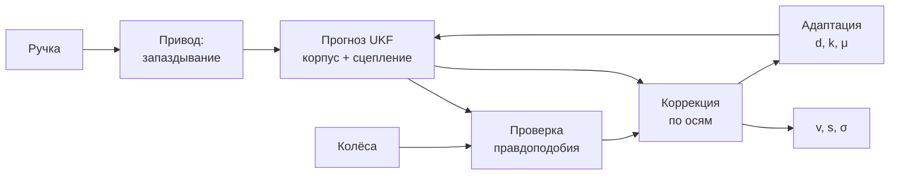

# Математическая модель движения трамвая

Адаптивная нелинейная модель и фильтр для резервного вычисления скорости и
положения без GNSS и инерциальных систем. Входы — только положение ручки
контроллера и одометрия (частоты вращения колёс).

Модель **параметризована**: структура уравнений фиксирована, все числовые
константы собраны в одном описании `Params`
([estimator_core.py](ros2_ws/src/tram_state_estimator/tram_state_estimator/estimator_core.py)).
Константы вагона из ТЗ подставлены в лист `config/tram.yaml`: они получены
калибровкой по записанным прогонам (раздел 0). Разделы 1–9 описывают модель в
общем виде, раздел 0 — как она применена к данным кейса.

---

## Содержание

- [0. Решение на данных ТЗ](#0-решение-на-данных-тз)
- [Что где](#что-где)
- [1. Корпус](#1-корпус)
- [2. Привод и аппроксиматор](#2-привод-и-аппроксиматор)
- [3. Сцепление и проскальзывание](#3-сцепление-и-проскальзывание)
- [4. Модель измерений](#4-модель-измерений)
- [5. Фильтр](#5-фильтр)
- [6. Адаптация параметров](#6-адаптация-параметров)
- [7. Срывы и отказы датчиков](#7-срывы-и-отказы-датчиков)
- [8. Что проверено](#8-что-проверено)
- [9. Ограничения](#9-ограничения)
- [Лист параметров](#лист-параметров)
- [Подстановка констант из ТЗ](#подстановка-констант-из-тз)
- [Соответствие постановке](#соответствие-постановке)

---

## 0. Решение на данных ТЗ

### 0.1. Что показали данные

122 прогона двух трамваев (30618 — 103, 30639 — 19), 36,7 ч. Разбор —
[`analysis/explore.py`](analysis/explore.py), [`explore2.py`](analysis/explore2.py).

| Факт | Следствие |
| --- | --- |
| Скорость тележек пишется **в км/ч**, а не в м/с, как сказано в README датасета: отношение к скорости GNSS 3,595–3,616 во всех прогонах | `meas_units: km_h` |
| Остаток масштаба: 0,9986 у 30618, 1,0045 у 30639 | общий `meas_scale = 1,0013`; разница вагонов — ограничение |
| Тележки ~9,4 Гц каждая, в разные моменты; ручка 20 Гц; разрывы тележек до ~1 с | ядро принимает показания каждой тележки по отдельности |
| После перевода единиц колёса отличаются от GNSS не больше чем на 0,16 м/с в 99 % времени | колёса точнее модели привода |
| Отказы: застывший датчик одной тележки (1,28 м/с 40 с), ноль одной тележки на ходу | обратимая диагностика ядра (раздел 7) их ловит |
| **Ошибки ручки:** в части прогонов вагон разгоняется при «тормозной» позиции (−8…−15) | правило согласия тележек (0.3) |
| GNSS есть в 86 прогонах; две антенны разнесены на 12,3 м вдоль вагона, rover впереди | курс на старте даже на стоянке |
| Высота за прогон меняется до 47 м | z нужна из карты путей |
| Прогоны `30618_21dd3af3` и `30618_f3b8c99b` совпадают | дубликат в датасете |

### 0.2. Калибровка (офлайн, разрешена ТЗ)

Прогоны делятся на обучающие и отложенные: каждый пятый отложен (98 / 24).

* **Привод — таблица** `A(u, v)`: ускорение на ровном пути по 31 позиции
  ручки (u = позиция / 15) и 11 узлам скорости, билинейная, подобрана методом
  наименьших квадратов со сглаживанием
  ([`calib_drive.py`](analysis/calib_drive.py)). Отсчёты, противоречащие ручке
  (разгон при торможении и наоборот), в подгонку не идут. Запаздывание
  0,1 с, инерция 0,4 с — перебором по отложенной выборке. Ошибка ускорения на
  отложенных прогонах 0,175 м/с² (СКО; сюда входят уклоны, которых модель не
  видит). Таблица нелинейна: тяга растёт до позиции +9 (~0,9 м/с²), падает со
  скоростью (0,57 м/с² при 14 м/с на +15); позиции −9…−15 — торможение
  ~1,0–1,5 м/с²; позиция −8 особая: выше 2 м/с даёт лишь −0,3…−0,6 м/с².
* **Масштаб показаний, шум** — по установившемуся движению против скорости
  GNSS ([`calib_sheet.py`](analysis/calib_sheet.py)).
* Результат — [`config/tram_calibration.json`](ros2_ws/src/tram_state_estimator/config/tram_calibration.json),
  из него генератор делает лист `config/tram.yaml`.

В ядре таблица подключается без изменения структуры (раздел 2): сила привода
`F = M·k·(A(u, v) − A(0, v))`, сопротивление `W = −M·A(0, v)` — строка
выбега. Масштабы `k_т`, `k_б` адаптируются поверх таблицы.

### 0.3. Согласие тележек сильнее модели

В данных вагон разгоняется при «тормозной» позиции ручки. Прежде фильтр
верил модели больше, чем обеим тележкам: при команде тормоза держал скорость у
нуля (раньше неопределённость не росла — вагон не катится назад), и масштабы
привода уходили в границу. Теперь показание принимается вопреки модели, если

* оно согласно со всеми остальными тележками (разница ≤ `agree_tol` = 0,3 м/с,
  их показания не старше `agree_age`);
* ни одна тележка не ускоряется физически невозможно (признак буксования из ТЗ
  «резкий рост скорости колёс» по-прежнему отвергает);
* срыв этим не объясняется (блокировка, неоднозначность «стоим или скользим»,
  срыв обеих тележек разом — одновременный скачок показаний, раздел 7).

Тогда неопределённость скорости расширяется до расхождения, и показание
принимается. Оконное измерение масштаба привода тоже проходит проверку
правдоподобия: мусорное окно (ошибка ручки) его не сдвигает.

### 0.4. Время и публикация

Нода [`tram_node.py`](ros2_ws/src/tram_state_estimator/tram_state_estimator/tram_node.py)
не зависит от часов: время — `header.stamp` входных сообщений (время из bag).
Связка [`runner.py`](ros2_ws/src/tram_state_estimator/tram_state_estimator/runner.py)
делает шаги ядра на сетке 50 мс по этим меткам: пришло сообщение с меткой `t` —
выполнены все шаги до `t`, каждый опубликован с меткой своего момента.

* `/result/velocity` (`VelocitySensor`), `/result/position` (`Odometry`),
  `/result/acceleration` (`AccelStamped`), `/tram/estimator_status` — 20 Гц.
* Время на один выход: медиана 2,1 мс, 99 % — 4,2 мс, максимум 24 мс (Python,
  Windows); допуск ТЗ «вход → результат» — 100 мс. 22-минутный прогон
  обрабатывается за 70 с.
* Та же связка используется в офлайн-оценке, поэтому числа ниже — то, что
  опубликует нода.

### 0.5. Положение x, y, z

Судья сравнивает x, y, z в метрах. Колёса дают только пройденный путь, поэтому
форму пути даёт **карта путей**.

1. **Начальная выставка по GNSS** — только первые `init_window_s` = 3 с и
   только пока вагон стоит. Начало координат — первая точка GNSS master
   (x — восток, y — север, z — вверх); курс — вектор master → rover,
   усреднённый по окну. После окна GNSS не используется.
2. **Карта путей** ([`build_map.py`](analysis/build_map.py),
   [`track_map.py`](ros2_ws/src/tram_state_estimator/tram_state_estimator/track_map.py))
   собрана офлайн из траекторий GNSS прогонов: 27,5 тыс. точек (клетка 1 м ×
   сектор курса 15°) с направлением движения и высотой. В ноде она хранится в
   широте/долготе и переводится в систему прогона при выставке.
3. **Движение по карте**: на каждом шаге точка сдвигается на пройденный путь по
   курсу и притягивается поперёк к оси пути с тем же курсом (встречный путь
   отсекается курсом). На стрелке преобладает ветка, по которой ездили чаще.
   Высота — из карты. Ушла с карты — ищет путь с тем же курсом в
   расширяющемся радиусе.
4. **Множитель пути по карте** 0,99777: карта из усреднённых положений антенны
   на 0,22 % короче пути колёс (калибровка по обучающим прогонам).
5. **Привязка к остановкам**: 49 устойчивых точек остановки (платформы,
   стоп-линии; стояли ≥ 3 прогонов с разбросом ≤ 4 м). Если вагон стоит
   дольше 8 с и точка остановки с тем же курсом в окне 3σ вдоль пути
   (σ растёт с путём от прошлой привязки: ~6–15 м) — положение вдоль пути
   переносится в неё. Остановка в очереди за другим трамваем (~30 м) в окно не
   попадает.

### 0.6. Результаты на отложенных прогонах

[`analysis/evaluate.py`](analysis/evaluate.py) — «как судья»: прогон
воспроизводится в порядке записи через ту же связку, GNSS подаётся только
первые 3 с, пары «выход — эталон» по ближайшей метке в пределах 0,05 с.
Эталон — GNSS master. **Карта и калибровка — только по обучающим прогонам.**

| | Значение |
| --- | --- |
| Скорость, средняя \|ошибка\| | **0,049 м/с** (оценка по двум тележкам с заглядыванием на 0,1 с вперёд — 0,036) |
| Положение, средняя 3D-ошибка | **4,7 м** (17 прогонов по ~5,5 км, ~20 мин) |
| Положение к концу прогона, медиана | **1,8 м** |
| Трамвай 30618, средняя 3D по прогонам | 0,9–4,3 м |
| Трамвай 30639 | 9–23 м (масштаб колёс отличается на 0,45 %) |
| Частота публикации | 20 Гц |

Путь к этим числам: положение по прямой из начального курса — тысячи метров;
карта — 10,4 м; с множителем и привязкой к остановкам — 4,7 м.

### 0.7. Ограничения решения на данных

1. **Выбор ветки на стрелке не наблюдаем** по колёсам и ручке. Выбирается
   преобладающая ветка. В 3 из 17 отложенных прогонов вагон в конце ушёл на
   редкую ветку: ошибка к концу 54–131 м.
2. **Масштаб колёс у двух трамваев разный** (0,45 %); вагон нода не знает, лист
   общий. Привязка к остановкам гасит накопление, но у 30639 ошибка выше.
3. **Система координат судьи не описана.** Принято: ENU от первой точки GNSS
   master прогона. Если у судьи другое начало, параметры `origin_lat/lon/alt`
   задают его без правки кода.
4. **Карта собрана из GNSS обучающих прогонов.** В основном контуре GNSS нет;
   карта — офлайн-данные, как калибровка. Это стоит подтвердить у
   организаторов. Если проверочный маршрут выйдет за карту, положение ведётся
   по курсу, пока путь с тем же курсом не найдётся снова.
5. **Одинаковое медленное буксование обеих тележек** не отличить от разгона:
   согласие тележек его примет. Резкий срыв обеих тележек (скачок показаний
   на 20 % скорости и больше) распознаётся как срыв всех осей, скорость на
   это время ведёт модель (раздел 7).
6. Эталон GNSS сам содержит выбросы (скорость на отсчёт падает до 0); в
   средних числах они есть.

---

## Что где



Прогноз по сигналу управления, коррекция по одометрии. Каждое измерение
оси проходит проверку правдоподобия; отвергнутое состояние не меняет. Когда
верить нечему, модель работает разомкнуто, а неопределённость растёт.

Обозначения: `s` — путь, `v` — скорость корпуса, `u` — нормированный момент
привода (−1…+1), `d` — приведённое возмущение, `k_т`, `k_б` — масштабы тяговой
и тормозной характеристик, `μ` — доступное сцепление, `ω_a` — частота вращения
оси, `N` — нагрузка на ось.

---

## 1. Корпус

Задача одномерная: вагон едет по рельсам, положение — координата вдоль пути.

```math
\dot s = v, \qquad
M\,\dot v \;=\; F_{\text{кор}} \;-\; W(v) \;+\; M\,d
```

`F_кор` — сила, реально переданная корпусу (раздел 3), `W(v)` — сопротивление
движению, `d` — приведённое возмущение.

Сопротивление — форма Дэвиса: постоянная часть (качение, подшипники), линейная
(механические потери), квадратичная (аэродинамика):

```math
W(v) \;=\; A + B\,v + C\,v^2 \quad (v > 0)
```

Возмущение `d` собирает всё неучтённое: уклон, отклонение массы от номинала,
ветер, ошибку коэффициентов `W`. Моделируется случайным блужданием и
оценивается вместе с состоянием.

> **Масса и уклон не разделяются** по одному продольному каналу: рост массы и
> подъём дают одинаковый отклик. Обе величины попадают в `d`; для скорости и
> положения разделение не требуется.

Направление движения принято «вперёд» (`v ≥ 0`): одометрия беззнаковая, откат
ею не виден.

---

## 2. Привод и аппроксиматор

Позиция ручки — **команда**, а не момент: между ними лежат набор поля и
ограничитель рывка. Модель первого порядка с чистым запаздыванием:

```math
\tau_{\text{пр}}\,\dot u + u \;=\; \Phi\big(n(t-\tau_{\text{з}})\big)
```

`Φ` — таблица листа «позиция → доля полного момента», отдельная для тяги
(`notch_tract`) и торможения (`notch_brake`). Число позиций — длина таблицы,
поэтому оно может различаться для тяги и торможения, а зависимость может быть
нелинейной. Дробная позиция (непрерывная ручка) интерполируется, позиция за
пределами таблицы даёт полный момент. Заглушка — линейная таблица на 4
позиции в обе стороны.

Сила привода — **нелинейный аппроксиматор**: нелинейна по скорости, линейна по
адаптируемым масштабам. Тяга и торможение описываются раздельно:
электродинамический тормоз гаснет у нуля и замещается механическим, одна
кривая на оба знака не описывает ни одну из них.

```math
F_{\text{пр}}(u,v) \;=\;
\begin{cases}
k_{\text{т}}\,F_{\text{т}}\,u\,\min\!\big(1,\, v_{\text{баз}}/v\big), & u>0\\[4pt]
k_{\text{б}}\,F_{\text{б}}\,u\,\big[h + (1-h)\min\!\big(1,\, v/v_{\text{ЭД}}\big)\big], & u<0
\end{cases}
```

Первая форма — полка постоянного момента, затем ослабление поля (постоянная
мощность). Вторая — торможение: ниже `v_ЭД` электродинамический тормоз
гаснет, а механический подхватывает долю `h = brake_hold_frac` полной силы.
`h = 1` — полное замещение (заглушка), `h = 0` — тормоз гаснет вместе с ЭД.
Прежняя редакция гасила тормоз в ноль при любом вагоне и расходилась с
текстом выше.

**Табличный режим.** Если в листе задана таблица `acc_table` на сетках
`acc_u`, `acc_v`, привод описывается ею, а не паспортными кривыми:

```math
F_{\text{пр}}(u,v) \;=\; k\,M\,\big(A(u,v) - A(0,v)\big),\qquad
W(v) \;=\; -M\,A(0,v) \;(\ge 0)
```

`A` — ускорение на ровном пути, билинейная интерполяция; строка `u = 0` —
выбег, то есть сопротивление движению. `k = k_т` при тяге, `k_б` при
торможении. Так применена модель на данных кейса (раздел 0.2); структура
фильтра не меняется.

---

## 3. Сцепление и проскальзывание

Физика плохой погоды здесь. Привод может потребовать больше, чем даёт рельс.
Корпусу передаётся сила, **ограниченная сцеплением**:

```math
F_{\text{кор}} \;=\; \operatorname{clip}\!\Big(F_{\text{пр}},\; -\mu N_{\text{торм}},\; +\mu N_{\text{пр}}\Big)
```

`N_пр`, `N_торм` — суммарная нагрузка на моторные и тормозные оси, `μ` —
доступное сцепление. Без этого предела разомкнутый прогноз на льду разгонял бы
вагон силой, которой там быть не может: проверка на имитаторе давала ошибку
пути в километры.

`μ` — оцениваемый параметр (случайный, зависит от погоды). Он наблюдаем только
при насыщении, поэтому оценивается по признакам срыва (раздел 6).

### Крип

Передача силы требует проскальзывания колеса относительно рельса. В рабочей
области, до пика характеристики, оно линейно по нагрузке оси:

```math
\xi_a \;=\; c\,\frac{F_a}{N_a} \;-\; c_0,
\qquad F_a = \text{доля } F_{\text{кор}} \text{ на оси } a
```

Под тягой колесо опережает корпус (`ξ > 0`), под торможением отстаёт
(`ξ < 0`), ненагруженная ось идёт чуть медленнее корпуса (`c_0` — сопротивление
вращению). За пиком характеристики линейность нарушается — это и есть срыв,
он ловится проверкой правдоподобия (раздел 5), а не моделью крипа.

---

## 4. Модель измерений

Показание оси:

```math
\boxed{\;\omega_a r \;=\; v\,(1 + \xi_a)\;}
```

Систематическая ошибка одометрии (крип) **предсказывается и вычитается**, а не
принимается за шум. Прогноз крипа считается по номинальной силе (`k = 1`), а
не по оцениваемой: иначе неточность самого коэффициента `c` смещала бы масштаб
привода — проверка показала уход в границу.

Дисперсия измерения нагруженной оси включает неопределённость коэффициента
крипа: `σ² = σ_meas² + (v·σ_creep)²`.

**Пересчёт показаний.** Датчик задаётся листом, без правки кода:

| Параметр | Что задаёт |
| --- | --- |
| `meas_units` | единицы: `rad_s`, `rpm`, `hz` (об/с), `pulses_s` (с `ppr`), `m_s`, `km_h` |
| `sensor_ratio` | передаточное число от колеса к валу датчика; 1 — датчик на колесе |
| `sensors_per_axle` | 2 — оба борта, 1 — один |
| `sensor_axles` | на каких осях есть датчики |

Показания переводятся в скорость обода колеса, м/с, до всякой обработки:

```math
v_w \;=\; \frac{k_{\text{ед}}\;\hat\omega_{\text{вал}}}{i}\;r
```

где `k_ед` — перевод единиц в рад/с, `i` — передаточное число. Для линейных
единиц (`m_s`, `km_h`) передаточное число не применяется. Вектор показаний
идёт подряд по осям с датчиками, по `sensors_per_axle` на ось; нода проверяет,
что в сообщении ровно столько значений, и иначе отбрасывает его с ошибкой.
Если задан параметр ноды `wheel_names` (имена датчиков в порядке листа),
показания берутся по `JointState.name`, а не по позиции в сообщении.

**Частота датчиков.** Показания колёс могут приходить реже цикла фильтра.
Шаг без нового сообщения — только прогноз; производная скорости колеса и
время стоянки считаются по реальному интервалу между показаниями. Прежде
одно и то же показание учитывалось на каждом шаге заново: при датчиках 20 Гц
и цикле 100 Гц это давало 37 ложных срывов за прогон, теперь 0.

**Приведение к оси пути.** На кривой внешнее колесо проходит больший путь.
Среднее по бортам оси равно скорости центра колеи независимо от радиуса.
При одном датчике на ось усреднять нечего: он читает путь своего рельса, и
дисперсия измерения увеличивается на `(v · curve_ratio_max)²`, где
`curve_ratio_max = b/R_min`. Разброс масштаба осей (износ бандажа)
выравнивается на выбеге: там срыв исключён, поэтому расхождение осей
относится к датчику, а не к физике.

---

## 5. Фильтр

Сигма-точечный (UKF), состояние `x = [s, v, d, k_т, k_б]`. Модель нелинейна и
по процессу (предел сцепления, ослабление поля), и по измерению.

**Прогноз.** Дрейф параметров включается только там, где параметр наблюдаем:
возмущение — на выбеге (привод не действует), масштаб тяги — под тягой,
масштаб торможения — под торможением. Иначе возмущение и масштаб привода
поглощают друг друга: по данным они неразличимы.

**Коррекция.** Измерения осей обрабатываются по одному. Оси упорядочиваются по
невязке — сначала согласованное большинство, затем подозрительные, поэтому
ось, читающая заведомо больше остальных (буксование), не тянет состояние на
себя. Измерение отвергается, если:

- нормированная невязка `ν²/S` превышает порог (по умолчанию 9, то есть 3σ);
- либо ускорение колеса выше физического предела корпуса плюс запас: колесо не
  может ускоряться быстрее вагона, значит, оно срывается;
- либо идёт срыв в разгаре и показание уходит в сторону срыва.

Отвергнутое измерение состояние не меняет. Если отвергнуты все и срывом это не
объясняется, неопределённость по ускорению `d` раздувается до предела,
правдоподобного при текущей команде (без команды тормоза скорость падает не
быстрее уклона и сопротивления). Так блокировка фильтра заканчивается за
ограниченное время, если ошибся сам фильтр.

**Нет одометрии.** При устаревших данных нода вызывает разомкнутый шаг:
прогноз без коррекции, неопределённость растёт. Подставлять нули нельзя — это
выглядело бы остановкой.

**Нет ручки.** При устаревшем сигнале ручки скорость и путь по-прежнему
корректируются по колёсам (модель использует последнюю позицию), но `d`, `k_т`,
`k_б` не адаптируются: иначе их испортила бы неверная команда.

**Старт.** Скорость берётся из первых показаний, а не из нуля: под тягой —
минимум по осям (буксующие читают больше корпуса), при торможении — максимум
(заблокированные читают меньше), на выбеге — медиана. Прежде при перезапуске
ноды на 12 м/с фильтр ~7 с отвергал «слишком большие» показания; теперь
оценка точна с первого шага.

**Стоянка.** Принятые показания на нуле и оценка тоже около нуля — скорость
обнуляется. Это даёт точное измерение `v = 0`: каждая остановка сбрасывает
накопленную ошибку скорости, поэтому дрейф положения растёт линейно с путём.

**Неоднозначность «стоим или скользим».** Колёса перестают свидетельствовать
о скорости корпуса, если до этого оценка подтверждалась колёсами (не дольше
`t_valid` назад), отвергнуты все оси, и при этом

- либо идёт торможение и причина — срыв (блокировка колёс);
- либо все колёса разом показывают ноль при скорости выше `v_dead_ref`
  (блокировка или общий отказ датчиков — по этим входам их не различить).

С этого момента выставляется флаг `ambiguous`:

- нулевые показания не принимаются, скорость ведёт модель с пониженным
  сцеплением — оценка остаётся сверху, а не падает в ноль при скользящем вагоне;
- стоянка не объявляется, `valid = false`;
- публикуемая `σ_v` не меньше половины скорости в начале срыва, а `σ_s`
  нарастает на ту же величину за каждую секунду и остаётся после снятия флага:
  без внешней привязки ошибка пути сама не уходит.

Оценка сверху — безопасная сторона: вагон считает себя быстрее и дальше, то
есть ближе к тому, что впереди. На имитаторе при общем отказе датчиков на
сухом рельсе это +122 м пути (σ_s к концу 242 м); при блокировке на льду
−200 м (σ_s 418 м) — там сцепление скольжения у имитатора ниже `μ_min`.

Флаг снимается, только когда колёса снова покатятся: принятые показания выше
`v_standstill` и срыва нет. Если вагон на самом деле остановился, флаг
держится до трогания — по этим входам остановку после скольжения подтвердить
нельзя. Прежде через ~25 с нули принимались, и публиковалось `v = 0` с почти
нулевой `σ` и `valid = true`, пока вагон ещё скользил.

Условие «из подтверждённого состояния» нужно потому, что после долгого
буксования всех осей оценка сама ошибочна, и при торможении завышенная оценка
выглядит так же, как блокировка. Защёлка тогда держала бы неверную скорость
(на имитаторе +315 м пути вместо +70 м); вместо неё работает общий механизм
раздувания неопределённости.

---

## 6. Адаптация параметров

Параметры адаптируются только там, где они наблюдаемы, и разными способами:

| Параметр | Как | Когда |
| --- | --- | --- |
| Возмущение `d` | UKF, через ковариацию | установившийся выбег, `v > v_адапт` |
| Масштаб тяги `k_т`, торможения `k_б` | оконное измерение (ниже) | установившаяся тяга/торможение, `v > v_адапт`, нет срыва |
| Сцепление `μ` | признаки насыщения | срыв: падает к `μ_min`; иначе медленно к номиналу |
| Масштаб осей | выравнивание по медиане | выбег, принятые измерения |

**Масштаб привода.** За окно установившегося режима вагон меняет скорость на

```math
M\,(v_2 - v_1) \;=\; k\int F_{\text{ном}}\,dt \;-\; \int W\,dt \;+\; M\,d\,T
\quad\Longrightarrow\quad
k_{\text{изм}} \;=\; \frac{M\,(\Delta v - d\,T) + \int W\,dt}{\int F_{\text{ном}}\,dt}
```

`k_изм` входит в фильтр как обычное линейное измерение параметра. Разность
скоростей гасит постоянное смещение одометрии (крип, ошибка радиуса), поэтому
сигнал устойчив там, где шаговая невязка бесполезна: через шаговую невязку
масштаб уходил в границу при истинных 0,9 — смещение измерения на порядок
больше полезного сигнала.

Параметры удерживаются в физически возможном диапазоне.

---

## 7. Срывы и отказы датчиков

| Ситуация | Признак | Реакция |
| --- | --- | --- |
| Буксование части осей под тягой | нагруженная ось отвергнута в сторону «больше», и это подтверждено не одной моделью: резкий рост колеса (скачок, производная за пределом) или другая ось читает меньше | остальные оси держат скорость; `μ` падает; ось не участвует |
| **Срыв всех осей разом** (юз или буксование обеих тележек) | скачок показаний всех осей одного знака за `slip_pair_s` против собственного тренда колеса (вторая тележка может сорваться позже первой на это время), каждый не меньше `slip_jump` и `slip_rel`·v; после скачка показания по ту же сторону от прогноза модели; знак не против ручки: буксование не начинается при ручке в торможении, юз — при ручке в тяге | показания в сторону срыва не принимаются — это лишь граница (при юзе корпус не медленнее колеса, при буксовании не быстрее); скорость ведёт модель: таблица привода с силой по ручке, `μ` не снижается; σ скорости растёт по измеренной ошибке разомкнутого прогноза (`slip_sigma_a`); `slip`, `slip_all = ±1`, режим SLIP |
| Конец срыва всех осей | все оси скачком вернулись; или все оси вернулись плавно: производная колеса отошла от ρ·(ускорение модели) (ρ — показание/прогноз) в сторону корпуса больше `slip_ret_a`, а потом снова ближе `a_slip_margin`/2; или все новые показания принимаются подряд `slip_ok_s`; или `slip_t_max`; или все показания в ноль; или оценка шума выросла так, что начальный скачок в неё укладывается | колёса снова принимаются; производная колёс начинается заново от ускорения модели. Нули — не остановка: неоднозначность «стоим или скользим», оценка держится, `valid = false` |
| Блокировка при торможении | тормозные оси ниже `lock_ratio` прогноза (колесо за пиком сцепления) | модель несёт состояние с пониженным `μ`; флаг `ambiguous`; нули не принимаются, пока колёса не покатятся |
| **Высокий шум показаний** (аномально высокая дисперсия) | оценка шума оси по вторым разностям (медиана за `noise_n` показаний) выше `sigma_meas` | дисперсия измерения растёт до оценки, пороги скачка и производной расширяются на `noise_k` σ шума: шум — не срыв, фильтр его усредняет; оценка в выходе `meas_noise` |
| Оборванный датчик | ноль, когда и остальные датчики, и оценка корпуса больше `v_dead_ref` | колесо исключается из оси |
| Залипший датчик | неизменные отсчёты дольше `stuck_n`, пока остальные изменились больше `stuck_dv` | колесо исключается из оси |
| Исключённый датчик снова согласен с остальными или с подтверждённой оценкой корпуса | расхождение не больше `recover_tol + recover_rel·v` в течение `t_recover` | колесо возвращается |
| Отказ всех датчиков в ноль | все оси разом в ноль на ходу | `ambiguous`, модель разомкнута, `σ_v`, `σ_s` расширены |
| Отказ всех датчиков в другое значение | резкий скачок всех показаний | срыв всех осей (выше) или, если скачок меньше `slip_rel`·v, отвержение одного показания и дальше — согласие осей |
| Нет данных колёс | устаревшие входы | разомкнутый шаг |
| Нет данных ручки | устаревший вход | коррекция по колёсам, параметры заморожены |

Исключение датчика обратимо. Прежде оно было навсегда: пятно льда,
заблокировавшее одну ось на 0,5 с, выключало её датчики до перезапуска.
Одинаковые отсчёты сами по себе залипанием не считаются: на постоянной
скорости реальный энкодер выдаёт одно и то же число. Ноль считается обрывом,
только если движение подтверждает и оценка корпуса: при буксовании на месте
моторные колёса крутятся, вагон стоит, и прежде как «оборванные»
исключались исправные датчики холостых осей — медиану давали буксующие.

Оценка помечается `valid = false`, когда принятых измерений нет дольше
`t_valid`, нет данных колёс или выставлен `ambiguous`. Потребитель обязан это
учитывать. Во время срыва всех осей колёса не принимаются, поэтому через
`t_valid` оценка тоже `valid = false`, а режим — SLIP (не DEGRADED): скорость
ведёт модель.

**Срыв всех осей (юз или буксование обеих тележек).** У вагона кейса обе
тележки моторные и тормозные — ненагруженной оси, которая показала бы
скорость корпуса, нет. Когда срываются обе, они согласны между собой, и
правило «согласие осей сильнее модели» (оно нужно для ошибок ручки) прежде
принимало срыв за движение: при юзе −30 % оценка была как у голых колёс.
Теперь признак срыва — одновременный скачок показаний обеих тележек одного
знака против их собственного тренда (не против модели: при ошибке ручки
модель ошибается на 1–2 м/с², а колёса меняются плавно), на 20 % скорости и
больше, и после скачка показания лежат по ту же сторону от прогноза модели
(«рост колёс без соответствующего ускорения по модели», «отрицательное
рассогласование при торможении»). Порог 20 % — не ниже: в записях есть
сбои меток времени (показания обеих тележек запаздывают на ~1 с, потом
запаздывание разом исчезает) — это скачок на 7–13 % скорости, и принять его за
юз значило бы держать неверную скорость до конца срыва.

Пока идёт срыв, показание в сторону срыва говорит только о границе: при юзе
корпус не медленнее колеса, при буксовании не быстрее. Скорость ведёт модель —
таблица привода с силой по ручке; `μ` по такому срыву не снижается (иначе
модель перестала бы тормозить или разгонять вагон как раз тогда, когда она
одна держит скорость). Неопределённость ускорения на это время —
`slip_sigma_a`, измеренная ошибка разомкнутого прогноза на обучающих
прогонах, поэтому `σ_v` растёт честно (за 4 с — до ~0,6–0,7 м/с). Срыв
кончается, когда все тележки скачком вернулись к корпусу; когда все
тележки плавно догнали корпус (см. ниже); когда все новые показания
принимаются подряд `slip_ok_s` = 1 с (прежде флаг держался после этого ещё
~8 с); через `slip_t_max`
(дальше колёсам снова верят: защита от защёлки при ложном срабатывании;
скачок обратно в следующие `slip_t_max` — это возвращение колёс, а не новый
срыв); если показания ушли в ноль или если оценка шума выросла так, что
начальный скачок в неё укладывается.

**Плавное отпускание.** Колесо может догнать корпус не скачком, а за
1–2 с. Если модель за время срыва ушла от вагона (таблица тормозит слабее
на 0,1–0,45 м/с²), вернувшиеся колёса всё ещё лежат «в сторону срыва» от
модели, и прежде их показания не принимались до `slip_t_max`: модель вела
скорость ещё до 8 с после юза (на обучающих прогонах). Теперь возвращение
видно по производной колеса, а не по уровню: уровень уходит вместе с
ошибкой модели, а ускорение модели ошибается не больше чем на ~0,45 м/с².
Колесо в ровном срыве — доля ρ скорости корпуса (ρ = показание/прогноз), и
его производная — ρ·(ускорение модели). Если производная колеса отходит от
неё в сторону корпуса больше `slip_ret_a` = 0,7 м/с² (колесо догоняет
корпус), а потом снова ближе 0,5 м/с² (катится с корпусом), колесо
считается вернувшимся, его показания принимаются. Без ρ в глубоком юзе
ровное колесо само отходило от ускорения модели на (1 − ρ)·|a|, и срыв
ложно снимался (юз −50 % на обучающих прогонах: 0,435 → 0,579 м/с). Порог
выбран на обучающих: 0,5 давал ложные возвращения при буксовании (+60 %:
0,395 → 0,613 м/с), 1,0 пропускал отпускание за 2 с.

Юз, перешедший в блокировку (сначала обе тележки −30 %, потом обе в ноль),
и блокировка при экстренном торможении (обе тележки за 0,2–1 с падают в
ноль) — не остановка. Нули снимают срыв всех осей, но сами не принимаются,
как бы ни выглядел последний шаг к нулю, и дальше работает неоднозначность
«стоим или скользим»: оценку держит модель, `valid = false`, σ широкая.
Прежде нули проходили правило согласия осей как остановка: на обучающем
прогоне оценка падала с 13 м/с в ноль с `valid = true`, пока вагон шёл
12,9 м/с, а на отложенном — с 6,4 м/с, когда последний шаг к нулю
(0,64 → 0 м/с) был меньше порога скачка. Цена: если юз, помеченный как срыв
всех осей, дошёл до настоящей остановки, `valid = false` держится до
трогания (подтвердить остановку по этим входам нельзя).

Пара скачков складывается и тогда, когда вторая тележка срывается позже
первой (в пределах `slip_pair_s`): ровное показание сразу после скачка больше
не считается «скачком обратно». Буксование не начинается при ручке в
торможении, а юз — при ручке в тяге: так выглядит отпускание юза, который
начался плавно и не был замечен, и прежде оно открывало ложное «буксование»
на 12 с.

**Признак насыщения сцепления** (`μ` падает) ставится только при независимом
подтверждении: блокировка, резкий рост колеса или несоответствие тележек
(другая ось читает меньше). Одно лишь отклонение от модели срыва не доказывает:
без ненагруженных осей его так же объясняет ошибка самой модели. Прежде каждое
такое показание снижало `μ`, модель переставала разгонять вагон, показания
уходили ещё выше, и признак поддерживал сам себя: на обучающих прогонах шум ×5
давал отставание оценки на 3–5 м/с, одиночный выброс ×3 — +3 м/с на 18 с.

**Высокий шум показаний** («аномально высокая дисперсия» из ТЗ) — это шум, а
не срыв. Шум оценивается по каждой оси: остаток линейной экстраполяции по двум
прошлым показаниям, медиана модуля за `noise_n` показаний (выбросы и сам
скачок срыва её не сдвигают). На чистых обучающих прогонах оценка 0,01–0,02
м/с при паспортной `sigma_meas` 0,05; при шуме ×5 — 0,2–0,4 м/с. Шум сверх
паспортного увеличивает дисперсию измерения и расширяет пороги скачка и
производной колеса — фильтр усредняет показания, а не отвергает их. Невязка
фильтра для этого не годится: в неё входит ошибка модели (ручка, уклон), и
она раздувала бы дисперсию как раз тогда, когда ошибается модель. Оценка
шума публикуется (`meas_noise` в `/tram/estimator_status`).

---

## 8. Что проверено

Имитатор объекта (`plant.py`) намеренно богаче модели оценщика: двухмассовый
привод, падающая характеристика сцепления, перераспределение нагрузки,
квантование энкодера, задержка, разброс масштаба датчиков. Числа ниже —
показательные: константы имитатора выдуманные, это проверка, что модель
считается и ведёт себя физично, а не характеристика конкретного вагона.

<!-- RESULTS:BEGIN -->
15 сценариев по 3 прогона ([`prototype/scenarios.py`](prototype/scenarios.py)).
Ошибка — оценка минус истина; «|ош|» — средняя абсолютная ошибка скорости
(в прежней редакции документа эта колонка ошибочно называлась СКО).

| Сценарий | \|ош\|, м/с | p95 | макс | ошибка пути, м |
| --- | --- | --- | --- | --- |
| сухо, разгон–выбег–торможение | 0,052 | 0,17 | 0,29 | 0,5 |
| дождь, умеренная тяга | 0,022 | 0,04 | 0,25 | 0,5 |
| дождь, буксование под полной тягой | 0,002 | 0,00 | 0,08 | −0,2 |
| наледь при разгоне (μ = 0,03) | 0,001 | 0,00 | 0,04 | −0,1 |
| кривая R = 20 м с переходными | 0,039 | 0,16 | 0,31 | 0,4 |
| подъём 3 % | 0,033 | 0,18 | 0,27 | 0,6 |
| дребезг тяга/тормоз, период 0,7 с | 0,050 | 0,11 | 0,29 | −0,0 |
| рельсовый тормоз | 0,080 | 0,27 | 1,31 | 0,3 |
| отказ одного датчика | 0,049 | 0,17 | 0,29 | 0,6 |
| залипание датчика | 0,052 | 0,17 | 0,29 | 0,4 |
| маршрут из трёх перегонов (135 с, ~970 м) | 0,079 | 0,19 | 1,41 | −1,8 |
| **отказ всех датчиков разом (в ноль)** | 2,252 | 8,49 | 9,17 | +121,9 |
| **блокировка всех колёс, наледь при торможении** | 2,353 | 5,27 | 5,62 | −141,1 |
| **блокировка всех колёс, μ = 0,02** | 2,891 | 6,19 | 6,45 | −202,3 |
| **обледенелый спуск 6 % с блокировкой** | 11,922 | 27,42 | 31,37 | −833,7 |

В сценариях с буксованием вагон почти не едет (колёса срываются), поэтому
относительная ошибка пути там непоказательна — смотрите абсолютную.

**Что видно.**

- В штатных режимах и при буксовании ошибка скорости 0,001–0,08 м/с, пути —
  доли метра, на маршруте из трёх перегонов — менее 2 м на 970 м.
- **Буксование не ломает оценку**: моторные оси срываются, холостые держат
  скорость, `μ` падает. До проверки правдоподобия по осям ошибка пути в этих
  сценариях доходила до километров.
- **Рельсовый тормоз** (сигнала о нём нет) фильтр отслеживает шаг за шагом.
- Четыре нижних сценария — граница модели (раздел 9, пункты 1–2). Во всех
  выставлен `ambiguous`, `valid = false`, ошибку пути покрывает опубликованная
  `σ_s` (отношение ошибки к `σ_s` не выше 0,5). Прежние ошибки пути в
  сценариях блокировки: −334, −416, −1318 м. Последний сценарий к тому же вне
  рабочей области: вагон разгоняется до 31 м/с при `v_max_line = 20`.
- **Ложная стоянка** (объявлена при движении): 0 во всех сценариях блокировки
  и отказа (прежде 5276, 8277 и 7909 отсчётов) и **702 из ~40 500 (1,7 %) на
  маршруте**. На маршруте это последние доли секунды торможения: тормоз
  имитатора клинит колёса у нуля ниже `v_adapt_min`, и нули принимаются за
  остановку чуть раньше времени. По замеру на прежней редакции (696 случаев)
  вагон в эти моменты ехал 0,98 м/с в среднем, максимум 1,33 м/с; остаток
  пути по оценке v²/2a — десятки сантиметров. Порог под тормоз имитатора не
  подгонялся.

**Адаптация.** Масштаб тяги `k_т` уходит от заглушки 1,0 к 0,81–0,96 и не
упирается в границу; при буксовании остаётся 1,0 (адаптация выключена). Значение
физически не «масса»: у имитатора вращательное сопротивление колёс даёт ещё
около 200 Н·с/м сверх заданного `res_B`, и масштаб поглощает эту разницу — на
подъёме 3 % он поглощает и уклон (0,60). Для оценки скорости это безразлично;
разделяет эти вклады режим опознавания (ниже).

**Опознавание при вводе в эксплуатацию**
([`prototype/identify.py`](prototype/identify.py)). Специальный профиль (разные
позиции ручки, ниже предела сцепления, с выбегами) принимается: 27 окон,
невязка 3 %. Найдено: тяга 30,7 кН (статистическая погрешность 2 %),
торможение 53,8 кН (3 %), `res_B` = 240 Н·с/м (13 %) при истинных 256 у
имитатора. Процедура находит расхождения со значениями листа (торможение
30 кН в заглушке), для чего и нужна.

**Статистическая погрешность занижает настоящую.** Тяга имитатора — 36 кН
(6300 Н·м × 2 оси / 0,35 м), найдено 30,7 кН: смещение −15 % при заявленных
2 %. Погрешность считается по разбросу невязки и не видит того, чего нет в
модели: податливости привода, падающей характеристики сцепления, крипа.
Поэтому принятое значение — первое приближение, его нужно сверять с
паспортом, а не подставлять вслепую.

Отсчёты ниже `v_adapt_min` в опознавание не идут. У самого нуля и на стоянке
тормоз вагон не замедляет, а форма тормоза силу предсказывает. На обычном
движении (разгон–выбег–торможение) процедура поэтому отказывает: окон
меньше 12. Это верный ответ: данных для разделения параметров там нет.

**Быстродействие** шага ядра (3000 шагов, Python 3.13, Windows, без
реального времени; итоговое ядро):

| Лист | медиана | p99 | p99,9 |
| --- | --- | --- | --- |
| имитатор: 4 оси, 8 датчиков, шаг 10 мс | 1,29 мс | 1,81 мс | 2,63 мс |
| вагон: 2 тележки, таблица привода, шаг 50 мс | 1,62 мс | 1,96 мс | 3,07 мс |

Бюджет цикла — 10 и 50 мс. Векторизация модели измерений дала выигрыш втрое
по максимуму (было 19,9 мс); скалярный путь таблицы привода без numpy — вдвое
(было 3,3 мс). Хвост определяет среда исполнения, не алгоритм. С картой путей
и публикацией на один выход ноды — медиана 2,1 мс, максимум 24 мс (раздел 0.4).
<!-- RESULTS:END -->

---

## 9. Ограничения

Честный список того, что модель не решает при доступных входах.

1. **Длительная блокировка всех колёс на льду двусмысленна.** Нулевые показания
   колёс неотличимы от остановки: входы в двух состояниях совпадают. Модель
   ведёт скорость по уравнению корпуса с пониженным сцеплением `μ_min`, нули
   не принимает, выставляет `ambiguous`, `valid = false` и расширенную `σ_v`
   (раздел 5). Точность пути в этом режиме определяется тем, насколько
   `μ_min` близок к сцеплению скольжения на самом деле: на имитаторе, где
   заблокированное колесо почти не тормозит, ошибка пути −200 м за 50 с
   скольжения, её покрывает опубликованная `σ_s`. Если вагон на самом деле
   остановился, флаг держится до трогания. Разрешить двусмысленность может
   только дополнительный вход (сигнал дверей, стояночного тормоза).
2. **Общий отказ всех датчиков** — та же двусмысленность. Нули всех колёс на
   ходу не принимаются, модель идёт разомкнуто с `ambiguous`; при торможении
   нули выглядят как блокировка, и модель берёт `μ_min` — оценка сверху
   (+122 м пути на сухом рельсе, покрыто `σ_s`). Прежде нули через несколько
   секунд принимались, и на ходу публиковалось `v → 0`.
3. **Масштаб привода, возмущение и коэффициенты сопротивления не разделяются**
   в обычном движении: все дают силу в уравнении корпуса. Если `W(v)` в ТЗ
   неточна, масштаб `k` поглощает разницу (и уклон на подъёме). Для скорости и
   положения это безразлично. Разделяет их режим опознавания при вводе в
   эксплуатацию (`res_*`, `F_*`, источник «измерение»).
4. **Богатый базис по скорости** (радиально-базисные функции) на обычном
   возбуждении даёт почти коллинеарные регрессоры, поэтому параметризация
   сведена к двум масштабам паспортных кривых. Уточнение формы кривых —
   отдельный шаг опознавания; в этой работе он проверен только для двух
   масштабов и двух коэффициентов сопротивления.
5. **Рельсовый тормоз не моделируется** (сигнала о нём нет): плавное торможение
   им фильтр отслеживает шаг за шагом, резкий скачок показаний отвергает.
6. **Откат вагона** одометрией не виден (беззнаковая).
7. **Предел сцепления оценивается эвристически** (по признакам насыщения), а не
   строгим байесовским обновлением.
8. **Датчики на валах двигателей хуже переносят буксование.** Тогда
   измеряются только моторные оси, а при буксовании срываются именно они:
   держать скорость нечем, модель пережидает срыв разомкнуто. На имитаторе
   (мокрый рельс, полная тяга, 55 с): ошибка скорости 3,3 м/с и пути +70 м
   против 0,00 м/с и −0,2 м при датчиках на колёсах всех осей. Это свойство
   компоновки датчиков, константами не лечится. Один датчик на ось (на всех
   осях) на буксовании не хуже двух.
9. **Все оси моторные — то же самое.** Холостых осей, которые держат скорость
   при буксовании, нет. На имитаторе (мокрый рельс μ = 0,06, полная тяга,
   55 с): средняя ошибка скорости 3,97 м/с, пути +70 м — против 0,00 м/с и
   −0,1 м при двух моторных осях из четырёх. Свойство вагона.
10. **Радиус колеса не наблюдаем.** Все оси меряют через один `r_nom`;
    выравнивание на выбеге убирает только разброс осей между собой. Ошибка
    радиуса переходит в ошибку пути один к одному: `r_nom` на 3 % больше
    фактического — путь +3,3 % (13,7 м на 422 м). После обточки бандажей
    `r_nom` нужно обновлять.
11. **Медленный крип ниже порога принимается.** Проверка правдоподобия ловит
    срыв, а не слабое проскальзывание, которое укладывается в допуск (3σ).
    Такое проскальзывание сверх предсказанного крипа смещает оценку скорости
    вверх в пределах допуска.
12. **Масштаб `k` поглощает уклон** (раздел 8: 0,60 на подъёме 3 %).
    Возмущение `d` адаптируется только на выбеге, а уклон под тягой
    приписывается приводу. На скорость и путь это не влияет, но значение
    `k` на уклоне — не характеристика привода.
13. **Плавный срыв обеих тележек не отличить от разгона.** Срыв всех осей
    распознаётся по скачку показаний (не меньше 20 % скорости за одно
    показание). Если обе тележки уходят от корпуса плавно или меньше чем на
    20 %, это неотличимо от ошибки модели (уклон, ошибка ручки), и согласие
    тележек показания примет. Признак ТЗ «высокий тяговый момент при низкой
    производной скорости» без ненагруженных осей по тем же причинам не
    используется: его так же дают уклон и ошибка ручки. Отпускание такого
    незамеченного юза (скачок вверх при ручке в торможении) новым срывом не
    считается. Обратная сторона: буксование обеих тележек при ручке
    «торможение» (ошибка ручки в записи) срывом всех осей не распознаётся —
    знак срыва не должен противоречить ручке. Тележки, сорвавшиеся с разницей
    больше `slip_pair_s` = 0,5 с, в пару не складываются.
14. **Во время срыва всех осей скорость — модель.** Ошибка растёт примерно на
    0,15–0,2 м/с за секунду (ошибка таблицы привода и уклоны; на обучающих
    прогонах разомкнутый прогноз через 4 с — 0,49–0,75 м/с СКО по фазам,
    `tools/slip_study.py --openloop`). На отдельных прогонах таблица тормозит
    слабее вагона на ~0,45 м/с², и за 4 с юза ошибка доходит до 1,3 м/с —
    всё равно меньше, чем у скользящих колёс. Срыв дольше `slip_t_max` = 12 с после этого снова принимается за
    движение. Скачок меньше 20 % скорости срывом всех осей не считается —
    такие скачки дают сбои меток времени в записях.
15. **Юз против блокировки решает порог.** Выше `lock_ratio` прогноза
    (половины скорости корпуса) колесо считается в частичном юзе, корпус
    тормозит с силой по ручке; ниже — блокировка, скольжение с `μ → mu_min`
    (оценка сверху, неоднозначность). Настоящее сцепление скольжения по этим
    входам не наблюдаемо; порог — допущение, а не измерение. Если во время
    срыва всех осей обе тележки ушли в ноль (блокировка или остановка) при
    оценке выше `v_dead_ref` = 2 м/с, это всегда неоднозначность:
    `valid = false` до трогания, даже если вагон на самом деле остановился.
    Плавное отпускание (без скачка) видно по производной колеса, только
    если колесо догоняет корпус быстрее `slip_ret_a` = 0,7 м/с² относительно
    модели: отпускание за 2 с на скорости ниже ~5 м/с так не видно, и тогда
    срыв снимается лишь через `slip_ok_s`, по нулям или через `slip_t_max`
    (на отложенных: буксование с отпусканием за 2 с — восстановление до
    8 с). Ложного «возвращения» в ровном юзе в синтетическом тесте нет
    при ошибке таблицы торможения −15…+10 % и глубине юза 30–45 %.
16. **Оценке шума нужно ~6 показаний** (0,6 с). В первую секунду шума
    отдельные показания ещё пересекают пороги: возможны короткие ложные
    признаки срыва и снижение `μ` (на обучающих прогонах с шумом ×5 — флаг
    `slip` в 1 % окна; в синтетическом тесте μ падает до ~0,1–0,15 и
    восстанавливается за десятки секунд, на таблице привода это не
    сказывается).

---

## Лист параметров

Единственный экземпляр листа — `Params`. Таблица ниже сгенерирована из него
скриптом `tools/gen_params.py`; там же генерируется `params.yaml`.

**Источник:** паспорт — из документации вагона, датчика или линии; измерение —
определяется опознаванием при вводе в эксплуатацию; настройка — параметр
фильтра. **Заглушка** — значение, при котором модель считается на имитаторе;
это не рекомендация, а то, что заменяется данными ТЗ.

<!-- PARAMS:BEGIN -->
#### Механика

| Параметр | Единицы | Источник | Смысл | Заглушка |
| --- | --- | --- | --- | --- |
| `M_nom` | кг | паспорт | номинальная масса вагона, средняя загрузка | 28000.0 |
| `r_nom` | м | паспорт | радиус колеса при среднем износе | 0.35 |
| `n_axles` | — | паспорт | число осей | 4 |
| `driven` | — | паспорт | моторные оси | true; true; false; false |
| `braked` | — | паспорт | оси с тормозом, участвующие в торможении | true; true; true; true |
| `v_max_line` | м/с | паспорт | максимальная скорость на линии | 20.0 |

#### Привод

| Параметр | Единицы | Источник | Смысл | Заглушка |
| --- | --- | --- | --- | --- |
| `F_notch` | Н | паспорт | тяга при полном отклонении ручки | 36000.0 |
| `F_brake` | Н | паспорт | тормозная сила при полном отклонении | 30000.0 |
| `v_base` | м/с | паспорт | скорость начала ослабления поля | 8.0 |
| `v_ed_fade` | м/с | паспорт | скорость затухания электродинамического тормоза | 1.5 |
| `brake_hold_frac` | — | паспорт | доля тормозной силы, которую механический тормоз сохраняет ниже v_ed_fade: 1 — полное замещение, 0 — тормоз гаснет вместе с ЭД | 1.0 |
| `notch_tract` | — | паспорт | доля полной тяги на позициях тяги 1…N; число позиций = длина списка | 0.25; 0.5; 0.75; 1.0 |
| `notch_brake` | — | паспорт | доля полной тормозной силы на позициях торможения 1…N; число позиций = длина списка | 0.25; 0.5; 0.75; 1.0 |
| `acc_u` | — | измерение | табличный привод: сетка нормированной команды u (позиция / число позиций); пусто — параметрическая модель F_notch/F_brake |  |
| `acc_v` | м/с | измерение | табличный привод: сетка скорости |  |
| `acc_table` | м/с² | измерение | табличный привод: ускорение на ровном пути A(u, v) по строкам acc_u, len(acc_u)·len(acc_v) значений; строка u = 0 — выбег, то есть сопротивление движению |  |
| `tau_drive` | с | измерение | постоянная времени привода | 0.3 |
| `delay_drive` | с | измерение | чистое запаздывание привода | 0.1 |
| `T_dead` | — | настройка | мёртвая зона по нормированному моменту | 0.05 |
| `t_confirm` | с | настройка | время подтверждения режима движения | 0.15 |

#### Сопротивление

| Параметр | Единицы | Источник | Смысл | Заглушка |
| --- | --- | --- | --- | --- |
| `res_A` | Н | измерение | постоянная часть сопротивления | 2400.0 |
| `res_B` | Н·с/м | измерение | линейная часть сопротивления | 55.0 |
| `res_C` | Н·с²/м² | измерение | квадратичная часть сопротивления | 3.5 |

#### Сцепление

| Параметр | Единицы | Источник | Смысл | Заглушка |
| --- | --- | --- | --- | --- |
| `mu_nominal` | — | паспорт | коэффициент сцепления сухого рельса | 0.25 |
| `mu_min` | — | паспорт | худшее сцепление (листопадная плёнка, лёд) | 0.02 |
| `tau_sat` | с | настройка | темп снижения сцепления при признаках срыва | 0.3 |
| `tau_rec` | с | настройка | темп восстановления сцепления без признаков срыва | 30.0 |
| `c_creep` | — | измерение | податливость по крипу: ξ = c · μ | 0.02 |
| `c_creep_drag` | — | измерение | крип ненагруженной оси от сопротивления вращению | 0.002 |
| `sigma_creep` | — | настройка | неопределённость самого коэффициента крипа | 0.004 |

#### Пределы корпуса

| Параметр | Единицы | Источник | Смысл | Заглушка |
| --- | --- | --- | --- | --- |
| `a_max_acc` | м/с² | паспорт | предельное ускорение корпуса | 1.5 |
| `a_max_brake` | м/с² | паспорт | предельное замедление корпуса, с рельсовым тормозом | 3.0 |
| `theta_max` | рад | паспорт | максимальный уклон линии | 0.06 |
| `d_extra` | м/с² | настройка | запас возмущения на отклонение массы и ветер | 0.3 |
| `a_free_decel` | м/с² | паспорт | предельное замедление БЕЗ команды тормоза: уклон и сопротивление | 0.75 |
| `lock_ratio` | — | настройка | показание оси ниже этой доли прогноза при торможении = блокировка (плавное торможение, в том числе рельсовым, отстаёт на проценты); выше — частичный юз: при срыве всех осей скорость ведёт модель с тормозной силой по ручке, ниже — колесо скользит за пиком сцепления, модель с μ → mu_min | 0.5 |
| `a_slip_margin` | м/с² | настройка | запас над пределом ускорения до признания срыва | 1.0 |

#### Срыв всех осей и шум

| Параметр | Единицы | Источник | Смысл | Заглушка |
| --- | --- | --- | --- | --- |
| `slip_all_on` | — | настройка | распознавать срыв ВСЕХ осей разом (юз или буксование обеих тележек) по одновременному скачку показаний; false — только прежние признаки | true |
| `slip_jump` | м/с | настройка | скачок показания оси против её собственного тренда за один интервал (сверх a_slip_margin·интервал и шума) — признак срыва оси | 0.3 |
| `slip_rel` | — | настройка | срыв всех осей — только если скачок каждой оси не меньше этой доли скорости: срыв — относительное проскальзывание, а скачки сбоя меток времени в данных (запаздывание показаний ~1 с, исчезающее разом у обеих тележек) — |a|·запаздывание, на обучающих прогонах 7–13 % скорости | 0.2 |
| `slip_pair_s` | с | настройка | скачки всех осей одного знака в этом окне — один срыв всех осей (тележка может сорваться позже другой на столько: её скачок помнится, ровное показание после него скачком обратно не считается) | 0.5 |
| `slip_cont_k` | σ | настройка | во время срыва всех осей показание дальше этого числа σ шума показания в сторону срыва не принимается (колесо ещё скользит, это лишь граница скорости корпуса); ближе или по другую сторону — принимается | 2.0 |
| `slip_t_max` | с | настройка | наибольшая длительность срыва всех осей: дальше колёсам снова верят (защита от защёлки при ложном срабатывании или смене масштаба датчиков) | 12.0 |
| `slip_ok_s` | с | настройка | срыв всех осей снимается, когда все новые показания столько времени подряд принимаются (колёса снова катятся с корпусом, в том числе после плавного отпускания без скачка); 0 — только скачок обратно, нули, шум или slip_t_max | 1.0 |
| `slip_ret_a` | м/с² | настройка | во время срыва всех осей колесо возвращается к корпусу плавно, если его производная отходит от ρ·(ускорение модели) в сторону корпуса больше этого (ρ — показание/прогноз, сверх шума производной); когда отход снова меньше половины a_slip_margin — колесо вернулось, показания принимаются. Ошибка ускорения модели — до 0,45 м/с²; 0 — только скачком | 0.7 |
| `slip_sigma_a` | м/с² | измерение | СКО ускорения модели при разомкнутом прогнозе (ошибка таблицы привода и уклоны; tools/slip_study.py --openloop): на время срыва всех осей σ возмущения равна этому, чтобы σ скорости росла честно | 0.15 |
| `noise_n` | отсчётов | настройка | окно оценки шума показаний оси по вторым разностям (медиана, выбросы и сам скачок срыва её не сдвигают) | 12 |
| `noise_k` | σ | настройка | шум сверх sigma_meas расширяет пороги скачка и производной оси на столько своих σ, а дисперсия измерения растёт до оценки шума: высокий шум — это шум, а не срыв | 3.0 |

#### Датчики

| Параметр | Единицы | Источник | Смысл | Заглушка |
| --- | --- | --- | --- | --- |
| `meas_units` | — | паспорт | единицы показаний: rad_s, rpm, hz (об/с), pulses_s (импульсы/с, с ppr), m_s, km_h | "rad_s" |
| `ppr` | имп/об | паспорт | импульсов на оборот вала датчика (для pulses_s) | 200 |
| `meas_scale` | — | измерение | поправочный множитель показаний (износ бандажей, погрешность номинала); определяется по эталонной скорости | 1.0 |
| `sensor_ratio` | — | паспорт | передаточное число от колеса к валу датчика: 1 — датчик на колесе; для m_s и km_h не применяется | 1.0 |
| `sensors_per_axle` | — | паспорт | датчиков на ось: 2 — оба борта, 1 — один | 2 |
| `sensor_axles` | — | паспорт | оси с датчиками (при датчике на валу двигателя — только моторные) | true; true; true; true |
| `curve_ratio_max` | — | паспорт | b/R_min: наибольшая относительная разница путей бортов на кривой; учитывается при одном датчике на ось | 0.038 |
| `sigma_meas` | м/с | паспорт | шум измерения скорости оси, с учётом квантования энкодера и окна измерения | 0.15 |
| `stuck_n` | отсчётов | настройка | неизменных отсчётов = подозрение на залипание датчика | 60 |
| `stuck_dv` | м/с | настройка | залипание признаётся, только если остальные датчики за это время изменились больше этого: на постоянной скорости реальный энкодер может выдавать одинаковые отсчёты | 0.5 |
| `recover_tol` | м/с | настройка | исключённый датчик возвращается, если расходится с остальными не больше recover_tol + recover_rel·v | 0.5 |
| `recover_rel` | — | настройка | относительная часть допуска возврата датчика | 0.1 |
| `t_recover` | с | настройка | сколько датчик должен согласоваться с остальными, чтобы вернуться в работу | 2.0 |
| `v_dead_ref` | м/с | настройка | скорость остальных, выше которой нулевой датчик считается оборванным | 2.0 |
| `axle_dot_alpha` | — | настройка | сглаживание производной скорости оси | 0.2 |
| `calib_gain` | — | настройка | темп калибровки масштаба осей на выбеге | 0.01 |
| `calib_v_min` | м/с | настройка | минимальная скорость калибровки масштаба | 2.0 |
| `scale_range` | — | паспорт | допустимый разброс масштаба оси (износ бандажа) | 0.1 |

#### Фильтр

| Параметр | Единицы | Источник | Смысл | Заглушка |
| --- | --- | --- | --- | --- |
| `gate_nis` | — | настройка | порог нормированной невязки (9 = 3σ) | 9.0 |
| `sigma_rej_frac` | — | настройка | доля предела ускорения в σ возмущения при отвержении всех измерений | 0.5 |
| `q_v` | м/с² | настройка | шум процесса по скорости | 0.05 |
| `q_d` | м/с²/√с | настройка | дрейф возмущения на выбеге | 0.02 |
| `q_k` | 1/√с | настройка | дрейф масштаба привода под нагрузкой | 0.003 |
| `p0_s` | м | настройка | начальная σ положения | 1.0 |
| `p0_v` | м/с | настройка | начальная σ скорости | 1.0 |
| `p0_d` | м/с² | настройка | начальная σ возмущения | 0.3 |
| `p0_k` | — | настройка | начальная σ масштаба привода | 0.1 |
| `k_min` | — | настройка | нижняя граница масштаба привода | 0.4 |
| `k_max` | — | настройка | верхняя граница масштаба привода | 1.6 |
| `adapt_on` | — | настройка | адаптация масштабов привода k_t, k_b по окнам установившейся тяги и торможения; false — масштабы остаются начальными | true |
| `t_adapt` | с | настройка | окно установившегося режима для адаптации масштаба привода (по реальному времени) | 3.0 |
| `sigma_k_meas` | — | настройка | σ оконного измерения масштаба привода | 0.05 |
| `adapt_f_min` | — | настройка | минимальная средняя нагрузка привода в окне, доля номинала | 0.3 |
| `t_sat_hold` | с | настройка | после признака срыва отвержение измерений считается объяснённым срывом | 3.0 |
| `v_adapt_min` | м/с | настройка | ниже этой скорости параметры не адаптируются (квантование энкодера у нуля) | 2.0 |
| `t_valid` | с | настройка | без принятых измерений дольше — оценка недостоверна | 1.0 |
| `agree_tol` | м/с | настройка | оси согласны, если их показания расходятся не больше этого; согласие всех осей перевешивает модель | 0.3 |
| `agree_age` | с | настройка | показание другой оси годится для проверки согласия, если оно не старше этого | 0.3 |

#### Стоянка

| Параметр | Единицы | Источник | Смысл | Заглушка |
| --- | --- | --- | --- | --- |
| `v_standstill` | м/с | настройка | полоса неразличимости стоянки | 0.3 |
| `t_standstill` | с | настройка | время подтверждения стоянки | 0.3 |

#### Выходная σ

| Параметр | Единицы | Источник | Смысл | Заглушка |
| --- | --- | --- | --- | --- |
| `sv_gain` | — | настройка | множитель σ скорости фильтра в публикуемой σ | 1.0 |
| `sv_floor` | м/с | измерение | пол публикуемой σ скорости на ходу | 0.0 |
| `sv_floor_stand` | м/с | измерение | пол публикуемой σ скорости на стоянке | 0.0 |
| `sv_age` | с | измерение | эффективный возраст показаний: к σ скорости добавляется модуль ускорения, умноженный на sv_age | 0.0 |
| `sv_rel` | — | измерение | относительная ошибка масштаба колёс: к σ скорости добавляется sv_rel·v | 0.0 |
| `ss_map` | м | измерение | σ положения вдоль пути от карты и точки привязки | 0.0 |
| `ss_rel` | — | измерение | рост σ положения на метр пути после выставки или привязки к остановке (масштаб колёс) | 0.0 |

<!-- PARAMS:END -->

---

## Подстановка констант из ТЗ

Для данных кейса это сделано; повторить (например, на новых прогонах):

```bash
cd analysis
py -3 bagio.py            # bag -> кэш numpy (один раз)
py -3 calib_drive.py      # таблица привода, запаздывание, инерция
py -3 calib_sheet.py      # масштаб, шум -> config/tram_calibration.json
py -3 build_map.py all    # карта путей и точки остановок -> config/track_map.npz
cd ../ros2_ws/src/tram_state_estimator
py -3 tools/gen_params.py # -> config/tram.yaml (и params.yaml имитатора)
cd ../../../analysis
# оценка на отложенных — с картой только из обучающих прогонов
py -3 build_map.py train cache/track_map_train.npz
TRAM_MAP=cache/track_map_train.npz py -3 evaluate.py
```

`config/tram.yaml` — полный лист: значения `Params`, заменённые калибровкой, и
параметры ноды. Нода объявляет по ROS-параметру на каждое поле `Params`
автоматически; несогласованный лист отвергается при старте с перечнем ошибок.
Структура уравнений от калибровки не меняется: листом задаются число осей
(здесь две тележки), единицы показаний, таблица привода, масштаб, шумы.

`config/params.yaml` — лист имитатора (`prototype/`, тесты): заготовочные
значения `Params` для модели с четырьмя осями и восемью датчиками.

---

## Соответствие постановке

**Ожидаемый результат ТЗ**

| Пункт ТЗ | Где |
| --- | --- |
| Модель тягового привода | таблица `A(u, v)` + запаздывание и инерция (0.2, 2) |
| Модель продольной динамики | уравнение корпуса, сопротивление, возмущение `d` (1, 0.2) |
| Учёт проскальзывания | предел сцепления, признаки срыва, согласие тележек, неоднозначность (3, 5, 7, 0.3) |
| Допущения и ограничения | 0.7, 9 |
| Пакет ROS 2 Humble, нода | `tram_state_estimator` (`tram_estimator`), `tram_vehicle_msgs`, `tram_msgs` |
| Подписка на входы, публикация выходов | `/vehicle/*` → `/result/velocity`, `/result/position` (0.4) |
| Сборка, запуск, параметры | README; параметры — «Лист параметров», `config/tram.yaml` |
| Запуск на rosbag, реальное время | `ros2 bag play` + `tram.launch.py`; время из bag, 20 Гц, ≤ 24 мс на выход (0.4) |
| Оценка точности по GNSS | `analysis/evaluate.py` (0.6) |

**Функции модуля предобработки**

| Функция | Как |
| --- | --- |
| Синхронизация по времени | сетка ядра по `header.stamp`; тележки — по отдельности со своим временем |
| Фильтрация выбросов | проверка правдоподобия по невязке и пределу ускорения колеса (5) |
| Корректность и непрерывность | диагностика залипания и обрыва, тайм-ауты ручки и тележек (7, 0.4) |
| Обработка пропусков | шаг без новых показаний — только прогноз; долгий разрыв — разомкнутый режим |
| Приведение единиц | `meas_units: km_h`, `meas_scale` |

**Признаки проскальзывания из ТЗ**

| Признак | Как |
| --- | --- |
| Резкий рост скорости колёс без ускорения по модели | предел ускорения колеса; отвержение по невязке |
| Несоответствие передней и задней тележек | согласие тележек; последовательная коррекция по невязке |
| Высокий тяговый момент при низкой производной скорости | признак насыщения сцепления, падение `μ` |
| Отрицательное рассогласование при торможении | признак блокировки, неоднозначность «стоим или скользим» |
| Аномальная дисперсия | проверка правдоподобия по ковариации |
