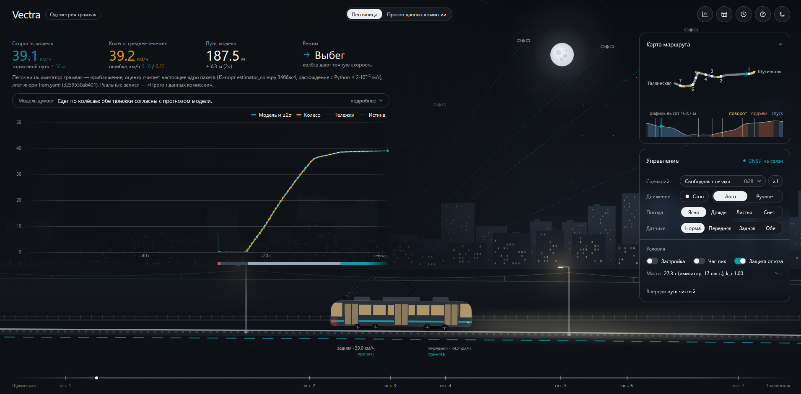
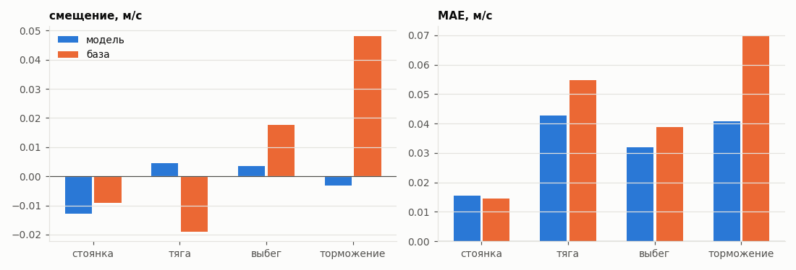

# TrackVector: резервная одометрия трамвая по модели

[](https://docs.ros.org/en/humble/)
[](#установка)
[](https://www.python.org/)
[](#установка)
[](#тесты)

Пакет ROS 2 Humble, который без GNSS и IMU в реальном времени считает скорость и
положение трамвая по двум скоростям тележек и позиции ручки контроллера.

**1. Точнее колёс по скорости.** На вагоне 30618 средняя ошибка скорости 0,027 м/с
против 0,037 м/с у наивной оценки по колёсам. На торможении нет систематического
смещения: −0,003 м/с против +0,048 м/с у колёс.

**2. Держит скорость при юзе и отказах.** Юз обеих тележек на −30 %: ошибка 0,18 м/с
против 1,77 м/с у колёс. Отказ передней тележки на 60 с: ошибка пути 0,1 м против 186 м.

**3. Положение в системе судьи.** Плоские MGRS от угла квадрата 37UCB, точка `base_link`,
`z` на уровне рельса. Пример координат организаторов воспроизводится точно.

**4. Проверено скриптом организаторов.** На их записи `30618_88aea4d9`: скорость RMSE
0,042 м/с, положение 3D RMSE 1,43 м. Нода работает на 20 Гц с задержкой p99 54 мс
в пределах 2 ядер и 512 МБ.

**5. Честная оценка.** Параметры подобраны только на обучающих записях, числа
посчитаны на 15 отложенных против GNSS, рядом всегда наивная база. 362 теста.

Команда VECTRA · кейс «Резервная одометрия по модели» · хакатон Московского транспорта, 2026

## Как это работает

**Шаг 1.** Нода подписана на `/vehicle/front_bogie_velocity`,
`/vehicle/rear_bogie_velocity` (км/ч) и `/vehicle/driver_position_cmd`
(−15..+15). GNSS нужен только в первые 3 с записи: для начального положения и
курса.

**Шаг 2.** Нода шагает по равномерной сетке 50 мс по меткам входов. На
каждом шаге ядро делает прогноз по ручке и принимает или отвергает показания
тележек.

**Шаг 3.** Путь вдоль колеи переводится в x, y, z по карте путей; стоянка у
остановки обнуляет накопленную ошибку пути.

**Шаг 4.** Нода публикует скорость, положение, ускорение и диагностику
(`/tram/estimator_status`: режим, срыв, сцепление, «стоим или скользим»,
достоверность).

**Шаг 5.** Если GNSS приходит и посреди маршрута (организаторы разрешили
использовать его для коррекции), нода поправляет по нему положение вдоль пути
с отбраковкой выбросов. На скорость GNSS не влияет.

## Демо

[](https://odometry.ecopus.tech)

- **Репозиторий.** https://github.com/kitay-sudo/vectra-tram-odometry
- **Симулятор онлайн.** https://odometry.ecopus.tech (статическая страница, сервер ROS 2
  для неё не нужен). Режимы:
  - **«Песочница»** - демонстрационный стенд. Модель в нём настоящая: ядро нашего
    пакета, перенесённое в JavaScript (совпадает с Python до 1,5·10⁻¹² м/с на каждом
    шаге). Трамвай, погоду и отказы датчиков придумывает имитатор, кроме двух настоящих
    записей, одна из них - запись проверки организаторов. Карты путей и GNSS в песочнице
    нет: путь в ней - чистая одометрия, положение на карте считает только нода. Жюри
    оценивает пакет ROS 2, а не песочницу; все отличия - в
    [simulator/README.md](simulator/README.md#2-песочница);
  - **«Прогон данных комиссии»** - реальная отложенная запись `30618_e9a34502`,
    которую посчитал сам пакет ROS 2, эталон - GNSS.
- **Без сети.** Откройте `simulator/index.html` двойным щелчком: песочница и
  прогон данных комиссии работают из файла, ключи и сервер не нужны.
- **Живой режим ROS 2 (локально).** Страница показывает поток работающей ноды через
  rosbridge: `docker compose up --build` из корня репозитория, затем
  http://localhost:8080/?mode=live. Нужна запись датасета в `./data` (по умолчанию
  `30618_e9a34502`, папка и запись задаются в `.env`).

## С чего начать

Поднять всё одной командой из корня репозитория: нода, проигрывание записи
(`ros2 bag play`), проба задержки, мост rosbridge и страница симулятора.

```bash
docker compose up --build
```

- **Что видно.** Страница симулятора - http://localhost:8080, мост rosbridge -
  `ws://localhost:9090`. Итог пробы (частота, задержка, CPU, память) -
  `out/probe/summary.json`.
- **Данные.** Нужна папка с записями rosbag2 из датасета кейса. По умолчанию
  это `./data` (`DATA_DIR`) и запись `30618_e9a34502` (`BAG`); другая папка или
  запись задаются в `.env` по шаблону [.env.example](.env.example), см.
  [Настройки](#настройки).
- **Версии.** Docker с Compose v2 (проверено на Docker 28.3, Compose 2.38).
- **Без Docker.** Проверка в пять шагов в чистом ROS 2 Humble описана в разделе
  [Быстрая проверка](#быстрая-проверка), запуск тестов в разделе [Тесты](#тесты).
- **Документы.** Карта документов и порядок чтения - [docs/README.md](docs/README.md).

**Разделы**

1. [Для кого и зачем](#для-кого-и-зачем)
2. [Возможности](#возможности)
3. [Результаты](#результаты)
4. [Критерии ТЗ в репозитории](#критерии-тз-в-репозитории)
5. [Границы прототипа](#границы-прототипа)
6. [Развитие](#развитие)
7. [Быстрая проверка](#быстрая-проверка)
8. [Установка](#установка)
9. [Настройки](#настройки)
10. [Данные](#данные)
11. [Версия, коммит и зависимости](#версия-коммит-и-зависимости)
12. [Воспроизведение по шагам](#воспроизведение-по-шагам)
13. [Тесты](#тесты)
14. [Топики и сообщения](#топики-и-сообщения)
15. [Структура](#структура)
16. [Документы](#документы)
17. [Источники](#источники)

## Для кого и зачем

- **Пользователь.** Бортовые системы трамвая и диспетчерская: им нужны скорость и положение
  вагона, когда GNSS нет (плотная застройка, эстакады, помехи, отказ приёмника).
- **Действие.** Нода выдаёт скорость и положение 20 раз в секунду по колёсам, ручке и карте
  путей. Когда колёсам верить нельзя (юз, буксование, отказ датчика), скорость ведёт модель,
  нода поднимает флаг и расширяет σ; потребитель видит это в `valid` и в ковариациях.
- **Цена ошибки.** При отказе датчиков одометрия «только колесо» ошибается в пути на сотни
  метров: если обе тележки 20 с показывают 0 км/ч, через 5 минут ошибка пути до 206,7 м у колёс
  против 36,0 м у модели ([docs/EVAL.md](docs/EVAL.md) §6).

## Возможности

Что пакет делает сверх основных выходов и где это видно; поля диагностики публикуются в
`/tram/estimator_status`.

| Возможность | Где |
|:---|:---|
| Ускорение по модели | `/result/acceleration` |
| Юз и буксование обеих тележек: флаг, знак, скорость по модели | `slip`, `slip_all` (+1 буксование, −1 юз), режим 4 |
| Отказ, залипание, обрыв датчика одной тележки: исключение и возврат | `wheel_healthy`, `n_accepted`, `n_rejected` |
| «Стоим или скользим»: нули обеих тележек на ходу - не остановка | `ambiguous`, `valid = false`, расширенная σ |
| Оценка сцепления и шума показаний | `mu`, `meas_noise` |
| Битые входы (NaN, метка 0, скачок времени, второй bag) не роняют ноду | [docs/ROBUST.md](docs/ROBUST.md) |
| Пауза входов: прогноз модели до 0,2 с, метки не идут назад | параметр `pulse_horizon_s` |
| Вагон 30618 или 30639, уточнение масштаба колёс по остановкам | параметры `vehicle`, `wheel_scale_online` |
| Другая система координат выхода без правки кода | `projection`, `mgrs_grid`, `output_point` |
| Замер частоты, задержки, CPU и памяти как у судьи | `tools/ros_probe.py`, `tools/measure_realtime.sh` |

## Результаты

Эталон - GNSS. «Колёса» - наивная база: среднее показаний тележек на той же связке, карте и
выставке. Жирным выделено, где модель лучше базы. Положение у модели и у базы почти одинаковое
(у базы даже чуть лучше): его держат карта путей и привязка к остановкам, а не модель. Модель
выигрывает в скорости, особенно на торможении, и при отказах и срывах датчиков.

Методика - [docs/EVAL.md](docs/EVAL.md) §2: запись идёт в порядке bag через ту же связку
`Runner`, что в ноде, GNSS - только первые 3 с, пары «выход - эталон» - по ближайшей метке в
пределах 0,05 с. Эталон скорости - GNSS master, положения - `base_link` по двум антеннам в MGRS
37UCB, как у судьи. Лист и карта - только по обучающим записям. Полнота выхода: пар скорости
99,99 % меток GNSS, положения 100,00 %, NaN в выходе 0, падений связки 0.

### Вагон 30618

12 записей; проверку жюри ведут только на этом вагоне ([docs/EVAL.md](docs/EVAL.md) §3.3).

| Метрика | Модель | Колёса |
|:---|---:|---:|
| скорость MAE, м/с | **0,0266** | 0,0369 |
| смещение скорости, м/с | −0,0047 | −0,0011 |
| истина внутри ±2σ скорости | 97,1 % | - |
| положение, средняя 3D-ошибка, м | 1,91 | 1,85 |
| вдоль пути RMSE, м | 4,41 | 4,35 |
| дрейф 3D по концу, % пути, медиана | 0,032 | 0,022 |
| \|вдоль\| ≤ 2σ положения | 96,1 % | - |

- **Ещё у модели.** RMSE скорости 0,0655 м/с; 3D RMSE 4,33 м; ошибка в конце записи - средняя
  1,74 м, медиана 1,59 м, наибольшая 5,0 м; дрейф 3D по концу - не больше 0,086 % пути; поперёк
  оси pathgraph организаторов - 0,010 м в среднем.
- **Скрипт организаторов.** Их запись `30618_88aea4d9`: результат и команда повтора -
  [docs/JURY.md](docs/JURY.md), раздел 1а.

### Все 15 отложенных записей

Скорость ([docs/EVAL.md](docs/EVAL.md) §3.1):

| Фаза (доля времени) | Модель: MAE / смещение, м/с | Модель: ±2σ | Колёса: MAE / смещение, м/с |
|:---|---|---:|---|
| вся запись | **0,0335** / −0,0027 | 96,0 % | 0,0463 / +0,0069 |
| стоянка (28 %) | 0,0156 / −0,0127 | 95,8 % | 0,0146 / −0,0090 |
| тяга (33 %) | **0,0428** / +0,0045 | 95,4 % | 0,0548 / −0,0189 |
| выбег (9 %) | **0,0319** / +0,0035 | 97,1 % | 0,0388 / +0,0177 |
| торможение (29 %) | **0,0407** / **−0,0032** | 96,4 % | 0,0696 / +0,0482 |

RMSE скорости по всем 15 записям: модель 0,0890 м/с, колёса 0,0948 м/с.

Положение ([docs/EVAL.md](docs/EVAL.md) §3.2; метры, кроме дрейфа):

| Метрика | Модель | Колёса |
|:---|---:|---:|
| средняя 3D / RMSE / макс | 3,81 / 8,81 / 70,6 | 3,77 / 8,82 / 70,6 |
| ошибка в конце записи, ср. / медиана / макс | 2,7 / 1,86 / 10,0 | 2,6 / 1,37 / 10,4 |
| дрейф 3D по концу, % пути, медиана / макс | 0,037 / 0,140 | 0,026 / 0,145 |
| вдоль пути: ср. \|ошибка\| / RMSE / макс | 2,96 / 8,72 / 129,4 | 2,90 / 8,71 / 129,0 |
| поперёк пути, ср. / макс | 0,58 / 55,8 | 0,58 / 56,1 |
| поперёк оси pathgraph организаторов, ср. / 95 % | 0,011 / 0,04 | 0,011 / 0,04 |
| \|вдоль\| ≤ 2σ положения | 92,8 % | - |
| шагов без положения после первого опубликованного | 0 | 0 |

Вагон 30639 (3 записи, все от 05.05, часть без RTK): MAE 0,0610 м/с (колесо 0,0837), средняя 3D
11,39 м; эталон GNSS в этих записях сам смещён
([docs/POSITION_FRAME.md](docs/POSITION_FRAME.md) §8, [MODEL.md](MODEL.md) §0.7).

### GNSS посреди маршрута

Вагон 30618 ([docs/EVAL.md](docs/EVAL.md) §5.1). С теми же первыми 3 с GNSS скорость во всех
сценариях та же, что без коррекции.

| Сценарий | Средняя 3D, м | Конец ср. / макс, м |
|:---|---:|---:|
| GNSS только первые 3 с (как у жюри) | 1,91 | 1,74 / 5,0 |
| пачки по 5-10 с каждые 2-3 мин | 1,76 | 1,62 / 4,9 |
| пачки по 1-4 с раз в минуту | 1,61 | 1,54 / 5,1 |
| GNSS весь прогон | 1,48 | 0,87 / 4,1 |
| пачки со сбоями GNSS (скачки, метки ±1 с, без RTK) | 1,79 | 1,65 / 4,9 |

### Аномалии

Аномалии внесены в 3 реальные отложенные записи ([docs/EVAL.md](docs/EVAL.md) §6). В ячейках
модели и колёс: MAE скорости в окне аномалии, среднее по 3 записям, м/с; остаток ошибки вдоль
пути через 300 с, худший из 3, м. Флаги - наименьшая доля valid и наибольшие доли остальных.

| Аномалия | Модель | Колёса | Флаги модели в окне: valid / «стоим или скользим» / срыв |
|:---|---:|---:|---|
| отказ передней тележки (0 км/ч, 60 с) | **0,028**; **0,1** | 2,378; 186,2 | 100 % / 0 % / 0 % |
| отказ задней тележки, как в записях 30639 (73,5 с) | **0,027**; 0,2 | 0,079; 0,2 | 100 % / 0 % / 0 % |
| обе тележки 0 км/ч, 20 с | **1,001**; **36,0** | 9,328; 206,7 | 0 % / 100 % / 15 % |
| обе тележки залипли, 20 с | **1,124**; **39,4** | 5,357; 116,1 | 11 % / 0 % / 0 % |
| пропуск сообщений обеих тележек, 2 с | **0,069**; 1,8 | 0,361; 1,8 | 78 % / 0 % / 0 % |
| пропуск всех входов (тележки и ручка), 2 с | **0,121**; **1,7** | 0,361; 1,8 | 78 % / 0 % / 0 % |
| юз −30 % обеих тележек на торможении | **0,183**; 0,1 | 1,772; 0,0 | 24 % / 0 % / 99 % |
| буксование +30 % обеих тележек на разгоне | **0,211**; 0,9 | 0,862; 0,8 | 24 % / 0 % / 99 % |
| выбросы ×3 | **0,035**; **0,1** | 0,213; 0,2 | 100 % / 0 % / 2 % |
| шум ×5 | **0,100**; 0,1 | 0,147; 0,1 | 100 % / 0 % / 2 % |
| одно показание NaN | **0,032**; 0,3 | 0,034; 0,3 | 100 % / 0 % / 0 % |
| метка одного сообщения +30 с | **0,025**; 0,1 | 0,038; 0,1 | 100 % / 0 % / 0 % |

Нода ни в одном случае не падает. valid - доля окна, где оценка помечена достоверной: при отказе
обеих тележек модель честно снимает достоверность.

### Реальное время

Полная запись 20 мин, скорость 1x, нода в контейнере с лимитами ТЗ `--cpus 2 --memory 512m`,
проба best-effort, как у судьи ([docs/EVAL.md](docs/EVAL.md) §7).

| Требование ТЗ | Измерено |
|:---|:---|
| частота ≥ 10 Гц | 20,0 Гц по меткам, 24 081 выход |
| задержка вход → выход ≤ 100 мс, пик ≤ 250 мс | p50 51,2 мс, p99 54,2 мс, макс 169,4 мс |
| ≤ 2 ядра CPU | в среднем 10,3 % одного ядра, максимум 16,0 % |
| ≤ 0,5 ГБ ОЗУ, без утечек | 70 МБ, рост 0,00 МБ/мин |
| `colcon build` без интернета | 3 пакета примерно за 5 с в чистом `ros:humble-ros-base` с `--network none` |

- **Задержка около 50 мс** заложена схемой: нода шагает по сетке 50 мс, и показание попадает в
  следующий узел.
- **Пауза записи входов.** Второй замер - запись `30618_af7496f0` (4,5 мин): входы `/vehicle/*`
  на t+142 с прерываются на 0,95 с, GNSS идёт. За паузу нода выдаёт прогноз модели не дальше
  0,2 с (4 узла сетки), дальше выхода нет до возвращения входов. Задержка: максимум 181,5 мс,
  больше 250 мс - 0 из 10 259 пар, p99 без первых 2 с bag - 53,3 мс; с GNSS только в первые
  3 с - максимум 181,4 мс ([docs/TZ_COMPLIANCE.md](docs/TZ_COMPLIANCE.md) §3).



## Критерии ТЗ в репозитории

Полная таблица соответствия с командами и числами -
[docs/TZ_COMPLIANCE.md](docs/TZ_COMPLIANCE.md). Коротко:

| № | Критерий (баллы) | Где |
|:---|:---|:---|
| 1 | Точность скорости (30): RMSE, MAE, нет смещения на разгоне, торможении, стоянке | [EVAL §3.1](docs/EVAL.md#31-скорость), [MODEL.md §0.6](MODEL.md#06-результаты-на-отложенных-прогонах) |
| 2 | Точность положения (35): дрейф в % пути, вдоль и поперёк пути, корректность Odometry | [EVAL §3.2](docs/EVAL.md#32-положение-mgrs-от-37ucb-точка-base_link-ошибки-в-непрерывных-координатах), [POSITION_FRAME.md](docs/POSITION_FRAME.md) |
| 3 | Устойчивость (20): доверие при срыве, пропуски, выбросы, нода не падает | [EVAL §6](docs/EVAL.md#6-инъекции-аномалий), [MODEL.md §7](MODEL.md#7-срывы-и-отказы-датчиков), [ROBUST.md](docs/ROBUST.md) |
| 4 | Реальное время (15): задержка, частота, CPU, ОЗУ, `colcon build` без интернета | [JURY §6](docs/JURY.md#6-логи-частота-задержка-cpu-и-ram), [EVAL §7](docs/EVAL.md#7-реальное-время) |
| 5 | Выступление (30): демонстрация, глубина погружения, ответы | [симулятор](simulator/README.md), [docs/SANDBOX.md](docs/SANDBOX.md) |

| № | Обязательный артефакт ТЗ | Где |
|:---|:---|:---|
| 1 | Пакет ROS 2 Humble: `colcon build`, подписка на входы, выходы `/result/*` | нода [tram_node.py](ros2_ws/src/tram_state_estimator/tram_state_estimator/tram_node.py), [tram.launch.py](ros2_ws/src/tram_state_estimator/launch/tram.launch.py) |
| 2 | Инструкция для жюри: rosbag, топики, логи, метрики, задержка | [docs/JURY.md](docs/JURY.md), [Быстрая проверка](#быстрая-проверка) |
| 3 | Описание модели: уравнения, структура, входы и выходы, ускорение, от момента к скорости | [MODEL.md §1-7](MODEL.md#1-корпус), [«Соответствие постановке»](MODEL.md#соответствие-постановке) |
| 4 | Допущения, ограничения, параметры | [MODEL.md §0.8](MODEL.md#08-допущения), [§0.7](MODEL.md#07-ограничения-решения-на-данных), [«Лист параметров»](MODEL.md#лист-параметров) |
| 5 | Точность и быстродействие: методика, таблицы, графики, задержка, частота, ресурсы | [docs/EVAL.md](docs/EVAL.md), [JURY §6](docs/JURY.md#6-логи-частота-задержка-cpu-и-ram) |
| 6 | Ограничения и план развития | [MODEL.md §9](MODEL.md#9-ограничения), [§10](MODEL.md#10-план-развития), [Границы прототипа](#границы-прототипа), [Развитие](#развитие) |
| - | Модуль предобработки: синхронизация, выбросы, непрерывность, пропуски, единицы | [MODEL.md](MODEL.md#соответствие-постановке), [runner.py](ros2_ws/src/tram_state_estimator/tram_state_estimator/runner.py) |

Параметры из п. 4 (начальная позиция, масса, радиус колеса, сопротивление, пороги
проскальзывания, фильтр) лежат в листе
[config/tram.yaml](ros2_ws/src/tram_state_estimator/config/tram.yaml).

## Границы прототипа

Полностью - [MODEL.md §0.7 и §9](MODEL.md#9-ограничения). Главное:

- **Положение держит карта.** Колёса дают только путь вдоль колеи, форму пути даёт карта. Вне
  известной линии положение ведётся по курсу, пока путь с тем же курсом не найдётся снова. Ветку
  на стрелке по колёсам не видно: берётся преобладающая, у западной конечной - по тому, стоял ли
  вагон у платформы.
- **Без GNSS в начале положения нет.** Скорость есть. Окно выставки - 3 с от первой точки GNSS
  master; ноду нужно запустить до bag.
- **Масштаб колёс.** Меняется по датам (до 1,2 % у одного вагона) сильнее, чем между вагонами
  (0,38 %). Нода уточняет его по остановкам, но у одной отложенной записи 30618 уточнение
  ошиблось на 0,7 %: MAE вагона 30618 с уточнением 0,0266 м/с, без него 0,0261
  ([docs/EVAL.md](docs/EVAL.md) §3.3, [docs/VEHICLES.md](docs/VEHICLES.md) §5).
- **Плавный срыв обеих тележек.** Срыв, который нарастает за 0,5 с и дольше или меньше 20 %
  скорости, не отличить от разгона: распознаётся только резкий.
- **Отказ обеих тележек сразу после трогания.** Ниже 2 м/с он выглядит как остановка: в
  песочнице модель 20 с считает, что вагон стоит, ошибка скорости до 10,8 м/с
  ([docs/SANDBOX.md](docs/SANDBOX.md) §5).
- **Длительный юз с блокировкой колёс.** «Стоим или скользим» по этим входам не различить:
  модель помечает оценку недостоверной и расширяет σ.
- **Коррекция по GNSS посреди маршрута доверяет RTK.** Долгий сбой RTK (десятки секунд) она
  примет. Без RTK делаются только малые поправки.
- **Пауза записи входов около секунды.** Прогноз идёт только 0,2 с, дальше выход молчит до
  возвращения входов (на `30618_af7496f0` разрыв выхода 0,85 с); задержка после паузы - до
  181,5 мс. Точки GNSS, пришедшие во время паузы, ждут возвращения входов тележек и ручки.

## Развитие

Полный план по порядку пользы, с ограничением и критерием для каждого пункта, -
[MODEL.md §10](MODEL.md#10-план-развития). Ближайшие шаги:

1. Признавать стоянку по длительности нулей при тормозной команде; не принимать «стоим», если
   ручка долго держит тягу.
2. Плавный возврат пути после снятия неоднозначности вместо скачка.
3. Детектор плавного юза и буксования по расхождению колёс с моделью на длинном окне, с уклоном
   из карты.
4. Граф путей со стрелками вместо «преобладающей ветки».
5. Уклон из профиля высот карты - прямо в уравнение движения.
6. Дополнительные входы, если они есть в вагоне: двери, стояночный тормоз, ток тяговых
   двигателей. Они снимают двусмысленность «стоим или скользим».

## Быстрая проверка

Пять шагов на чистом ROS 2 Humble (Ubuntu 22.04), без интернета и `rosdep`. Проверено в образе
`ros:humble-ros-base` с `docker run --network none`: 3 пакета собираются примерно за 5 с.
Репозиторий лежит в `~/vectra-tram-odometry`, workspace создаётся в `~/vectra_ws`.

**Шаг 1.** Собрать пакеты в терминале 1.

Подключить ROS 2 Humble.
```bash
source /opt/ros/humble/setup.bash
```
Создать папку workspace.
```bash
mkdir -p ~/vectra_ws/src
```
Скопировать пакеты в workspace.
```bash
cp -r ~/vectra-tram-odometry/ros2_ws/src/* ~/vectra_ws/src/
```
Перейти в workspace.
```bash
cd ~/vectra_ws
```
Собрать пакеты.
```bash
colcon build
```
Подключить собранные пакеты; то же сделать в каждом новом терминале шагов 3-5.
```bash
source ~/vectra_ws/install/setup.bash
```

**Шаг 2.** Запустить ноду в терминале 1.
```bash
ros2 launch tram_state_estimator tram.launch.py
```

При запуске нода печатает настройки: от строки «оценщик запущен» (версия и хэш кода) до строки
«жду входы» - лист, вагон, карта, система координат, режим GNSS.

**Шаг 3.** Запустить пробу в терминале 2: отдельная нода с подпиской best-effort, как у судьи.
```bash
python3 ~/vectra-tram-odometry/tools/ros_probe.py --out /tmp/probe.json --idle 10
```

Проба пишет сводку в `/tmp/probe.json` и печатает итог после 10 с тишины (`--idle 10`).

**Шаг 4.** Проиграть запись в терминале 3, когда нода и проба уже запущены.
```bash
ros2 bag play <путь к записи> -d 3
```

Ключ `-d 3` - пауза 3 с перед проигрыванием; выставка по GNSS идёт по первым 3 с записи.

**Шаг 5.** Проверить частоту скорости в терминале 4 (Ctrl+C - остановить).
```bash
ros2 topic hz /result/velocity
```
Показать одно сообщение положения.
```bash
ros2 topic echo /result/position --once
```

Итог пробы в терминале 2 на короткой записи `30618_98161270` (39 с):

```text
[probe] критерий                                    | измерено                                                      | итог
[probe] --------------------------------------------+---------------------------------------------------------------+-----
[probe] частота /result/velocity ≥ 10 Гц            | 20.0 Гц по меткам, 22.0 по стенным; 852 из 852 узлов сетки    | OK
[probe] /result/position (Odometry)                 | 828 выходов, 20.0 Гц; frame_id map -> base_link               | -
[probe] задержка in2out ≤ 100 мс (p99)              | p50 48.7 / p99 53.2 мс (без первых 2 с bag)                   | OK
[probe] пик задержки ≤ 250 мс                       | max 122.5 мс; > 250 мс: 0 из 1455                             | OK
[probe] вместе со стартом bag (справочно)           | in2out(vehicle): p99 122.1, max 149.4 мс; > 250 мс: 0 из 1683 | -
[probe] CPU ≤ 2 ядра                                | ср. 9.7 % ядра, макс 23.0 %                                   | OK
[probe] ОЗУ ≤ 0,5 ГБ, без утечки                    | RSS макс 67.8 МБ, рост 0.000 МБ/мин                           | OK
[probe] NaN в выходе, плохие ковариации             | 0 / 0                                                         | OK
[probe] скорость против GNSS bag (справочно)        | MAE 0.004 м/с по 362 парам                                    | -
[probe] положение против антенны master (справочно) | ср. 10.26 м (mgrs); около 10 м - плечо антенны до base_link   | -
```

- **Задержка.** Критерий ТЗ проба считает без первых 2 с bag: там хвост буфера регистратора,
  метки на 2-6 с старше момента записи приходят пачкой. Строка «вместе со стартом bag» - та же
  задержка по всей записи, для справки ([docs/JURY.md](docs/JURY.md), раздел 6).
- **Сверка с GNSS.** Идёт против антенны master, поэтому около 10 м - плечо от антенны до
  `base_link`, а не ошибка ноды.
- **Неполадки.** Симптомы и что сделать - [docs/JURY.md](docs/JURY.md), раздел 10.

## Установка

### Docker

Репозиторий клонируется в `~/vectra-tram-odometry`, остальные команды выполняются из его корня.

Скачать репозиторий.
```bash
git clone https://github.com/kitay-sudo/vectra-tram-odometry.git ~/vectra-tram-odometry
```
Перейти в корень репозитория.
```bash
cd ~/vectra-tram-odometry
```
Создать `.env` из шаблона, чтобы задать свою папку записей `DATA_DIR` и запись `BAG`.
```bash
cp .env.example .env
```

Шаг с `.env` необязателен: без него действуют значения по умолчанию. Запуск - в разделе
[С чего начать](#с-чего-начать), тесты - в разделе [Тесты](#тесты).

Посчитать точность на отложенных записях (нужны данные в `DATA_DIR`).
```bash
docker compose run --rm eval --out out/eval_check --doc out/eval_check/EVAL.md
```

JSON, отчёт и графики пишутся в `out/eval_check/`, `docs/` не меняется.

- **Образ.** `vectra/tram:compose` собирается из `docker/Dockerfile` на базе
  `ros:humble-ros-base`, закреплённого по digest. Интернет нужен только при сборке (apt, pip
  `rosbags`); `colcon build` внутри сеть не использует.
- **Обновление кода.** После правки исходников нужен `--build`: нода запускается из образа.
- **Сервисы и неполадки.** `estimator`, `player`, `probe`, `bridge` (rosbridge, только чтение),
  `web` - [docs/JURY.md](docs/JURY.md), разделы 8 и 10; сервер с доменом -
  [docs/DEPLOY.md](docs/DEPLOY.md).

### Без Docker

Нужны Ubuntu 22.04 и ROS 2 Humble (`ros-humble-ros-base`): пакет использует только `rclpy`,
стандартные сообщения, `launch`, `launch_ros`, `python3-numpy`, `python3-yaml`. Сборка - шаг 1
[Быстрой проверки](#быстрая-проверка), три пакета workspace - [docs/JURY.md](docs/JURY.md),
раздел 2.

Поставить ROS 2 Humble, если его нет (по инструкции ROS 2 для Ubuntu 22.04).
```bash
sudo apt install ros-humble-ros-base
```

- **`tram_vehicle_msgs`.** В манифест добавлен `<maintainer>`: без него `colcon build` в Humble
  падает. Если в workspace уже есть этот пакет из датасета, оставьте один: поля сообщений те же.
- **Проба, оценка и тесты.** Нужны `python3-psutil` (CPU и память в пробе), `python3-pytest`,
  `python3-matplotlib` и `pip install rosbags==0.10.9`; всё это есть в образе
  `vectra/tram:compose`.

## Настройки

Все параметры ноды с комментариями - в листе
[`config/tram.yaml`](ros2_ws/src/tram_state_estimator/config/tram.yaml); тест `test_sheets.py`
сверяет его с объявлениями ноды. Команды ниже выполняются из любой папки после
`source ~/vectra_ws/install/setup.bash`.

Запустить ноду под вагон 30639.
```bash
ros2 launch tram_state_estimator tram.launch.py vehicle:=30639
```
Запустить ноду со своим листом параметров.
```bash
ros2 launch tram_state_estimator tram.launch.py params_file:=<путь к листу.yaml>
```
Запустить ноду без коррекции по GNSS посреди маршрута.
```bash
ros2 run tram_state_estimator tram_estimator --ros-args -p gnss_correction:=false
```

`ros2 run` без `--params-file` тоже работает по листу пакета: недостающие параметры нода берёт
из него сама. Параметры ноды:

| Параметр | По умолчанию | Назначение |
|:---|:---|:---|
| `vehicle` | `30618` | вагон `30618`, `30639` или `auto` (общий лист); от него зависит масштаб колёс |
| `wheel_scale_online` | `true` | масштаб колёс по остановкам: расхождение с картой больше 0,5 % - поправка скорости до ±2 % |
| `projection` | `mgrs` | система выхода: `mgrs`, `utm` (E/N), `enu` (от первой точки master), `equirect` |
| `mgrs_grid` | `"37UCB"` | квадрат отсчёта, координаты от его угла, как у pathgraph; `""` - у точки свой квадрат |
| `mgrs_guard_m` | `0.0` | при `mgrs_grid: ""`: ближе этого к краю квадрата положение не публикуется |
| `output_point` | `base_link` | точка выхода: `base_link` (ось передней тележки на уровне рельса) или `master` |
| `antenna_master_x`, `antenna_rover_x`, `antenna_z` | `-9.873`, `2.563`, `3.0` | антенны в `base_link`, м (tf организаторов) |
| `init_window_s` | `3.0` | окно начальной выставки по GNSS от первой точки, с |
| `gnss_correction` | `true` | GNSS после выставки поправляет положение вдоль пути; `false` - только выставка |
| `gnss_sigma_rtk_m`, `gnss_sigma_sbas_m`, `gnss_sigma_fix_m` | `0.5`, `1.5`, `5.0` | вес точки GNSS по `NavSatFix.status` 2 / 1 / 0, м |
| `map_file` | `config/track_map.npz` | карта путей (от `share` пакета или абсолютный путь); `""` - без карты |
| `nomap_mode` | `hold` | без карты: `hold` - стоять в точке выставки, `line` - по прямой вдоль курса |
| `scale_adapt` | `true` | масштаб пути подстраивается по привязкам к остановкам (±1 %) |
| `terminal_hold` | `terminals` | в тупике карты курсор держится только у известных конечных |
| `wheel_timeout_s` | `1.0` | нет показаний тележек дольше - разомкнутый режим по модели, с |
| `handle_timeout_s` | `0.5` | нет ручки дольше - параметры модели не адаптируются, с |
| `pulse_horizon_s` | `0.2` | входы молчат - прогноз модели не дальше этого от последней метки; `0` - выключено |
| `speed_output_delay_s` | `0.08` | скорость выходит на столько раньше (эталон организаторов запаздывает около 0,1 с) |
| `start_sort_s` | `0.1` | первые столько секунд входы сортируются по метке (стартовый всплеск bag) |
| `frame_id`, `child_frame_id` | `map`, `base_link` | имена систем в заголовках выхода |
| `sheet` | `auto` | лист пакета под параметрами запуска; путь к листу; `none` - заглушки имитатора |
| `origin_lat`, `origin_lon`, `origin_alt` | NaN | начало для `projection: enu`; NaN - первая точка master |

- **Уточнения.** Неизвестный `vehicle` работает как `auto` с предупреждением.
  `wheel_scale_online` сравнивает пути от двух отрезков по 300 м. При `mgrs_grid: ""` на границе
  квадратов координаты скачут на 100 км. `speed_output_delay_s: 0` - без сдвига; положение не
  сдвигается.
- **Остальные параметры.** Коррекция по GNSS - [docs/POSITION_FRAME.md](docs/POSITION_FRAME.md),
  раздел 7; модель (таблица привода, шумы, пороги срыва) - [MODEL.md](MODEL.md), раздел «Лист
  параметров».
- **Аргументы `tram.launch.py`.** `params_file` (по умолчанию лист пакета) и `vehicle` (пусто -
  как в листе).

Главные переменные Docker Compose (все - в шаблоне [.env.example](.env.example) с комментарием
у каждой строки):

| Переменная | По умолчанию | Назначение |
|:---|:---|:---|
| `DATA_DIR` | `./data` | папка с записями `data/<запись>/{metadata.yaml,*.db3}` |
| `BAG` | `30618_e9a34502` | какую запись проиграть в демо |
| `PLAY_LOOP`, `PLAY_RATE`, `PLAY_DELAY` | `0`, `1.0`, `5` | по кругу; скорость; пауза перед стартом, чтобы нода нашла плеер, с |
| `ROS_DOMAIN_ID` | `42` | домен DDS |
| `WEB_PORT`, `BRIDGE_PORT` | `8080`, `9090` | порты страницы симулятора и моста rosbridge |
| `FAST`, `NO_TIMING` | `0`, `1` | тесты: без 4 самых долгих; без проверок времени шага |

## Данные

Датасет кейса - записи rosbag2 (sqlite3) двух трамваев: описание организаторов -
[docs/DATASET_README.md](docs/DATASET_README.md), наш разбор - [docs/DATA.md](docs/DATA.md).
Записи в репозиторий не входят: их папка задаётся в `DATA_DIR` (Docker) или передаётся
`ros2 bag play` напрямую.

- **Объём.** 122 записи: вагон 30618 - 103, вагон 30639 - 19; 36,75 ч. 25 пар побайтно
  одинаковых записей (все - 30618 за 10.08), уникальных записей 97.
- **Единицы.** Скорость тележек записана в **км/ч**, а не в м/с, как сказано в README датасета:
  отношение к скорости GNSS - медиана 3,598, в отдельных записях от 3,54 до 3,66 (масштаб колёс
  вагона и даты, [docs/DATA.md](docs/DATA.md) §2.3). Организаторы подтвердили км/ч. Выход
  `/result/velocity` - в м/с.
- **Топики.** Тележки по 10 Гц (в среднем 9,4 Гц), ручка 20 Гц, GNSS master и rover по 10 Гц
  (`fix`, `vel`). GNSS есть в 86 записях.
- **Разбиение** ([tools/split.json](tools/split.json)). `train` - 98 записей (80 уникальных):
  калибровка, карта оценки и выбор всех порогов. `holdout` - 17 записей, из них
  `holdout_scored` - **15 чистых отложенных** с GNSS, без дублей и копий в обучении (12 - вагон
  30618, 3 - 30639): на них считаются все отчётные числа.
- **Два листа и две карты.** Лист и карта ОЦЕНКИ построены только по `train` (`config/eval/`),
  на них посчитан отчёт. Лист и карта ЖЮРИ построены по всем уникальным записям
  (`config/tram.yaml`, `config/track_map.npz`), они входят в пакет.
- **pathgraph организаторов.** Две ломаные, по одной на направление, выданы отдельно от
  датасета; их точки уже в карте пакета. Исходные файлы в git не входят (для пересборки карт -
  `_incoming/pathgraph/`).
- **Кэш.** `analysis/cache/<запись>.npz` (в git не входит); `tools/eval.py` строит его из
  `data/` сам.

## Версия, коммит и зависимости

Показать полный хэш рабочей копии.
```bash
git rev-parse HEAD
```

`tools/eval.py` пишет в шапку [docs/EVAL.md](docs/EVAL.md) хэши кода пакета, листа и карты
оценки. Нода при запуске печатает хэш своего кода, посчитанный так же (строка «оценщик
запущен», «код sha»). Если он совпадает с «Код пакета: sha» в EVAL.md, отчёт посчитан на том же
коде, что работает у вас. Если нет, отчёт пересчитывает шаг 6
[Воспроизведения по шагам](#воспроизведение-по-шагам).

Лист и карта, которые уходят в пакет (пути от `ros2_ws/src/tram_state_estimator/`):

| Файл | SHA-256 |
|:---|:---|
| `config/tram.yaml` | `9950bee716af5b62db8aea1a5c5c3226410499cabb2a16b92c69d4232f1dc97e` |
| `config/track_map.npz` | `cbef185f2f87f9bed4e486c9b7a195f751cb6c09ddeff45ab2b9da74af85671f` |

Проверить хэши.
```bash
sha256sum ros2_ws/src/tram_state_estimator/config/tram.yaml ros2_ws/src/tram_state_estimator/config/track_map.npz
```
То же в PowerShell (хэш печатается заглавными буквами).
```powershell
Get-FileHash ros2_ws/src/tram_state_estimator/config/tram.yaml, ros2_ws/src/tram_state_estimator/config/track_map.npz
```

| Что | Версия |
|:---|:---|
| ОС и ROS | Ubuntu 22.04, ROS 2 Humble; образ `ros:humble-ros-base`, закреплён по digest (ниже) |
| Python | 3.10 (системный Humble) |
| rclpy, rosbag2, rosbridge_server | 3.3.21, 0.15.16, 2.0.8 (пакеты Humble в образе) |
| numpy, PyYAML, psutil | 1.21.5, 5.4.1, 5.9.0 (пакеты Ubuntu) |
| только офлайн-оценка и тесты: rosbags, matplotlib, pytest | 0.10.9 (pip), 3.5.1, 6.2.5 |
| симулятор: Node.js, Chromium | Node.js 22 для проверок страницы (`vectra/tram:sim`); страница без внешних зависимостей |
| Docker | Docker с Compose v2 (проверено на Docker 28.3, Compose 2.38) |

Базовый образ по digest (он же в `docker/Dockerfile` и в CI):
`ros:humble-ros-base@sha256:1813d3c85d7f96ff7d3012d865204583255740182db5d0065f8f8cd029a83138`.

**Детерминизм.** Два полных прогона `tools/eval.py` дают побайтно одинаковые `summary.json`,
`runs.json`, `inject.json`; ключ `--check-determinism` проверяет это сам (код выхода 2 при
расхождении).

## Воспроизведение по шагам

Шаги 1-7 и первая команда шага 9 выполняются в образе пакета, остальное - на хосте; всё из
корня репозитория. Готовые результаты каждого шага лежат в репозитории, поэтому любой шаг можно
пропустить.

Собрать образ.
```bash
docker compose build
```
Отключить в Git Bash подмену путей контейнера (в Linux не нужно).
```bash
export MSYS_NO_PATHCONV=1
```
Открыть оболочку в образе: репозиторий на запись, записи и pathgraph только на чтение.
```bash
docker run --rm -it -v "$PWD":/repo -v <папка с записями>:/repo/data:ro \
  -v <папка pathgraph>:/repo/_incoming/pathgraph:ro -w /repo \
  -e PYTHONPATH=/repo/ros2_ws/src/tram_state_estimator:/repo/tools:/repo/analysis \
  vectra/tram:compose bash
```

### 1. Кэш и разбор данных

Собрать кэш всех записей в `analysis/cache/`.
```bash
python3 analysis/bagio.py
```
Разобрать датасет в `out/data/` (таблицы для [docs/DATA.md](docs/DATA.md)).
```bash
python3 tools/data_audit.py --workers 6
```

### 2. Разбиение

Разбить записи без утечки дублей; итог - `tools/split.json` (лежит в репозитории).
```bash
python3 tools/make_split.py out/data/bags.csv
```

### 3. Калибровка

Откалибровать листы ОЦЕНКИ и ЖЮРИ и собрать листы ноды (около часа на 8 ядрах).
```bash
bash analysis/calib_all.sh
```

Калибруются таблица привода A(u, v), запаздывание и инерция, масштаб колёс, шумы, `q_v`,
выходная σ. Лист ОЦЕНКИ - только по `train`, лист ЖЮРИ - по всем уникальным записям.

Записать масштаб колёс по вагонам (блок `vehicles` в калибровках).
```bash
python3 analysis/calib_vehicle.py --write
```

### 4. Карты путей

Обе карты - гибрид pathgraph и нашей карты по GNSS: остановки, конечные, ветки у западной
конечной.

Собрать карту ОЦЕНКИ только по `train`.
```bash
python3 analysis/build_map.py eval
```
Собрать карту ЖЮРИ по всем записям.
```bash
python3 analysis/build_map.py jury
```

### 5. Листы параметров

Сгенерировать листы ноды и таблицу «Лист параметров» в [MODEL.md](MODEL.md).
```bash
python3 ros2_ws/src/tram_state_estimator/tools/gen_params.py
```

Скрипт пишет `config/tram.yaml`, `config/eval/tram.yaml` и `config/params.yaml`.

### 6. Оценка на отложенных

Посчитать точность и устойчивость на 15 отложенных записях по листу и карте ОЦЕНКИ.
```bash
python3 tools/eval.py --variants --gnss-scenarios docs/data/eval_gnss_r3 \
  --label "итоговая (конечные и ветки у западной конечной, коррекция по GNSS, вагон)"
```

| Опция | Что делает |
|:---|:---|
| `--variants` | добавить варианты листа: заглушки крипа и нули (EVAL §4) |
| `--gnss-scenarios` | готовые итоги сценариев GNSS (шаг 7) для раздела 5.1 |
| `--label` | подпись версии в шапке EVAL.md |

- **Что считается.** Точность против GNSS, 12 видов аномалий, проверка «GNSS весь прогон».
  Время - около 4 минут на 12 ядрах, около 8,5 минуты на двух.
- **Итог.** `out/eval/*.json`, [docs/EVAL.md](docs/EVAL.md) и графики `docs/img/eval_*.png`;
  таблица раздела 7 берётся из сводок замера в `docs/data/realtime/` (шаг 8).
- **Совпадение.** sha256 трёх JSON - в конце раздела 1 EVAL.md. `runs.json` и `inject.json`
  совпадают с отчётными побайтно, `summary.json` - если подпись `--label` и хэш кода те же.

Проверить детерминизм: второй проход и побайтное сравнение JSON.
```bash
python3 tools/eval.py --check-determinism --no-doc --out out/eval_det
```
Проверить, что инструмент работает: 2 записи по 300 с, около 0,5 мин, `docs/` не меняется.
```bash
python3 tools/eval.py --quick
```

### 7. Сценарии GNSS посреди маршрута

Прогнать семь сценариев доступности GNSS с коррекцией и без (около 20 минут на 4 ядрах).
```bash
python3 tools/eval_gnss.py --no-naive --out out/eval_gnss
```

Сценарии: только первые 3 с, редкие пачки, запись с середины, весь прогон, сбои GNSS и другие.
`--no-naive` отключает прогоны базы «только колесо».

Пересобрать EVAL.md и графики из готовых JSON с разделом 5.1 «Сценарии доступности GNSS».
```bash
python3 tools/eval.py --render-only --gnss-scenarios out/eval_gnss
```

### 8. ROS 2 на настоящей записи

Команды шага выполняются на хосте (Git Bash или Linux); скрипты сами запускают контейнеры
образа `vectra/tram:compose`. Папка с записями - `DATA_DIR` (по умолчанию `data/` в корне).

Прогнать ROS-смоук на фикстуре из git, данные не нужны.
```bash
tools/ros_smoke.sh --build
```

Смоук проверяет частоту, задержку, NaN, `frame_id`, живость и останов ноды.

Проверить ноду на записи с NaN во входе: нода жива, выходов столько же, сколько узлов сетки.
```bash
tools/ros_e2e.sh --bag 30618_bab2fe58 --inject "nan --at 15 --dur 3" --build
```
Замерить реальное время с лимитами ТЗ на полной записи 20 мин со скоростью 1x.
```bash
tools/measure_realtime.sh --bag 30618_e9a34502 --cpus 2 --memory 512m --build
```

Нода работает в контейнере с лимитами `--cpus 2 --memory 512m`, `--build` пересобирает образ из
рабочего дерева. Итог - `out/realtime/<тег>/summary.md`.

### 9. Симулятор

Посчитать пакетом отложенную запись для страницы: итог - `simulator/replays/*.js`.
```bash
python3 tools/export_replay.py
```
Сверить JS-порт с Python-пакетом на каждом шаге (на хосте, нужен кэш записи `30618_e9a34502`).
```bash
bash js-port/check.sh
```

Лист песочницы, копия ядра в страницу и таблица сценариев [docs/SANDBOX.md](docs/SANDBOX.md)
собираются по [js-port/README.md](js-port/README.md).

## Тесты

Команды выполняются из корня репозитория.

Прогнать все тесты пакета в Docker без сети: `colcon build` и `pytest` по рабочему дереву.
```bash
docker compose run --rm test
```

Итог на этом коде: **362 passed, 1 skipped, 1 deselected**, последняя строка -
`[test] ИТОГ: PASS`. Пропущен тест pathgraph: его файлов нет в git. Не выбрана проверка времени
шага: она идёт отдельной командой ниже. Время - 10-12 минут на одном ядре.

Прогнать тесты на машине с ROS 2 Humble (нужен `python3-pytest`, сборка во временном `/tmp/ws`).
```bash
NO_TIMING=1 SRC=$PWD/ros2_ws/src bash docker/run_tests.sh
```
Пропустить самые долгие тесты имитатора.
```bash
FAST=1 docker compose run --rm test
```
Прогнать проверки времени шага по стенным часам: они идут отдельно, под нагрузкой CPU «мигают».
```bash
docker compose run --rm test -m timing
```
Проверить инструменты оценки (в образе).
```bash
python3 -m pytest tools/eval_selftest.py -q
```

- **Что покрыто.** Тесты пакета лежат в `ros2_ws/src/tram_state_estimator/test/`, по файлу на
  тему: модель и фильтр, юз и буксование, калибровка, связка и нода на плохих входах,
  положение и пример координат организаторов, ветки у конечной, коррекция по GNSS, параметр
  вагона, 180 с реальной записи, детерминизм, лист пакета.
- **Страница симулятора.** Офлайн-проверка в Chromium - `simulator/test/page_test.js`
  ([simulator/README.md](simulator/README.md)); JS-порт против Python - шаг 9
  [Воспроизведения по шагам](#воспроизведение-по-шагам).
- **CI.** [.github/workflows/ci.yml](.github/workflows/ci.yml) на каждый push: `colcon build`,
  тесты и ROS-смоук на фикстуре в чистом `ros:humble-ros-base`.

## Топики и сообщения

Коротко: все выходы идут с частотой 20 Гц, метки `header.stamp` - время из bag, узлы сетки
кратны 0,05 с. Полностью, с полями и очередями - [docs/JURY.md](docs/JURY.md), раздел 5.

| Топик | Тип | Что внутри |
|:---|:---|:---|
| `/vehicle/front_bogie_velocity`, `/vehicle/rear_bogie_velocity` | `tram_vehicle_msgs/msg/VelocitySensor` | вход: скорость тележки, км/ч |
| `/vehicle/driver_position_cmd` | `tram_vehicle_msgs/msg/DriverControllerCommand` | вход: позиция ручки −15..+15 |
| `/sensing/gnss/master/fix`, `/sensing/gnss/rover/fix` | `sensor_msgs/msg/NavSatFix` | вход: выставка в первые 3 с, дальше поправка положения |
| `/result/velocity` | `tram_vehicle_msgs/msg/VelocitySensor` | продольная скорость, м/с; `frame_id` `base_link` |
| `/result/position` | `nav_msgs/msg/Odometry` | x, y, z `base_link` в MGRS от 37UCB, курс, скорость и их σ² |
| `/result/acceleration` | `geometry_msgs/msg/AccelStamped` | продольное ускорение по модели, м/с² |
| `/tram/estimator_status` | `tram_msgs/msg/EstimatorStatus` | режим, срыв, сцепление, «стоим или скользим», `valid` |

- **QoS.** Входы - подписка best-effort, глубина 50; выходы - издатель reliable, глубина 10
  (подписчик best-effort с ним совместим).
- **Поля Odometry.** `pose.covariance[0]`, `[7]` - σ² положения, `twist.twist.linear.x` -
  скорость, `twist.covariance[0]` - её σ²; `frame_id` `map`, `child_frame_id` `base_link`.
- **Начало.** Положение публикуется с первой годной точки GNSS master; до неё идёт только
  скорость. Система координат и как её поменять -
  [docs/JURY.md §4](docs/JURY.md#4-система-координат-положения).
- **Диагностика.** Все поля и их смысл -
  [EstimatorStatus.msg](ros2_ws/src/tram_msgs/msg/EstimatorStatus.msg).

## Структура

| Папка | Что внутри |
|:---|:---|
| `ros2_ws/src/tram_state_estimator/` | нода `tram_estimator`: код, `config/`, `launch/`, `test/` |
| `ros2_ws/src/tram_vehicle_msgs/`, `ros2_ws/src/tram_msgs/` | сообщения кейса (с `<maintainer>`) и сообщение диагностики |
| `analysis/` | калибровка (`calib_*.py`, `calib_all.sh`), карта (`build_map.py`), кэш записей (`bagio.py`) |
| `tools/` | оценка, аномалии, разбиение `split.json`, ROS-проверки, экспорт прогонов в симулятор |
| `simulator/` | страница: песочница, прогон данных комиссии, живой ROS 2; тесты страницы |
| `js-port/` | JS-порт ядра и связки, сверка с Python (`check.sh`) |
| `prototype/` | имитатор вагона и сценарии проверки модели, опознавание параметров |
| `docker/`, `docker-compose.yml` | образ и сервисы: демо, `test`, `eval`, `server` |
| `docs/` | документы (таблица [Документы](#документы)); `docs/data/` - итоги оценки, `docs/img/` - графики |

- **Код ноды.** Ядро `estimator_core.py` (модель и UKF, без ROS), связка `runner.py` (сетка
  50 мс, выставка, положение), `track_map.py`, `geodesy.py`, `body.py`, `vehicle.py`,
  `tram_node.py`; `config/` - лист и карта жюри, `config/eval/` - лист и карта оценки.
- **Не в репозитории.** Данные кейса (rosbag2), кэш анализа `analysis/cache/`, исходные файлы
  pathgraph (`_incoming/`) и результаты прогонов `out/`.

## Документы

| Документ | Что внутри |
|:---|:---|
| [docs/README.md](docs/README.md) | карта документов: с чего начать, какая команда пишет какой файл |
| [docs/JURY.md](docs/JURY.md) | инструкция для жюри: сборка, запуск, топики, координаты, логи, задержка, неполадки |
| [MODEL.md](MODEL.md) | модель: уравнения, фильтр, срывы и отказы, допущения, ограничения, план, параметры |
| [docs/EVAL.md](docs/EVAL.md) | точность и устойчивость: методика, таблицы, графики; генерирует `tools/eval.py` |
| [docs/TZ_COMPLIANCE.md](docs/TZ_COMPLIANCE.md) | каждый критерий и обязательный артефакт ТЗ: файл, команда, число |
| [docs/POSITION_FRAME.md](docs/POSITION_FRAME.md) | положение: MGRS 37UCB, точка `base_link`, карта путей, коррекция по GNSS |
| [docs/ROBUST.md](docs/ROBUST.md) | устойчивость ноды: плохие входы, разрывы времени, пауза входов, ковариации |
| [docs/VEHICLES.md](docs/VEHICLES.md) | вагоны 30618 и 30639, параметры `vehicle` и `wheel_scale_online` |
| [docs/DATA.md](docs/DATA.md) | разбор датасета: топики, единицы, метки времени, дубли, аномалии |
| [docs/SANDBOX.md](docs/SANDBOX.md) | песочница: что в ней настоящее, сценарии, слабые места |
| [docs/DEPLOY.md](docs/DEPLOY.md) | демо на ноутбуке и на публичном сервере |
| [docs/TZ_REQUIREMENTS.md](docs/TZ_REQUIREMENTS.md) | выжимка ТЗ: входы, выходы, критерии, обязательные артефакты |
| [docs/DATASET_README.md](docs/DATASET_README.md) | README датасета от организаторов (контракт судьи) |
| [simulator/README.md](simulator/README.md), [js-port/README.md](js-port/README.md) | симулятор и JS-порт ядра |

## Источники

| Источник | Что взято |
|:---|:---|
| ТЗ кейса «Резервная одометрия по модели» (PDF организаторов) | входы, выходы, критерии, обязательные артефакты; выжимка - [docs/TZ_REQUIREMENTS.md](docs/TZ_REQUIREMENTS.md) |
| README датасета от организаторов | топики, типы сообщений, контракт судьи - [docs/DATASET_README.md](docs/DATASET_README.md) |
| Ответы организаторов на вопросы команд | система координат судьи (MGRS, `base_link`, ошибка по x, y, z), км/ч, tf антенн, GNSS для коррекции, проверка на вагоне 30618 |
| pathgraph организаторов | ось линии в двух направлениях, MGRS 37UCB, `z` - уровень рельса; точки входят в карту пакета |
| Датасет кейса: 122 записи rosbag2, вагоны 30618 и 30639 | калибровка модели, карта путей, оценка |
| REP-103, REP-105 (ROS) | оси и имена систем координат |
