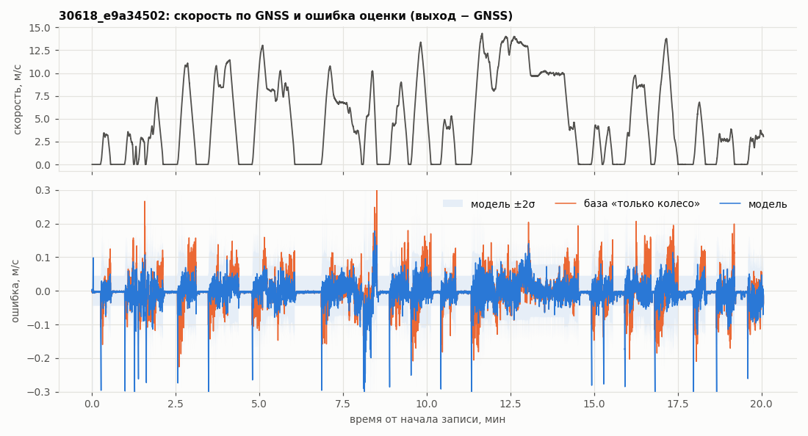
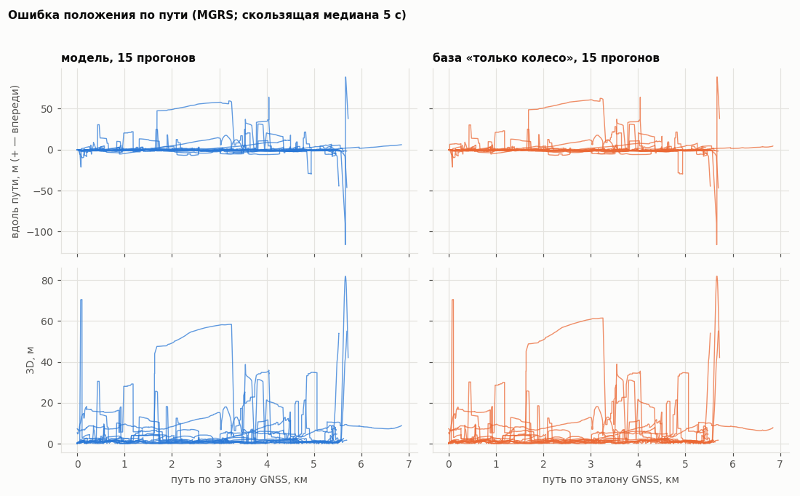
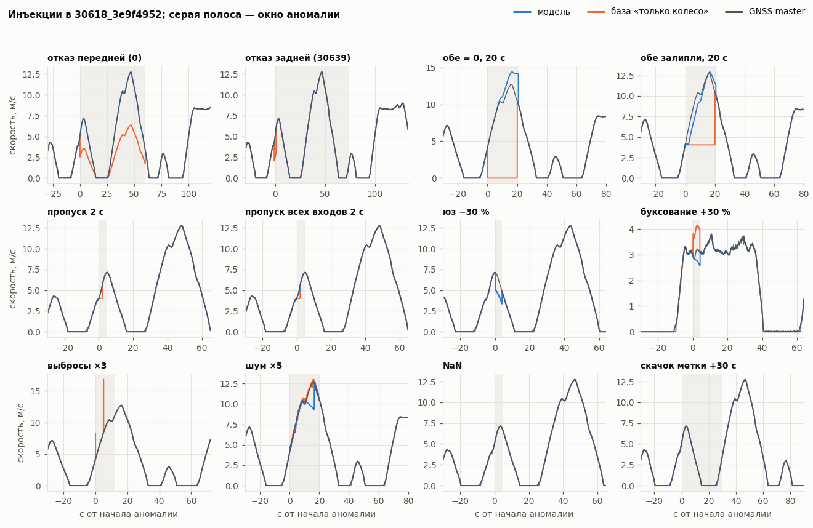
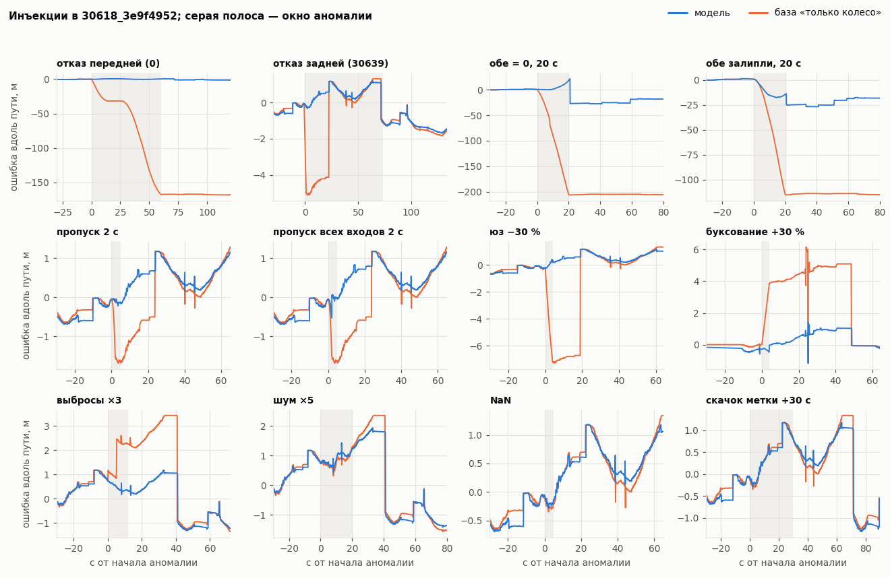

# Оценка точности и устойчивости (tools/eval.py)

> **Версия чисел: до правок.** Документ целиком сгенерирован `tools/eval.py` (не править руками). Код пакета: sha `5f634e9a5a63564d`. Лист: json (запасной: оценочного листа config/eval/ нет) (sha `383f2e64dd90d682`). Карта: оценочная: только обучающие прогоны (build_map.py train, ключ b16c47d5) (sha `eaa47081ac8cc1a7`). GNSS в связку: первые 3 с. Прогонов: 15.
>
> **УТЕЧКА: таблица привода и масштаб подогнаны по всем 122 bag, включая отложенные; q_v, delay, tau подбирались на отложенных.** Эти числа не отчётные, пока нет оценочного листа.
>
> Лист json — не то, что читает нода: боевая нода берёт `config/tram.yaml` (аудит sub15 на этом коде: на yaml MAE 0,0518 и ±2σ 66,7 %, на json 0,0489 и 75,6 %).

## Главное

* **Скорость** (15 отложенных, против GNSS master): модель MAE 0,0489 м/с, смещение +0,0130, ±2σ 75,6 %; база «только колесо» MAE 0,0483, смещение +0,0066.
* **Положение** (MGRS, после перевода выхода): модель 3D ср. 5,04 м, вдоль RMSE 10,92 м, дрейф 3D по концу медиана 0,060 % (макс 2,30 %); база 3D 3,94 м.
* **Полнота выхода** (модель): пар скорости 99,99 % меток GNSS vel (NaN в выходе: 0), пар положения 100,00 % меток GNSS fix (строк выхода без опубликованного положения: 0, положение NaN: 0); падений связки: 0.
* **Без заглушек крипа** (c_creep = c_creep_drag = 0): MAE 0,0443, смещение +0,0042, 3D 4,01 м.
* **Система судьи:** выход Runner сейчас не в MGRS судьи (код до правок — equirect от начала): без перевода средняя 3D у судьи ≈ 96 км.
* **Граница квадратов MGRS** (E = 400 км, запад в 37U CB): средняя 3D модели при сочетании «наш выход × соглашение судьи» — перенос × перенос 17,74 м, 37UDB × 37UDB 5,04 м, **перенос × 37UDB 21523 м, 37UDB × перенос 21533 м** (пар с ошибкой > 1 км: 36943 и 36959 из 171547). Несовпадение соглашений стоит ~100 км всей западной части пути; при совпадении добавляются только пары у самой границы, где оценка и эталон по разные стороны (перенос × перенос: 22; раздел 3.2).
* **GNSS весь прогон:** выход совпал с режимом «GNSS 3 с» в 0 из 5 прогонов; 3D ср. 347,3 м против 2,2 м (первые 5 мин).
* **Инъекции:** both_zero — флаг есть; модель лучше базы; остаток 43 м; both_stuck — не замечено: ошибка без флага; остаток 119 м; skid_brake — не замечено: ошибка без флага; spin_traction — не замечено: ошибка без флага; noise — флаг есть; модель хуже базы; nan — модель падает (3 из 3); stamp_jump — флаг есть; модель хуже базы; остаток 123 м.

## 1. Как запустить

Одна команда в Docker (PowerShell, из корня репозитория; кэш строится из `data/` сам):

```powershell
docker run --rm --cpus 2 -v ${PWD}:/repo -v <каталог с bag>:/repo/data:ro -w /repo `
    vectra/tram:dev python3 tools/eval.py --label "<подпись версии>"
```

Основные ключи (полный список — `python3 tools/eval.py --help`):

| ключ | по умолчанию | что делает |
|---|---|---|
| `--sheet` | `eval` | лист: `eval` — `config/eval/tram_eval.yaml`, `tram.yaml` или `tram_calibration.json` (только train); если их нет — `config/tram_calibration.json` с пометкой об утечке; `jury` — боевой `config/tram.yaml` (не для отчёта); `json`; путь |
| `--set k=v,...` | — | переопределить поля листа: поля `Params` — ядру, остальное — параметрам ноды (`--set mgrs_grid=37UDB`, `--set nomap_mode=line`) |
| `--map` | `train` | `train` — карта только по обучающим (`analysis/build_map.py`, строится сама); `eval` — `config/eval/track_map.npz` пакета; `jury` — боевая; `none` — без карты; путь |
| `--gnss` | `3` | секунд GNSS в связку от первой записи master; `full` — весь прогон |
| `--frame` | `mgrs` | система эталона: `mgrs` (судья), `enu`, `equirect`, `utm` |
| `--runner-frame` | `auto` | система выхода Runner: `auto` — параметр ноды `projection` (объявление в `tram_node.py`, поверх — лист), иначе `equirect` (код до правок), с проверкой по величине; `mgrs`, `utm`, `enu`, `equirect` |
| `--runner-grid` | параметр `mgrs_grid` | как **читать** выход Runner в MGRS (`""` — перенос по точке, `37UDB`). Runner не настраивает — для этого `--set mgrs_grid=37UDB` |
| `--judge-grid` | `""` | соглашение судьи на границе квадратов для «взгляда судьи»; код квадрата — и для матрицы соглашений (иначе `37UDB`) |
| `--variants` | выкл. | варианты листа: заглушки крипа / нули (+15 прогонов модели, ~+5 мин при `--cpus 2`) |
| `--gnss-full-runs` | каждый 3-й | прогоны проверки «GNSS весь прогон» (первые 5 мин): список или `all` |
| `--quick` | — | CI: 2 прогона по 300 с, 4 инъекции, без вариантов и GNSS-full; документ и графики — в `<out>/EVAL.md`, `docs/` не трогает |
| `--check-determinism` | — | второй проход и побайтное сравнение JSON (код выхода 2 при расхождении) |
| `--render-only` | — | пересобрать документ и графики из `out/eval/*.json` и `plotdata.npz` |
| `--cache`, `--data`, `--out` | `analysis/cache`, `data`, `out/eval` | каталоги |
| `--no-inject`, `--no-gnss-full`, `--no-doc` | — | пропустить разделы |

Кэш и карта. Кэш прогонов (`analysis/cache/<bag>.npz`) строится из `data/` для нужных прогонов, если его нет. Карта оценки `track_map_train.<ключ>.npz` строится `analysis/build_map.py` только по `tools/split.json:train` (98 прогонов): после WP10 — `--set train --split tools/split.json --calib <лист оценки>` (множитель пути — с `meas_scale` оцениваемого листа), до правок — `build_map.py train`. Ключ — хэш `build_map.py`, `drive_model.json`, `split.json`, `track_map.py`, `runner.py`, `geodesy.py`, `tram_calibration.json` (после WP10 и листа), поэтому после правок карта пересобирается сама (в каталог кэша или `out/maps/`, если кэш только для чтения; нужен кэш 98 train, ~2 мин).

После слияний потоков: `python3 tools/eval.py --label "после слияний"`. Лист `eval` подхватится из `config/eval/`; параметры ноды (`projection`, `mgrs_grid`, …) — из объявлений `tram_node.py` и листа. Проверки: (1) в шапке нет предупреждения о параметрах, не дошедших до Runner; (2) «взгляд судьи» в разделе 3.2 равен ошибке в MGRS при своём соглашении (нет ~100 км); (3) раздел 5: выход с GNSS весь прогон совпадает с GNSS 3 с во всех прогонах.

Результаты: `out/eval/summary.json` (итоги), `runs.json` (по прогонам), `inject.json` (инъекции), `timing.json` (время, sha256 JSON, git, строки реального времени; не детерминирован). Тесты инструментов: `python3 -m pytest tools/eval_selftest.py -q`.

Этот прогон: 17,7 мин без графиков и документа (они ~0,5 мин), процессов 2, с --variants (на машине параллельно работали контейнеры других агентов — время предварительное).
sha256 JSON этого прогона: `summary.json` 61d1e3ad77c5, `runs.json` d691d0372833, `inject.json` e797d1b16b5f.
Воспроизводимость: два полных прогона дают побайтно одинаковые `summary.json`, `runs.json`, `inject.json` (`--check-determinism` проверяет это сам); чистый `git clone` с пустым кэшем строит кэш и карту из `data/` и даёт тот же sha256 `runs.json` (проверено 25.09 на коде до правок). Карта напарника `analysis/cache/track_map_train.npz` (собрана на Windows) отличается от пересобранной множителем пути в 16-м знаке, поэтому не используется.

## 2. Методика

* **Прогоны.** `tools/split.json:holdout_scored` — 15 чистых отложенных записей (без дублей и копий в обучении). Лист и карта для отчёта — только по `train`; боевые (по всем данным, уходят жюри) для отчёта не используются.
* **Связка.** Запись проигрывается в порядке записи в bag через `Runner` пакета так же, как в ноде (`tools/eval_replay.py`: объявления параметров `tram_node.py`, поверх — лист → `Params` + параметры ноды → `Runner(...)`). GNSS в связку — только первые 3 с записи от первой точки master (как в проверочных bag); `--gnss full` — весь прогон. Статус NavSatFix в `on_fix`: нет (Runner его не принимает); сортировка стартового всплеска (StartSorter, WP24): нет в этом коде. Пульс ноды (WP16) не эмулируется: он публикует те же узлы сетки с теми же значениями, что связка выдаёт при следующем сообщении (прогноз на копии тем же кодом), кроме ≤ 2 с после последнего входа записи. Исключение в связке считается падением ноды: дальше выходов нет (нода после WP4 ловит исключения в колбэках и живёт, но Runner их бросать не должен — это дефект в любом случае).
* **Пары.** Выход ↔ эталон по ближайшей метке `header.stamp` в пределах 0,05 с (README, 5.1). Скорость публикуется на каждом шаге; положение — только при `pos_valid` (нода после WP10 не публикует `/result/position` без якоря GNSS или у края квадрата) и конечных x, y, z: фикс сопоставляется с ближайшим **опубликованным** положением, без него — непарный. Доли пар, NaN и падения — в «Главном» и разделе 3.
* **Эталон скорости.** Официального эталона нет: источников четыре (2 тележки, 2 GNSS). Основной — |v| GNSS master по (x, y); дополнительный — rover. Фаза: стоянка, если |v| GNSS < 0,2 м/с, иначе по ручке: > 0 тяга, < 0 торможение, 0 выбег. Ложная стоянка: режим STANDSTILL (у базы — v < 0,3 м/с) при |v| GNSS > 0,5 м/с.
* **Эталон положения — система судьи.** Организаторы (25.09): плоские координаты **MGRS**; по REP-103 x — восток, y — север, z — высота NavSatFix (абсолютная). Антенна эталона — master (имена антенн — «антенна 1/2», это наше допущение). Ошибки считаются в непрерывных координатах UTM зоны 37 (зона начала выставки); это то же, что MGRS внутри одного квадрата.
* **Граница квадратов 100 км.** Линия пересекает E = 400 км: запад (~1,2 км) в **37U CB**, остальное в **37U DB**. Соглашение судьи на границе **неизвестно** до получения их карты: (а) «перенос по точке» — координаты внутри квадрата, где лежит точка (Autoware gnss_poser, lanelet2 MGRSProjector; x скачет на 100 км), или (б) непрерывно от одного квадрата (`37UDB`, запад — отрицательный x). Поэтому отдельно считается «несовпадение квадрата»: сколько пар при переносе по точке попали бы в другой квадрат, чем эталон (каждая такая пара у судьи — ошибка ~100 км); **матрица 2×2** «наше соглашение × соглашение судьи» (перенос по точке / непрерывно от `37UDB`) по непрерывной оценке; и «взгляд судьи» — сырые x, y, z выхода Runner против эталона в соглашении `--judge-grid`.
* **Перевод выхода.** Если выход Runner не в MGRS (код до правок — equirect от своей точки начала), x, y, z переводятся обратно в широту/долготу через его же начало и формулу, затем в UTM. Так ошибка перевода равна нулю, а «взгляд судьи» показывает, что увидел бы судья без перевода.
* **Вдоль/поперёк пути.** Проекция на ломаную эталона (медиана по 5 фиксам, шаг 1 м, окно ±1 км, то же направление движения; алгоритм `core_metrics.py`). Дрейф — ошибка **в конце прогона**, отнесённая к длине пути (PDF, стр. 6): 3D и вдоль пути.
* **Итоги.** Средние взвешены числом пар скорости прогона (как `critic_offline.py sub15`): для MAE, смещения и RMSE это пул всех пар; максимумы — по всем прогонам; дрейф — среднее, медиана и максимум по прогонам. Фазы — пулом всех пар.
* **База «только колесо»** — причинная: среднее последних показаний тележек (не старше 1 с) × `meas_scale` / 3,6, путь — интеграл на той же сетке 50 мс, положение — **та же** машинерия `Runner`/`Position`/карты, та же выставка и привязка к остановкам. Неконечные показания база пропускает.
* **Что утекает.** УТЕЧКА: таблица привода и масштаб подогнаны по всем 122 bag, включая отложенные; q_v, delay, tau подбирались на отложенных. Карта — только по train. Множитель пути карты (`calibrate_scale`) считается с `meas_scale` из `tram_calibration.json` (все данные) — утечка порядка 0,01 %.
* **Инъекции** — в поток входов реальных записей; шум задан абсолютно (σ = 0,25 м/с), от листа не зависит. Связка с аномалией — копия чистой связки, снятая за 35 с до аномалии (начало потока то же; проверяется, иначе прогон с нуля).

## 3. Итог на отложенных

### 3.1. Скорость

| оценка | RMSE, м/с | MAE, м/с | смещение, м/с | макс, м/с | ±2σ | ложные стоянки | пар | доля пар | NaN в выходе |
|---|---|---|---|---|---|---|---|---|---|
| модель | 0,0997 | 0,0489 | +0,0130 | 9,47 | 75,6 % | 0,020 % | 167306 | 99,99 % | 0 |
| база «только колесо» | 0,0967 | 0,0483 | +0,0066 | 9,44 | — | 0,036 % | 167306 | 99,99 % | 0 |

Доля пар — от меток GNSS master vel; непарные — метки без выхода в пределах 0,05 с (до первого выхода, пропуски, падение). Падения связки на чистых прогонах: нет.

Против GNSS **rover** (дополнительный эталон, итог взвешен парами rover):

| оценка | RMSE, м/с | MAE, м/с | смещение, м/с |
|---|---|---|---|
| модель | 0,2737 | 0,0535 | +0,0090 |
| база | 0,2732 | 0,0530 | +0,0026 |

По фазам (пулом всех пар master):

| фаза | доля | модель MAE | модель смещение | модель ±2σ | база MAE | база смещение |
|---|---|---|---|---|---|---|
| стоянка | 28 % | 0,0166 | −0,0114 | 81,8 % | 0,0148 | −0,0089 |
| тяга | 33 % | 0,0567 | −0,0022 | 81,5 % | 0,0576 | −0,0225 |
| выбег | 9 % | 0,0466 | +0,0318 | 77,3 % | 0,0397 | +0,0179 |
| торможение | 29 % | 0,0720 | +0,0478 | 62,3 % | 0,0726 | +0,0508 |

Без выбросов самого эталона (GNSS против обеих согласных тележек > 1 м/с, 170 пар): модель MAE 0,0477, RMSE 0,0858; база MAE 0,0471, RMSE 0,0826.




### 3.2. Положение (MGRS; ошибки в непрерывных координатах)

| оценка | 3D ср. | 3D RMSE | 3D макс | вдоль ср. абс. | вдоль RMSE | вдоль макс | поперёк ср. | поперёк макс | дрейф 3D, % мед./макс | дрейф вдоль, % мед./макс |
|---|---|---|---|---|---|---|---|---|---|---|
| модель | 5,04 | 11,51 | 131,3 | 4,19 | 10,92 | 129,1 | 0,56 | 59,9 | 0,060 / 2,295 | 0,031 / 0,650 |
| база «только колесо» | 3,94 | 9,68 | 130,8 | 2,93 | 8,48 | 66,5 | 0,55 | 59,8 | 0,031 / 2,286 | 0,028 / 0,602 |

Метры, кроме дрейфа. Высота: средняя |Δz| модели 1,35 м, в плане (2D) 4,39 м. Покрытие |вдоль| ≤ 2σ_s: 60,1 %. Пар без проекции (оценка дальше 60 м от пути): 500.

Полнота положения (фикс ↔ опубликованное положение в пределах 0,05 с):

| оценка | меток fix | пар | доля пар | строк выхода | без положения (pos_valid) | положение NaN | частота выхода / положения, Гц (ср. по прогонам) |
|---|---|---|---|---|---|---|---|
| модель | 171547 | 171547 | 100,00 % | 344310 | 0 | 0 | 20,00 / 20,00 |
| база «только колесо» | 171547 | 171547 | 100,00 % | 344310 | 0 | 0 | 20,00 / 20,00 |

**Квадраты MGRS.** Пар, где оценка при «переносе по точке» попала бы в другой квадрат 100 км, чем эталон: модель 22 из 171547, база 21. Соглашение судьи на границе неизвестно, поэтому — матрица «наш выход × соглашение судьи» (средняя 3D модели, м; в скобках — пар с ошибкой > 1 км):

|  | судья: перенос по точке | судья: непрерывно от 37UDB |
|---|---|---|
| наш выход: перенос по точке | 17,7 (22) | 21523 (36943) |
| наш выход: непрерывно от 37UDB | 21533 (36959) | 5,0 (0) |

Совпали соглашения — ошибка почти непрерывная (при переносе по точке добавляются только пары у самой границы, где оценка и эталон по разные стороны E = 400 км); не совпали — ~100 км у всей западной части пути (37U CB, ~1,2 км линии). Выбор соглашения выхода — параметр ноды `mgrs_grid` (`""` / `37UDB`); до ответа организаторов это главный риск по положению.

«Взгляд судьи» (сырые x, y, z выхода Runner против эталона MGRS с переносом по точке): средняя 3D **95819,2 м**, максимум 134848,0 м, пар с ошибкой > 1 км: 171547 — выход Runner не в MGRS судьи (код до правок — equirect от начала): без перевода судья увидел бы ошибку ~100 км. Это закрывает поток «положение» (выход MGRS).

Чувствительность к системе эталона (тот же выход, другой эталон; 3D ср. / конец ср.):

| эталон | модель, м | база, м |
|---|---|---|
| MGRS (UTM) | 5,04 / 21,13 | 3,94 / 17,96 |
| строгий ENU | 5,05 / 21,14 | 3,94 / 17,97 |
| equirect напарника | 5,04 / 21,11 | 3,93 / 17,94 |



### 3.3. По вагонам

| вагон | оценка | прогонов | MAE, м/с | смещение | 3D ср., м | вдоль RMSE, м | дрейф 3D, % мед. |
|---|---|---|---|---|---|---|---|
| 30618 | модель | 12 | 0,0390 | +0,0046 | 2,32 | 4,22 | 0,028 |
| 30618 | база | 12 | 0,0394 | −0,0014 | 1,89 | 3,67 | 0,030 |
| 30639 | модель | 3 | 0,0885 | +0,0464 | 15,85 | 22,83 | 0,219 |
| 30639 | база | 3 | 0,0834 | +0,0383 | 12,05 | 17,41 | 0,116 |

### 3.4. По прогонам

| прогон | путь, км | пар v | MAE | MAE база | смещение | ±2σ | 3D ср. | 3D база | 3D конец | вдоль конец | дрейф 3D, % | квадрат ≠ | падение |
|---|---|---|---|---|---|---|---|---|---|---|---|---|---|
| 30618_0652866c | 5,72 | 14320 | 0,0334 | 0,0367 | +0,0004 | 84 % | 2,82 | 2,58 | 131,32 | −34,1 | 2,295 | 2 |  |
| 30618_21dd3af3 | 5,43 | 10544 | 0,0600 | 0,0660 | +0,0028 | 71 % | 2,16 | 2,20 | 1,38 | +1,2 | 0,025 | 2 |  |
| 30618_28538acf | 5,63 | 12616 | 0,0578 | 0,0578 | +0,0019 | 78 % | 3,26 | 3,11 | 0,40 | −0,4 | 0,007 | 2 |  |
| 30618_3e9f4952 | 5,52 | 12949 | 0,0360 | 0,0317 | +0,0049 | 78 % | 1,53 | 1,16 | 0,11 | −0,0 | 0,002 | 2 |  |
| 30618_49fe4c54 | 5,69 | 13406 | 0,0407 | 0,0401 | +0,0071 | 73 % | 2,72 | 2,57 | 54,74 | +9,3 | 0,961 | 2 |  |
| 30618_616ec56b | 5,69 | 11909 | 0,0300 | 0,0369 | +0,0018 | 89 % | 3,29 | 2,79 | 1,59 | −1,6 | 0,028 | 0 |  |
| 30618_8158f0b0 | 5,52 | 11634 | 0,0330 | 0,0358 | +0,0042 | 85 % | 2,33 | 2,01 | 54,23 | +9,2 | 0,982 | 3 |  |
| 30618_98161270 | 0,00 | 362 | 0,0035 | 0,0035 | −0,0035 | 100 % | 0,06 | 0,02 | 0,13 | — | — | 0 |  |
| 30618_a53d5f6f | 5,53 | 11811 | 0,0376 | 0,0339 | +0,0048 | 78 % | 1,36 | 0,92 | 0,35 | −0,3 | 0,006 | 2 |  |
| 30618_b95ca60a | 5,48 | 10631 | 0,0342 | 0,0367 | +0,0122 | 86 % | 4,35 | 1,93 | 4,72 | −1,4 | 0,086 | 0 |  |
| 30618_d4ba7005 | 5,35 | 11568 | 0,0364 | 0,0329 | +0,0066 | 79 % | 0,90 | 0,67 | 1,48 | −1,5 | 0,028 | 1 |  |
| 30618_e9a34502 | 5,39 | 11902 | 0,0322 | 0,0286 | +0,0057 | 84 % | 0,95 | 0,72 | 1,80 | −1,8 | 0,033 | 0 |  |
| 30639_3b3d9eb8 | 5,47 | 12149 | 0,1306 | 0,1272 | +0,0506 | 45 % | 9,04 | 8,10 | 12,00 | +10,7 | 0,219 | 1 |  |
| 30639_92226df0 | 5,54 | 10723 | 0,0727 | 0,0628 | +0,0540 | 57 % | 16,08 | 5,81 | 41,17 | +36,0 | 0,743 | 4 |  |
| 30639_d3c43d69 | 6,85 | 10782 | 0,0568 | 0,0545 | +0,0342 | 67 % | 23,28 | 22,71 | 11,62 | +9,5 | 0,170 | 1 |  |

## 4. Заглушки крипа против подогнанных / нулевых

| вариант | поля | MAE, м/с | смещение | ±2σ | 3D ср., м |
|---|---|---|---|---|---|
| лист как есть | c_creep 0,0200, c_creep_drag 0,0020 | 0,0489 | +0,0130 | 75,6 % | 5,04 |
| stubs | c_creep=0.02,c_creep_drag=0.002 | = лист |  |  |  |
| zero | c_creep=0,c_creep_drag=0 | 0,0443 | +0,0042 | 79,7 % | 4,01 |

## 5. GNSS весь прогон (bag жюри с полным GNSS)

Первые 5 мин записи 5 прогонов (30618_0652866c, 30618_3e9f4952, 30618_8158f0b0, 30618_b95ca60a, 30639_3b3d9eb8; `--gnss-full-runs all` — все), только модель (база идёт через тот же Runner). README разрешает GNSS только для начальной выставки, значит выход с GNSS весь прогон должен совпасть с выходом при GNSS 3 с: те же метки сетки, те же скорость, положение и признак публикации положения.

| GNSS в связку | MAE, м/с | 3D ср., м |
|---|---|---|
| весь прогон | 0,0391 | 347,3 |
| первые 3 с | 0,0391 | 2,2 |

Совпали (та же сетка и pos_valid, |Δv| ≤ 1e-9, |Δxyz| ≤ 1e-6): **0 из 5** прогонов; наибольшее |Δv| 0,000 м/с, наибольшее |Δ положения| 1233,2 м. Если не совпали — GNSS после окна влияет на выход (дефект C2, WP1).

| прогон | та же сетка | макс \|Δv\|, м/с | макс \|Δ положения\|, м | 3D ср. (весь) | 3D ср. (3 с) |
|---|---|---|---|---|---|
| 30618_0652866c | да | 0,000 | 745,4 | 257,6 | 0,8 |
| 30618_3e9f4952 | да | 0,000 | 590,9 | 158,4 | 0,6 |
| 30618_8158f0b0 | да | 0,000 | 834,3 | 417,4 | 0,9 |
| 30618_b95ca60a | да | 0,000 | 1233,2 | 518,0 | 0,6 |
| 30639_3b3d9eb8 | да | 0,000 | 825,2 | 384,0 | 8,0 |

## 6. Инъекции аномалий

Модуль `tools/inject.py` меняет входной поток реальной отложенной записи (30618_3e9f4952, 30618_e9a34502, 30639_d3c43d69); GNSS не трогается. Окно — первое после 60 с от начала, где выполнено условие вида (скорость, ручка), и до конца остаётся ≥ 120 с. Окна метрик: «до» — 30 с перед аномалией, «во время» — окно оценки вида, «после» — 60 с после него. Восстановление — через сколько секунд после конца аномалии скорость совпадает с чистым прогоном (|Δv| ≤ 0,1 м/с не меньше 3 с). Прогон с инъекцией идёт до конца окна + 300 с; «Δ вдоль через 300 с» — остаточная ошибка вдоль пути в этот момент минус ошибка чистого прогона (снимает ли её привязка к остановке).

| вид | описание | длит., с |
|---|---|---|
| front_zero | отказ передней тележки: показания 0 | 60,0 |
| rear_drop | отказ задней тележки как в 30639: 1 с нулей, затем 73,5 с нет сообщений | 73,5 |
| both_zero | обе тележки показывают 0 | 20,0 |
| both_stuck | обе тележки залипли на последнем значении | 20,0 |
| dropout | пропуск сообщений обеих тележек | 2,0 |
| gap_all | пропуск всех входов (тележки и ручка) | 2,0 |
| skid_brake | юз: обе тележки −30 % на торможении | 4,0 |
| spin_traction | буксование: обе тележки +30 % на разгоне | 4,0 |
| outliers | выбросы ×3: 1, 2 и 3 сообщения подряд (через 5 с) | 12,0 |
| noise | шум ×5: σ = 0,25 м/с (5 × 0,05 м/с) на обеих тележках | 20,0 |
| nan | одно показание передней тележки NaN | 0,1 |
| stamp_jump | метка одного сообщения передней тележки +30 с | 0,1 |

**Сводка по видам** (среднее MAE во время аномалии по прогонам; наибольший |Δ вдоль| через 300 с; флаги модели во время: наименьшая доля valid, наибольшие доли ambiguous и slip; ±2σ — доля пар, где ошибка внутри ±2σ):

| вид | прогонов | MAE модели | MAE базы | \|Δ вдоль\| модели, м | \|Δ вдоль\| базы, м | valid / amb / slip | ±2σ | вывод |
|---|---|---|---|---|---|---|---|---|
| front_zero | 3 | 0,042 | 2,379 | 1,2 | 179,8 | 100 % / 0 % / 0 % | 86 % | модель лучше базы |
| rear_drop | 3 | 0,040 | 0,079 | 0,3 | 0,3 | 100 % / 0 % / 0 % | 86 % | в пределах нормы |
| both_zero | 3 | 0,985 | 9,328 | 43,1 | 205,9 | 0 % / 100 % / 34 % | 100 % | флаг есть; модель лучше базы; остаток 43 м |
| both_stuck | 3 | 5,339 | 5,357 | 118,7 | 115,2 | 100 % / 0 % / 0 % | 1 % | не замечено: ошибка без флага; остаток 119 м |
| dropout | 3 | 0,047 | 0,361 | 0,1 | 0,1 | 78 % / 0 % / 0 % | 99 % | флаг есть; модель лучше базы |
| gap_all | 3 | 0,103 | 0,361 | 0,1 | 0,1 | 78 % / 0 % / 0 % | 99 % | флаг есть; модель лучше базы |
| skid_brake | 3 | 1,721 | 1,772 | 0,1 | 0,0 | 100 % / 0 % / 0 % | 5 % | не замечено: ошибка без флага |
| spin_traction | 3 | 0,880 | 0,861 | 0,2 | 0,2 | 100 % / 0 % / 0 % | 2 % | не замечено: ошибка без флага |
| outliers | 3 | 0,038 | 0,473 | 0,0 | 0,1 | 100 % / 0 % / 16 % | 95 % | флаг есть; модель лучше базы |
| noise | 3 | 0,915 | 0,147 | 0,0 | 0,0 | 73 % / 0 % / 74 % | 28 % | флаг есть; модель хуже базы |
| nan | 3 | 0,036 | 0,032 | — | 0,0 | 100 % / 0 % / 0 % | 100 % | модель падает (3 из 3) |
| stamp_jump | 3 | 11,662 | 3,216 | 122,7 | 83,0 | 3 % / 0 % / 0 % | 100 % | флаг есть; модель хуже базы; остаток 123 м |

Подробно по прогонам:

| вид · прогон | оценка | MAE до | MAE во время | MAE после | вдоль, конец окна (чисто) | вдоль, после | Δ вдоль через 300 с, м | восст., с | флаги / падение | ±2σ во время |
|---|---|---|---|---|---|---|---|---|---|---|
| front_zero · 3e9f4952 | модель | 0,033 | 0,040 | 0,026 | +0,3 (+1,0) | −1,5 | +1,2 | 0,0 | valid 100 %, amb 0 %, slip 0 %, σv≤0,2 | 89 % |
|  | база | 0,031 | 2,781 | 0,027 | −167,4 (+0,6) | −168,5 | −179,8 | 0,1 |  |  |
| rear_drop · 3e9f4952 | модель | 0,033 | 0,037 | 0,026 | −0,9 (−0,9) | −0,9 | −0,2 | 0,0 | valid 100 %, amb 0 %, slip 0 %, σv≤0,2 | 89 % |
|  | база | 0,100 | 0,070 | 0,025 | −0,8 (−0,8) | −1,3 | −0,1 | 0,0 |  |  |
| both_zero · 3e9f4952 | модель | 0,038 | 0,932 | 0,094 | +16,8 (−0,1) | −18,5 | −14,2 | 0,9 | valid 0 %, amb 100 %, slip 17 %, σv≤9,5 | 100 % |
|  | база | 0,033 | 9,764 | 0,047 | −204,2 (−0,0) | −205,7 | −205,9 | 0,1 |  |  |
| both_stuck · 3e9f4952 | модель | 0,038 | 5,710 | 0,113 | −114,3 (−0,1) | −119,3 | −118,7 | 0,7 | valid 100 %, amb 0 %, slip 0 %, σv≤0,2 | 0 % |
|  | база | 0,033 | 5,734 | 0,040 | −114,2 (−0,0) | −115,1 | −115,2 | 0,1 |  |  |
| dropout · 3e9f4952 | модель | 0,033 | 0,029 | 0,040 | −0,5 (−0,7) | +1,4 | −0,0 | 0,0 | valid 78 %, amb 0 %, slip 0 %, σv≤1,5 | 98 % |
|  | база | 0,031 | 0,317 | 0,035 | −1,8 (−0,4) | +0,9 | +0,0 | 0,1 |  |  |
| gap_all · 3e9f4952 | модель | 0,033 | 0,114 | 0,040 | −0,4 (−0,7) | +1,4 | −0,0 | 0,1 | valid 78 %, amb 0 %, slip 0 %, σv≤1,5 | 98 % |
|  | база | 0,031 | 0,317 | 0,035 | −1,8 (−0,4) | +0,9 | +0,0 | 0,1 |  |  |
| skid_brake · 3e9f4952 | модель | 0,033 | 1,712 | 0,039 | −7,3 (−0,3) | +1,4 | +0,0 | 0,1 | valid 100 %, amb 0 %, slip 0 %, σv≤0,1 | 6 % |
|  | база | 0,030 | 1,767 | 0,036 | −7,4 (−0,2) | +1,0 | +0,0 | 0,1 |  |  |
| spin_traction · 3e9f4952 | модель | 0,020 | 0,882 | 0,032 | +2,5 (−1,0) | −0,3 | +0,0 | 0,1 | valid 100 %, amb 0 %, slip 0 %, σv≤0,1 | 0 % |
|  | база | 0,014 | 0,873 | 0,030 | +3,0 (−0,5) | −0,3 | +0,0 | 0,1 |  |  |
| outliers · 3e9f4952 | модель | 0,038 | 0,028 | 0,034 | −0,2 (−0,3) | −1,5 | −0,0 | 0,0 | valid 100 %, amb 0 %, slip 13 %, σv≤0,2 | 98 % |
|  | база | 0,033 | 0,455 | 0,030 | +5,1 (−0,0) | −1,3 | +0,0 | 0,0 |  |  |
| noise · 3e9f4952 | модель | 0,038 | 1,136 | 0,034 | −4,1 (−0,1) | −1,5 | −0,0 | 0,1 | valid 74 %, amb 0 %, slip 72 %, σv≤2,0 | 23 % |
|  | база | 0,033 | 0,155 | 0,029 | +1,0 (−0,0) | −1,4 | +0,0 | 0,1 |  |  |
| nan · 3e9f4952 | модель | 0,033 | 0,042 | — | −0,4 (−0,6) | — | — | — | **упала** 0,15 с: ValueError: cannot convert float NaN to integer | 100 % |
|  | база | 0,031 | 0,029 | 0,035 | −0,4 (−0,4) | +1,0 | +0,0 | 0,0 |  |  |
| stamp_jump · 3e9f4952 | модель | 0,033 | 12,090 | 0,061 | +355,6 (+0,5) | +93,2 | +86,8 | 30,0 | valid 3 %, amb 0 %, slip 0 %, σv≤14,5 | 100 % |
|  | база | 0,031 | 3,249 | 0,032 | +77,3 (+0,6) | +77,8 | +83,0 | 30,0 |  |  |
| front_zero · d3c43d69 | модель | 0,031 | 0,062 | 0,047 | +2,8 (+2,7) | +3,8 | −0,1 | 0,0 | valid 100 %, amb 0 %, slip 0 %, σv≤0,2 | 74 % |
|  | база | 0,033 | 2,661 | 0,046 | −159,9 (+2,3) | −156,8 | −157,9 | 0,0 |  |  |
| rear_drop · d3c43d69 | модель | 0,031 | 0,053 | 0,049 | −0,2 (−0,2) | +7,1 | −0,3 | 0,0 | valid 100 %, amb 0 %, slip 0 %, σv≤0,2 | 76 % |
|  | база | 0,100 | 0,098 | 0,050 | −0,2 (−0,2) | +6,8 | −0,3 | 0,0 |  |  |
| both_zero · d3c43d69 | модель | 0,053 | 0,893 | 0,113 | +16,0 (+0,8) | −17,5 | −9,0 | 0,9 | valid 1 %, amb 99 %, slip 21 %, σv≤9,3 | 100 % |
|  | база | 0,057 | 9,443 | 0,066 | −201,5 (+0,8) | −196,4 | −194,9 | 0,0 |  |  |
| both_stuck · d3c43d69 | модель | 0,053 | 5,490 | 0,113 | −110,3 (+0,8) | −110,7 | −110,6 | 0,6 | valid 100 %, amb 0 %, slip 0 %, σv≤0,2 | 1 % |
|  | база | 0,057 | 5,523 | 0,059 | −110,2 (+0,8) | −107,4 | −107,0 | 0,0 |  |  |
| dropout · d3c43d69 | модель | 0,030 | 0,088 | 0,060 | −2,7 (−2,6) | +2,8 | −0,1 | 0,0 | valid 78 %, amb 0 %, slip 0 %, σv≤1,5 | 100 % |
|  | база | 0,033 | 0,407 | 0,070 | −4,2 (−2,4) | +2,4 | −0,1 | 0,0 |  |  |
| gap_all · d3c43d69 | модель | 0,030 | 0,171 | 0,060 | −2,5 (−2,6) | +2,8 | −0,1 | 0,0 | valid 78 %, amb 0 %, slip 0 %, σv≤1,5 | 100 % |
|  | база | 0,033 | 0,407 | 0,070 | −4,2 (−2,4) | +2,4 | −0,1 | 0,0 |  |  |
| skid_brake · d3c43d69 | модель | 0,031 | 1,743 | 0,052 | −9,6 (−2,5) | +2,8 | −0,1 | 0,0 | valid 100 %, amb 0 %, slip 0 %, σv≤0,1 | 5 % |
|  | база | 0,031 | 1,784 | 0,067 | −9,7 (−2,3) | +2,5 | −0,0 | 0,0 |  |  |
| spin_traction · d3c43d69 | модель | 0,031 | 0,980 | 0,065 | +1,2 (−3,3) | +2,6 | −0,2 | 0,0 | valid 100 %, amb 0 %, slip 0 %, σv≤0,1 | 2 % |
|  | база | 0,032 | 0,946 | 0,074 | +1,4 (−3,1) | +2,3 | −0,2 | 0,0 |  |  |
| outliers · d3c43d69 | модель | 0,053 | 0,051 | 0,049 | −0,4 (−0,4) | −0,1 | −0,0 | 0,0 | valid 100 %, amb 0 %, slip 16 %, σv≤0,2 | 93 % |
|  | база | 0,057 | 0,484 | 0,057 | +5,0 (−0,2) | −0,1 | −0,1 | 0,0 |  |  |
| noise · d3c43d69 | модель | 0,053 | 1,310 | 0,049 | −4,1 (+0,8) | +0,8 | −0,0 | 0,0 | valid 73 %, amb 0 %, slip 74 %, σv≤2,2 | 29 % |
|  | база | 0,057 | 0,136 | 0,050 | +0,7 (+0,8) | +0,7 | −0,0 | 0,0 |  |  |
| nan · d3c43d69 | модель | 0,031 | 0,035 | — | −3,2 (−2,6) | — | — | — | **упала** 0,07 с: ValueError: cannot convert float NaN to integer | 100 % |
|  | база | 0,033 | 0,047 | 0,069 | −2,4 (−2,4) | +2,4 | −0,0 | 0,0 |  |  |
| stamp_jump · d3c43d69 | модель | 0,031 | 11,443 | 0,076 | +340,4 (−1,6) | +114,1 | +122,7 | 29,9 | valid 3 %, amb 0 %, slip 0 %, σv≤14,3 | 100 % |
|  | база | 0,033 | 3,020 | 0,059 | +71,3 (−1,3) | +76,9 | +77,5 | 29,9 |  |  |
| front_zero · e9a34502 | модель | 0,040 | 0,026 | 0,030 | −1,5 (−1,3) | −0,7 | +0,0 | 0,0 | valid 100 %, amb 0 %, slip 0 %, σv≤0,2 | 94 % |
|  | база | 0,038 | 1,693 | 0,038 | −102,6 (−1,1) | −102,7 | −92,1 | 0,1 |  |  |
| rear_drop · e9a34502 | модель | 0,041 | 0,031 | 0,023 | +0,2 (+0,2) | −0,8 | +0,0 | 0,0 | valid 100 %, amb 0 %, slip 0 %, σv≤0,2 | 93 % |
|  | база | 0,107 | 0,068 | 0,023 | −0,1 (−0,1) | −0,9 | +0,0 | 0,0 |  |  |
| both_zero · e9a34502 | модель | 0,015 | 1,129 | 0,116 | +18,3 (−0,6) | −41,9 | −43,1 | 1,0 | valid 0 %, amb 100 %, slip 34 %, σv≤9,0 | 100 % |
|  | база | 0,013 | 8,776 | 0,036 | −175,9 (−0,6) | −176,9 | −176,4 | 0,1 |  |  |
| both_stuck · e9a34502 | модель | 0,015 | 4,816 | 0,055 | −96,9 (−0,6) | −98,8 | −92,1 | 0,7 | valid 100 %, amb 0 %, slip 0 %, σv≤0,1 | 0 % |
|  | база | 0,013 | 4,815 | 0,030 | −96,9 (−0,6) | −97,5 | −92,1 | 0,1 |  |  |
| dropout · e9a34502 | модель | 0,040 | 0,024 | 0,029 | −1,4 (−1,5) | −0,8 | +0,0 | 0,0 | valid 78 %, amb 0 %, slip 0 %, σv≤0,9 | 100 % |
|  | база | 0,037 | 0,358 | 0,028 | −2,8 (−1,2) | −0,8 | −0,0 | 0,1 |  |  |
| gap_all · e9a34502 | модель | 0,040 | 0,024 | 0,029 | −1,4 (−1,5) | −0,8 | +0,0 | 0,0 | valid 78 %, amb 0 %, slip 0 %, σv≤0,9 | 100 % |
|  | база | 0,037 | 0,358 | 0,028 | −2,8 (−1,2) | −0,8 | −0,0 | 0,1 |  |  |
| skid_brake · e9a34502 | модель | 0,033 | 1,708 | 0,034 | −8,0 (−1,1) | −0,4 | +0,0 | 0,2 | valid 100 %, amb 0 %, slip 0 %, σv≤0,1 | 5 % |
|  | база | 0,034 | 1,766 | 0,030 | −8,1 (−0,9) | −0,5 | +0,0 | 0,1 |  |  |
| spin_traction · e9a34502 | модель | 0,049 | 0,777 | 0,026 | +2,1 (−1,0) | −1,3 | +0,0 | 0,1 | valid 100 %, amb 0 %, slip 0 %, σv≤0,1 | 3 % |
|  | база | 0,042 | 0,765 | 0,027 | +2,4 (−0,7) | −1,1 | +0,0 | 0,1 |  |  |
| outliers · e9a34502 | модель | 0,015 | 0,034 | 0,030 | −1,4 (−1,4) | −0,8 | −0,0 | 0,0 | valid 100 %, amb 0 %, slip 8 %, σv≤0,1 | 95 % |
|  | база | 0,013 | 0,480 | 0,029 | +4,7 (−1,2) | −0,7 | −0,0 | 0,0 |  |  |
| noise · e9a34502 | модель | 0,015 | 0,300 | 0,026 | −3,4 (−0,6) | −0,9 | +0,0 | 0,1 | valid 93 %, amb 0 %, slip 51 %, σv≤0,5 | 32 % |
|  | база | 0,013 | 0,148 | 0,026 | −0,8 (−0,6) | −0,8 | +0,0 | 0,1 |  |  |
| nan · e9a34502 | модель | 0,040 | 0,031 | — | −1,3 (−1,5) | — | — | — | **упала** 0,15 с: ValueError: cannot convert float NaN to integer | 100 % |
|  | база | 0,038 | 0,021 | 0,028 | −1,2 (−1,2) | −0,7 | +0,0 | 0,0 |  |  |
| stamp_jump · e9a34502 | модель | 0,040 | 11,453 | 0,063 | +340,0 (−0,1) | +27,3 | +30,0 | 30,0 | valid 3 %, amb 0 %, slip 0 %, σv≤14,2 | 100 % |
|  | база | 0,038 | 3,381 | 0,037 | +78,8 (−0,1) | +79,5 | +78,6 | 30,0 |  |  |





## 7. Реальное время

Сводки `tools/ros_probe.py` (найдены по `--probe-glob`): частота по меткам, задержка in2out — от приёма входа `/vehicle/*` до приёма первого выхода, который его учёл (стенные часы пробы, включая DDS), CPU — % одного ядра, RSS — МБ.

| замер | выходов | Гц | in2out p50, мс | p99 | макс | CPU ср., % | CPU макс | RSS, МБ | рост RSS, МБ/мин |
|---|---|---|---|---|---|---|---|---|---|
| audit25_exp1_af7496f0 | 5328 | 20,0 | 52,0 | 109,1 | 945,8 | 8,9 | 18,0 | 70 | −0,00 |

Строки `audit25_*` — замеры аудита ROS2_E2E 25.09 на коде до правок, bag ~4,5 мин, соседние контейнеры: предварительно. Отчётный замер (полный bag ≥ 20 мин, `--cpus 2 --memory 512m`, машина без соседей) делает поток infra (WP8).

Офлайн-скорость связки в этом прогоне (не замер ноды): 910 входных сообщений в секунду на процесс вместе с базой — предварительно, при соседних контейнерах.

## 8. Сверка с аудитом (critic_offline.py sub15)

Настройка совпадает с аудитом (код пакета тот же — sha `5f634e9a5a63564d`, json-лист, train-карта, GNSS 3 с, 15 прогонов, эталон equirect для 3D): числа должны совпасть до округления.

| метрика | sub15 (аудит 25.09, json_train) | этот прогон |
|---|---|---|
| MAE модели, м/с | 0,0489 | 0,0489 |
| смещение модели, м/с | +0,0130 | +0,0130 |
| ±2σ модели | 0,756 | 0,756 |
| 3D ср. модели (equirect), м | 5,04 | 5,04 |
| MAE базы, м/с | 0,0483 | 0,0483 |
| 3D ср. базы (equirect), м | 3,93 | 3,93 |

Откуда расхождения, если они есть: (1) аудит считал 3D, путь и вдоль/поперёк в equirect напарника, а здесь основная система — MGRS/UTM: длина пути в UTM на ~0,2 % больше (equirect короче по востоку на 0,23 %), средняя 3D по прогону меняется до ~0,2 %; для сверки выше взята та же equirect; (2) аудит хранил ряды в float32, поэтому доля «±2σ» на границе (стоянка, σ_v на полу) может отличаться на ~0,1 п. п.; (3) sub15 печатает 3 значащие цифры; (4) «вдоль, конец» там, где оценка в конце прогона на соседнем пути (30618_0652866c: 3D 131 м, поперёк ~55–60 м), зависит от выбора основания перпендикуляра среди почти равноудалённых (правило «ближайший ± 5 м»): последний фикс с проекцией тот же, но в equirect −35,13 м (как в аудите), в MGRS −34,08 м — UTM против equirect отличается масштабом (0,23 %) и поворотом на сближение меридианов (~1,3°). Скорость по прогонам совпадает с `out/core/runs_val_json_train.csv` аудита до 5-й значащей цифры (проверено 25.09 на коде до правок).

## 9. Пороги приёмок, пересчитанные на 15 чистых (WP7 (г))

| пакет | порог в TODO (на 17) | база на 15 чистых | предлагаемый порог |
|---|---|---|---|
| WP5 крип | MAE ≤ 0,045; смещение ≤ +0,005; 3D ≤ 4,1 м (17 прогонов, equirect) | без крипа: MAE 0,0443, смещение +0,0042, 3D 4,01 м (MGRS) | порог TODO сохраняется: MAE ≤ 0,045; смещение ≤ +0,005; 3D ≤ 4,1 м (запас 0,0007 / 0,0008 / 0,09) |
| WP11 конечные | конец у 0652866c / 49fe4c54 / 8158f0b0 < 40 м (было 131 / 55 / 54) | 131,3 / 54,7 / 54,2 м (MGRS) | < 40 м у трёх; остальные не хуже > 0,5 м (сейчас макс конца у остальных 41,2 м) |
| WP13 масштаб колёс | 3D ≤ 3,9 м; 92226df0 ≤ 6 м; 30618 не хуже > 1 м | 3D ср. 5,04 м; 92226df0 16,08 м (MGRS) | −15 % к 3D на момент приёмки (так выведен порог 3,9 из 4,65): сейчас 4,2 м, после WP5 (без крипа, 4,01 м) — 3,4 м; 92226df0 ≤ 6 м; ни один 30618 не хуже > 1 м |

Пороги предлагаются от чисел этого прогона; если лист или карта меняются, пересчитать. **Здесь лист с утечкой (json по всем данным): на оценочном листе пороги пересчитать; порог смещения WP5 +0,005 не ослаблять.**

## 10. Открытые вопросы

* Соглашение судьи на границе квадратов 100 км (перенос по точке или непрерывно от квадрата) — ждём карту организаторов. Инструмент считает оба: `--judge-grid ""` / `37UDB`.
* Антенна эталона (master или rover) и tf между антеннами — обещаны позже; сейчас master.
* Эталон скорости: официального нет; показываем master (основной) и rover.

